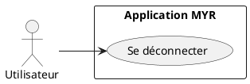
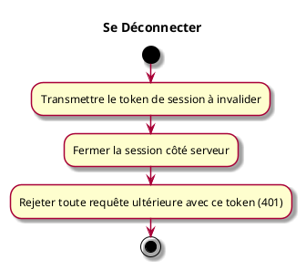

---
categorie: Compte et Accès
titre: "Se Déconnecter"
probabilite: 5
impact: 5
importance: 25
etat: relire
tags:
  - couche/expression
  - type/use-case
  - famille/UCA
  - domaine/identity
  - domaine/role
  - uc/UCA03
---

# Se Déconnecter

## Diagramme d'acteurs

## Contexte

Un client (interface graphique tierce, script, plugin...) met fin à une session active en invalidant son token.

## Pré-conditions

- Disposer d'un token de session valide

## Scénario

**Étape initiale :** Le client transmet son token de session (`X-Myr-Token`) pour clôturer la session

### Flux nominal — Déconnexion réussie

1. La session associée au token est invalidée côté serveur
2. Toute requête ultérieure avec ce token est rejetée (`401 Unauthorized`)

## Post-conditions

- La session est terminée et le token n'est plus valide

## Diagramme d'activités

<!-- liens-obsidian:begin — section de traçabilité générée à partir des références du document : ne pas l'éditer à la main -->
## Liens

**Navigation**
- [Carte des specs › UCA — Compte et Acces](../../Carte_des_specs.md#UCA%20—%20Compte%20et%20Acces)
- [UCA03 — couche analyse](../../2-Analyse/UCA-Compte_et_Acces/UCA03.md)
- [Traçabilité UCA03 vers le code](../../../docs/code/Tracabilite_UC_Code.md#UCA03)

**Exigences fonctionnelles couvertes**
- [EF03 — Déconnecter un utilisateur et invalider sa session](../Matrice_Tracabilite.md#1.%20Exigences%20fonctionnelles%20et%20UC%20couvrant)

**Cité par**
- [Expression_des_besoins_Intro](../Expression_des_besoins_Intro.md)
- [Matrice_Tracabilite](../Matrice_Tracabilite.md)
- [todo (expression)](../todo.md)
- [Analyse_des_besoins](../../2-Analyse/Analyse_des_besoins.md)
- [todo (analyse)](../../2-Analyse/todo.md)
- [todo (conception)](../../3-Conception/todo.md)
- [roadmap_dev](../../roadmap_dev.md)

<!-- liens-obsidian:end -->
