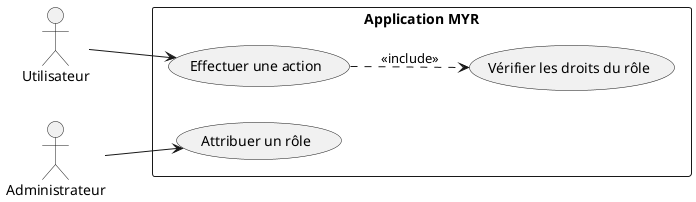
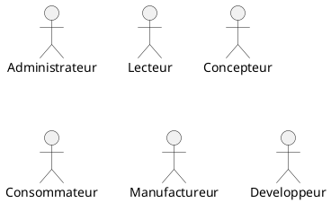
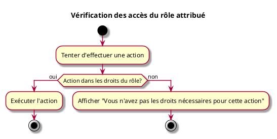

# Vérification des accès du rôle attribué

## Diagramme d'acteurs

## Contexte

Vérifier que l'utilisateur peut réaliser les actions autorisées par son rôle et ne peut pas réaliser celles qui lui sont refusées.

## Pré-conditions

- Être connecté au réseau
- Rôle attribué à l'utilisateur

## Scénario

**Étape initiale :** L'utilisateur tente d'effectuer une action

### Flux nominal — Action autorisée

1. L'action est dans les droits du rôle attribué
2. Le système exécute l'action

### Flux erreur — Action non autorisée

1. L'action n'est pas dans les droits du rôle attribué
2. Message d'erreur : "Vous n'avez pas les droits nécessaires pour cette action"

## Post-conditions

- Les droits du rôle sont respectés

## Diagrammes

### Rôles disponibles dans le système

### Diagramme d'activités

<!-- liens-obsidian:begin — section de traçabilité générée à partir des références du document : ne pas l'éditer à la main -->
## Liens

**Navigation**
- [Carte des specs › UCA — Compte et Acces](../../Carte_des_specs.md#UCA%20—%20Compte%20et%20Acces)
- [UCA05 — couche analyse](../../2-Analyse/UCA-Compte_et_Acces/UCA05.md)
- [Traçabilité UCA05 vers le code](../../../docs/code/Tracabilite_UC_Code.md#UCA05)

**Exigences fonctionnelles couvertes**
- [EF05 — Contrôler les accès selon le rôle attribué](../Matrice_Tracabilite.md#1.%20Exigences%20fonctionnelles%20et%20UC%20couvrant)

**Cité par**
- [Expression_des_besoins_Intro](../Expression_des_besoins_Intro.md)
- [Matrice_Tracabilite](../Matrice_Tracabilite.md)
- [todo (expression)](../todo.md)
- [Analyse_des_besoins](../../2-Analyse/Analyse_des_besoins.md)
- [UCA08 (analyse)](../../2-Analyse/UCA-Compte_et_Acces/UCA08.md)
- [todo (analyse)](../../2-Analyse/todo.md)
- [todo (conception)](../../3-Conception/todo.md)
- [roadmap_dev](../../roadmap_dev.md)

<!-- liens-obsidian:end -->
