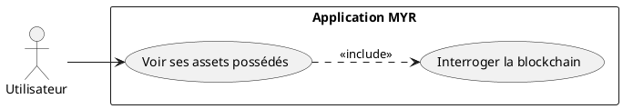
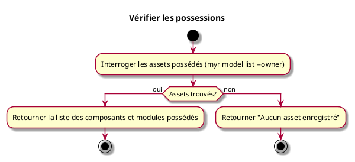

---
categorie: Compte et Accès
titre: "Vérifier les possessions"
probabilite: 3
impact: 3
etat: relire
tags:
  - couche/expression
  - type/use-case
  - famille/UCA
  - domaine/identity
  - domaine/role
  - uc/UCA06
---

# Vérifier les possessions

## Diagramme d'acteurs

## Contexte

L'utilisateur peut consulter la liste de ses assets (composants, modules) enregistrés sur le réseau dont il est propriétaire.

## Pré-conditions

- Être connecté au réseau

## Scénario

**Étape initiale :** Les assets possédés par l'identité connectée sont interrogés (`myr model list --owner <identityID>` ou l'appel API équivalent)

### Flux nominal — Affichage des possessions

1. Le système interroge la blockchain pour récupérer les assets dont l'identité est propriétaire
2. La liste des composants et modules possédés est retournée

### Flux nominal — Aucune possession

1. La réponse indique qu'aucun asset n'est enregistré

## Post-conditions

- L'utilisateur a une vue complète de ses possessions sur le réseau

## Diagramme d'activités

<!-- liens-obsidian:begin — section de traçabilité générée à partir des références du document : ne pas l'éditer à la main -->
## Liens

**Navigation**
- [Carte des specs › UCA — Compte et Acces](../../Carte_des_specs.md#UCA%20—%20Compte%20et%20Acces)
- [UCA06 — couche analyse](../../2-Analyse/UCA-Compte_et_Acces/UCA06.md)
- [Traçabilité UCA06 vers le code](../../../docs/code/Tracabilite_UC_Code.md#UCA06)

**Exigences fonctionnelles couvertes**
- [EF06 — Consulter les assets possédés par l'utilisateur](../Matrice_Tracabilite.md#1.%20Exigences%20fonctionnelles%20et%20UC%20couvrant)

**Cité par**
- [Expression_des_besoins_Intro](../Expression_des_besoins_Intro.md)
- [Matrice_Tracabilite](../Matrice_Tracabilite.md)
- [todo (expression)](../todo.md)
- [Analyse_des_besoins](../../2-Analyse/Analyse_des_besoins.md)
- [UCREC04 (analyse)](../../2-Analyse/UCREC-Recherche/UCREC04.md)
- [todo (analyse)](../../2-Analyse/todo.md)
- [DC_D8_Recherche](../../3-Conception/DC_D8_Recherche.md)
- [Securite](../../3-Conception/Securite.md)
- [todo (conception)](../../3-Conception/todo.md)
- [roadmap_dev](../../roadmap_dev.md)

<!-- liens-obsidian:end -->
