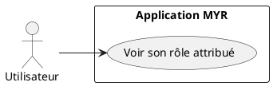
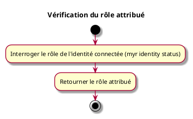

---
categorie: Compte et Accès
titre: "Vérification du rôle attribué"
probabilite: 1
impact: 1
importance: 1
etat: relire
tags:
  - couche/expression
  - type/use-case
  - famille/UCA
  - domaine/identity
  - domaine/role
  - uc/UCA07
  - relecture/remarque
---

# Vérification du rôle attribué

## Diagramme d'acteurs

## Contexte

Le rôle attribué à l'identité connectée est consultable via l'API ou le CLI.

<!-- #remarque : myr identity status / GET /api/identity/status retourne le statut d'enrôlement CA d'un wallet (pending/active/suspended), pas un rôle RBAC (reader/contributor/...). specs/2-Analyse/UCA-Compte_et_Acces/UCA07.md affirme au contraire qu'aucun endpoint ne permet de reconsulter le rôle après la connexion (le rôle n'est communiqué qu'une fois, dans la réponse de POST /api/identity/session). Les deux couches se contredisent sur la commande citée ici — à clarifier avant de considérer ce use case comme couvert. -->

## Pré-conditions

- Être connecté au réseau

## Scénario

**Étape initiale :** Le rôle de l'identité connectée est interrogé (`myr identity status` ou l'appel API équivalent)

### Flux nominal — Affichage du rôle

1. Le rôle attribué est retourné (ex : Concepteur, Consommateur, Manufactureur...)

## Post-conditions

- L'utilisateur connaît son rôle actuel

## Diagramme d'activités

<!-- liens-obsidian:begin — section de traçabilité générée à partir des références du document : ne pas l'éditer à la main -->
## Liens

**Navigation**
- [Carte des specs › UCA — Compte et Acces](../../Carte_des_specs.md#UCA%20—%20Compte%20et%20Acces)
- [UCA07 — couche analyse](../../2-Analyse/UCA-Compte_et_Acces/UCA07.md)
- [Traçabilité UCA07 vers le code](../../../docs/code/Tracabilite_UC_Code.md#UCA07)

**Exigences fonctionnelles couvertes**
- [EF05 — Contrôler les accès selon le rôle attribué](../Matrice_Tracabilite.md#1.%20Exigences%20fonctionnelles%20et%20UC%20couvrant)

**Cité par**
- [Expression_des_besoins_Intro](../Expression_des_besoins_Intro.md)
- [Matrice_Tracabilite](../Matrice_Tracabilite.md)
- [todo (expression)](../todo.md)
- [Analyse_des_besoins](../../2-Analyse/Analyse_des_besoins.md)
- [UCA02 (analyse)](../../2-Analyse/UCA-Compte_et_Acces/UCA02.md)
- [todo (analyse)](../../2-Analyse/todo.md)
- [DC_CLI_Identity](../../3-Conception/DC_CLI_Identity.md)
- [todo (conception)](../../3-Conception/todo.md)
- [roadmap_dev](../../roadmap_dev.md)

<!-- liens-obsidian:end -->
