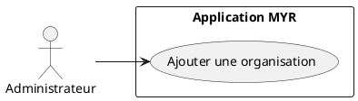
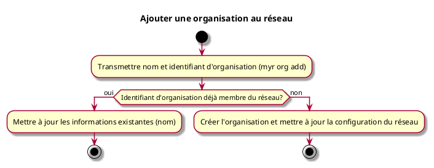

# Ajouter une organisation au réseau

## Diagramme d'acteurs

## Contexte

L'administrateur peut ajouter une organisation (fabricant, vendeur, association…) au réseau. Une organisation est identifiée par un **identifiant d'organisation** unique au sein du réseau. Les rôles et droits d'accès sont attribués séparément, dans un second temps (voir UCADM06 et UCADM07).

## Pré-conditions

- Être connecté en tant qu'administrateur du réseau
- Réseau opérationnel

## Scénario

**Étape initiale :** Sur le serveur (SSH), l'administrateur exécute `myr org add --id <orgID> --name <nom>` (équivalent `POST /api/networks/orgs`)

### Flux nominal — Organisation ajoutée

1. L'identifiant et le nom de l'organisation sont transmis
2. La configuration du réseau est mise à jour
3. L'organisation peut désormais gérer ses propres utilisateurs

### Flux alternatif — Organisation déjà membre du réseau

1. L'identifiant d'organisation transmis est déjà enregistré sur le réseau
2. Le système détecte que l'organisation existe et met à jour ses informations (nom) plutôt que de la recréer
3. La configuration du réseau est mise à jour sans recréation de l'organisation

## Post-conditions

- L'organisation est disponible sur le réseau
- Des rôles peuvent lui être attribués via UCADM06
- L'administrateur de l'organisation peut créer des comptes pour ses membres

## Diagramme d'activités

<!-- liens-obsidian:begin — section de traçabilité générée à partir des références du document : ne pas l'éditer à la main -->
## Liens

**Navigation**
- [Carte des specs › UCADM — Administration](../../Carte_des_specs.md#UCADM%20—%20Administration)
- [UCADM01 — couche analyse](../../2-Analyse/UCADM-Administration/UCADM01.md)
- [Traçabilité UCADM01 vers le code](../../../docs/code/Tracabilite_UC_Code.md#UCADM01)

**Exigences fonctionnelles couvertes**
- [EF08 — Gérer les organisations membres d'un réseau (ajout, mise à jour)](../Matrice_Tracabilite.md#1.%20Exigences%20fonctionnelles%20et%20UC%20couvrant)

**Use cases cités**
- [UCADM06 — Attribuer des rôles à une organisation](UCADM06.md)
- [UCADM07 — Gérer les rôles](UCADM07.md)

**Cité par**
- [Expression_des_besoins_Intro](../Expression_des_besoins_Intro.md)
- [Matrice_Tracabilite](../Matrice_Tracabilite.md)
- [UCADM06 (expression)](UCADM06.md)
- [UCDEV02 (expression)](../UCDEV-Developpement/UCDEV02.md)
- [todo (expression)](../todo.md)
- [Analyse_des_besoins](../../2-Analyse/Analyse_des_besoins.md)
- [UCADM03 (analyse)](../../2-Analyse/UCADM-Administration/UCADM03.md)
- [UCADM06 (analyse)](../../2-Analyse/UCADM-Administration/UCADM06.md)
- [UCDEV02 (analyse)](../../2-Analyse/UCDEV-Developpement/UCDEV02.md)
- [todo (analyse)](../../2-Analyse/todo.md)
- [API_REST](../../3-Conception/API_REST.md)
- [DC_CLI_Admin](../../3-Conception/DC_CLI_Admin.md)
- [DC_CLI_Model](../../3-Conception/DC_CLI_Model.md)
- [DC_D2_Administration](../../3-Conception/DC_D2_Administration.md)
- [DC_D7_Payment](../../3-Conception/DC_D7_Payment.md)
- [todo (conception)](../../3-Conception/todo.md)
- [roadmap_dev](../../roadmap_dev.md)

<!-- liens-obsidian:end -->
