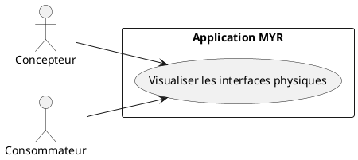
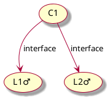
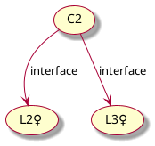
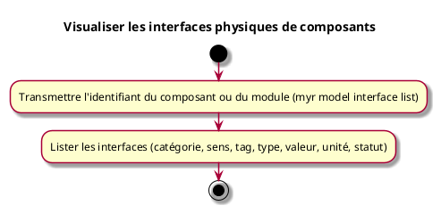

---
categorie: Assemblage Module
titre: "Visualiser les interfaces physiques de composants"
probabilite: 3
impact: 5
importance: 15
tags:
  - couche/expression
  - type/use-case
  - famille/UCAM
  - domaine/model
  - uc/UCAM02
---

# Visualiser les interfaces physiques de composants

## Diagramme d'acteurs

## Contexte

Un client peut lister les interfaces physiques (mécaniques, électriques, hydrauliques, etc.) d'un composant ou d'un module.

## Pré-conditions

- Être connecté au réseau
- Connaître l'identifiant du composant ou du module (asset ou module)

## Scénario

**Étape initiale :** `myr model interface list <assetID>` est exécutée (le composant peut aussi être un module, via la même commande) — même effet via l'API REST équivalente

### Flux nominal — Affichage des interfaces physiques

1. Les interfaces physiques du composant ou du module sont listées
2. Chaque ligne du résultat détaille : identifiant, catégorie, type, sens, valeur/plage, unité, et statut (virtuelle/utilisée)

## Post-conditions

- Les interfaces physiques du composant sont visibles et lisibles

## Diagrammes

### Composant C1 — interfaces L1♂ et L2♂

### Composant C2 — interfaces L2♀ et L3♀

Les interfaces L2♂ (sur C1) et L2♀ (sur C2) sont compatibles et peuvent être reliées par une liaison.

### Diagramme d'activités

<!-- liens-obsidian:begin — section de traçabilité générée à partir des références du document : ne pas l'éditer à la main -->
## Liens

**Navigation**
- [Carte des specs › UCAM — Assemblage Module](../../Carte_des_specs.md#UCAM%20—%20Assemblage%20Module)
- [UCAM02 — couche analyse](../../2-Analyse/UCAM-Assemblage_Module/UCAM02.md)
- [Traçabilité UCAM02 vers le code](../../../docs/code/Tracabilite_UC_Code.md#UCAM02)

**Exigences fonctionnelles couvertes**
- [EF19 — Visualiser les interfaces physiques d'un composant](../Matrice_Tracabilite.md#1.%20Exigences%20fonctionnelles%20et%20UC%20couvrant)

**Cité par**
- [Expression_des_besoins_Intro](../Expression_des_besoins_Intro.md)
- [Matrice_Tracabilite](../Matrice_Tracabilite.md)
- [UCAM01 (expression)](UCAM01.md)
- [todo (expression)](../todo.md)
- [Analyse_des_besoins](../../2-Analyse/Analyse_des_besoins.md)
- [UCDEV02 (analyse)](../../2-Analyse/UCDEV-Developpement/UCDEV02.md)
- [UCMOD03 (analyse)](../../2-Analyse/UCMOD-Module/UCMOD03.md)
- [todo (analyse)](../../2-Analyse/todo.md)
- [API_REST](../../3-Conception/API_REST.md)
- [Architecture_Composition](../../3-Conception/Architecture_Composition.md)
- [DC_CLI_Model](../../3-Conception/DC_CLI_Model.md)
- [roadmap_dev](../../roadmap_dev.md)

<!-- liens-obsidian:end -->
