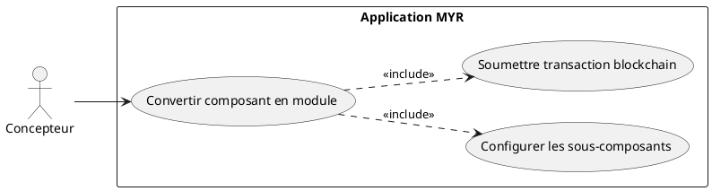
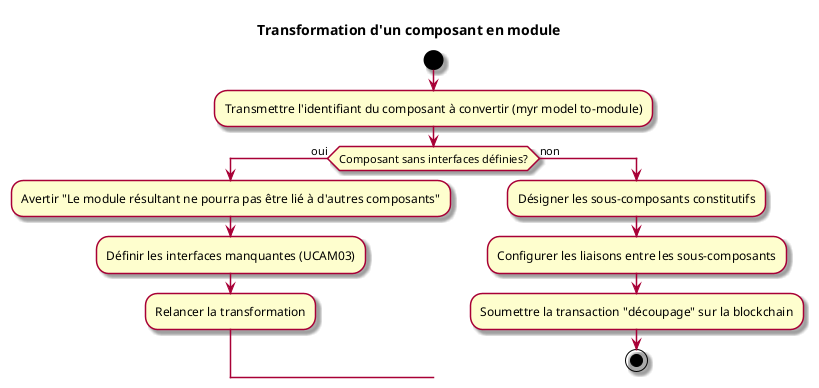

---
categorie: Assemblage Module
titre: "Transformation d'un composant en module"
probabilite: 1
impact: 4
importance: 4
etat: relire
tags:
  - couche/expression
  - type/use-case
  - famille/UCAM
  - domaine/model
  - uc/UCAM05
---

# Transformation d'un composant en module

## Diagramme d'acteurs

## Contexte

Un composant existant peut être converti en module s'il est redécoupé en sous-systèmes indépendants. Cette opération correspond à la catégorie **découpage** dans la taxonomie des assets.

Lorsque le fichier CAO du composant est un assemblage STEP/STP multi-pièces, ce découpage peut être précédé d'une analyse automatique qui propose sous-composants et connexions candidates à relire avant validation (voir UCAM09) — ce use case reste le chemin entièrement manuel, où le Concepteur désigne lui-même chaque sous-composant et configure chaque liaison.

## Pré-conditions

- Être connecté au réseau
- Être propriétaire du composant à convertir
- Avoir les droits d'édition

## Scénario

**Étape initiale :** Sur le serveur (SSH), l'administrateur exécute `myr model to-module <assetID> --name <nom>` pour le compte du Concepteur (ou l'appel API équivalent)

### Flux nominal — Conversion réussie

1. Les sous-composants constitutifs sont désignés
2. Les liaisons entre les sous-composants sont configurées (voir UCAM01)
3. La transaction "découpage" est soumise sur la blockchain

### Flux alternatif — Composant sans interfaces définies

1. Le composant ciblé ne possède aucune interface définie
2. Le service avertit : "Ce composant n'a pas d'interfaces — le module résultant ne pourra pas être lié à d'autres composants"
3. Les interfaces doivent être définies avant de poursuivre (voir UCAM03)
4. Une fois les interfaces définies, la transformation en module peut être relancée normalement

## Post-conditions

- Le composant est transformé en module contenant ses sous-composants
- Les interfaces du module correspondent aux interfaces libres des sous-composants

## Diagramme d'activités

<!-- liens-obsidian:begin — section de traçabilité générée à partir des références du document : ne pas l'éditer à la main -->
## Liens

**Navigation**
- [Carte des specs › UCAM — Assemblage Module](../../Carte_des_specs.md#UCAM%20—%20Assemblage%20Module)
- [UCAM05 — couche analyse](../../2-Analyse/UCAM-Assemblage_Module/UCAM05.md)
- [Traçabilité UCAM05 vers le code](../../../docs/code/Tracabilite_UC_Code.md#UCAM05)

**Exigences fonctionnelles couvertes**
- [EF22 — Transformer un composant en module (découpage en sous-systèmes)](../Matrice_Tracabilite.md#1.%20Exigences%20fonctionnelles%20et%20UC%20couvrant)

**Use cases cités**
- [UCAM01 — Liaison entre interfaces](UCAM01.md)
- [UCAM03 — Créer une interface sur un composant](UCAM03.md)
- [UCAM09 — Décomposition assistée d'un composant assemblage](UCAM09.md)

**Cité par**
- [Expression_des_besoins_Intro](../Expression_des_besoins_Intro.md)
- [Matrice_Tracabilite](../Matrice_Tracabilite.md)
- [UCAM09 (expression)](UCAM09.md)
- [todo (expression)](../todo.md)
- [Analyse_des_besoins](../../2-Analyse/Analyse_des_besoins.md)
- [UCCE01 (analyse)](../../2-Analyse/UCCE-Composant_Ecriture/UCCE01.md)
- [UCDEV02 (analyse)](../../2-Analyse/UCDEV-Developpement/UCDEV02.md)
- [UCREC03 (analyse)](../../2-Analyse/UCREC-Recherche/UCREC03.md)
- [todo (analyse)](../../2-Analyse/todo.md)
- [API_REST](../../3-Conception/API_REST.md)
- [Architecture_Composition](../../3-Conception/Architecture_Composition.md)
- [Conception_intro](../../3-Conception/Conception_intro.md)
- [DC_CLI_Model](../../3-Conception/DC_CLI_Model.md)
- [todo (conception)](../../3-Conception/todo.md)
- [roadmap_dev](../../roadmap_dev.md)

<!-- liens-obsidian:end -->
