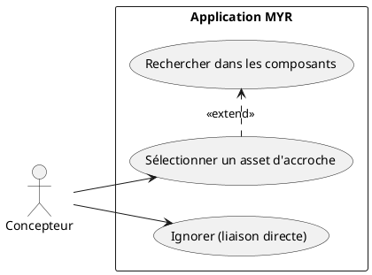
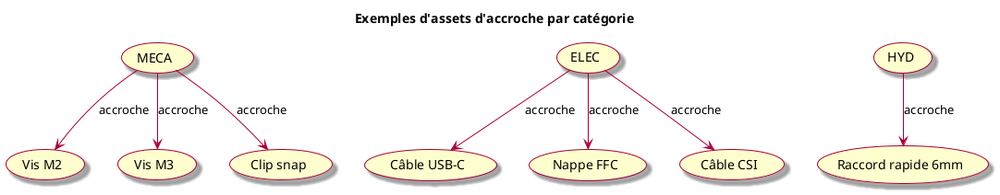
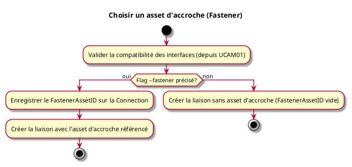

---
categorie: Assemblage Module
titre: "Choisir un asset d'accroche (Fastener)"
probabilite: 3
impact: 3
importance: 9
etat: relire
tags:
  - couche/expression
  - type/use-case
  - famille/UCAM
  - domaine/model
  - uc/UCAM07
---

# Choisir un asset d'accroche (Fastener)

## Diagramme d'acteurs

## Contexte

Lors de la création d'une liaison (voir UCAM01), le système propose optionnellement de désigner un **asset d'accroche** : un composant existant sur le réseau qui sert d'intermédiaire physique entre les deux interfaces (vis, câble, connecteur, raccord…).

L'identifiant de cet asset (`FastenerAssetID`) est enregistré sur la `Connection`. Si l'utilisateur ignore cette étape, `FastenerAssetID` reste vide et la liaison est directe.

## Pré-conditions

- Être en cours de création d'une liaison (UCAM01)
- Avoir des composants disponibles sur le réseau (potentiels fasteners)

## Scénario

**Étape initiale :** Lors de l'exécution de `myr model link add` (UCAM01), l'asset d'accroche est optionnellement précisé via le flag `--fastener <assetID>` — il n'existe pas de commande séparée, c'est un paramètre optionnel de la même commande

### Flux nominal — Asset d'accroche précisé

1. Le flag `--fastener <assetID>` désigne un composant existant sur le réseau, compatible par type d'interface (ex : vis M3, câble USB-C)
2. Le `FastenerAssetID` est enregistré sur la `Connection`
3. La liaison est créée avec l'asset d'accroche référencé

### Flux nominal — Liaison directe (accroche omise)

1. Le flag `--fastener` est omis
2. La liaison est créée sans asset d'accroche (`FastenerAssetID` vide)

## Post-conditions

- La `Connection` est enregistrée avec ou sans `FastenerAssetID`
- Si un fastener est précisé, il est associé à la liaison et consultable via `myr model get`

## Diagrammes

### Types d'accroche selon la catégorie d'interface

### Diagramme d'activités

<!-- liens-obsidian:begin — section de traçabilité générée à partir des références du document : ne pas l'éditer à la main -->
## Liens

**Navigation**
- [Carte des specs › UCAM — Assemblage Module](../../Carte_des_specs.md#UCAM%20—%20Assemblage%20Module)
- [UCAM07 — couche analyse](../../2-Analyse/UCAM-Assemblage_Module/UCAM07.md)
- [Traçabilité UCAM07 vers le code](../../../docs/code/Tracabilite_UC_Code.md#UCAM07)

**Exigences fonctionnelles couvertes**
- [EF23 — Choisir un asset d'accroche (fastener) pour une liaison](../Matrice_Tracabilite.md#1.%20Exigences%20fonctionnelles%20et%20UC%20couvrant)

**Use cases cités**
- [UCAM01 — Liaison entre interfaces](UCAM01.md)

**Cité par**
- [Expression_des_besoins_Intro](../Expression_des_besoins_Intro.md)
- [Matrice_Tracabilite](../Matrice_Tracabilite.md)
- [UCAM01 (expression)](UCAM01.md)
- [todo (expression)](../todo.md)
- [Analyse_des_besoins](../../2-Analyse/Analyse_des_besoins.md)
- [UCAM01 (analyse)](../../2-Analyse/UCAM-Assemblage_Module/UCAM01.md)
- [UCDEV02 (analyse)](../../2-Analyse/UCDEV-Developpement/UCDEV02.md)
- [todo (analyse)](../../2-Analyse/todo.md)
- [Architecture_Composition](../../3-Conception/Architecture_Composition.md)
- [DC_CLI_Model](../../3-Conception/DC_CLI_Model.md)
- [Sequence_soumission_module](../../3-Conception/Sequence_soumission_module.md)
- [roadmap_dev](../../roadmap_dev.md)

<!-- liens-obsidian:end -->
