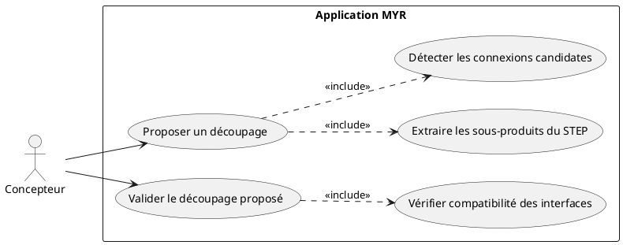
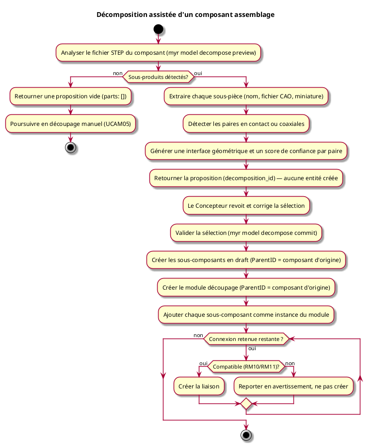

# Décomposition assistée d'un composant assemblage

## Diagramme d'acteurs

## Contexte

Un composant déjà enregistré, dont le fichier CAO est un assemblage STEP/STP (plusieurs sous-produits), peut être analysé pour obtenir une proposition de découpage en sous-composants et en liaisons candidates entre eux. Cette capacité assiste la transformation composant → module (catégorie **découpage**, voir UCAM05) : là où UCAM05 suppose que le Concepteur désigne lui-même chaque sous-composant et configure chaque liaison, ce use case propose un premier découpage à partir de la géométrie, que le Concepteur revoit, corrige puis valide — jamais un résultat engagé d'office (RM40).

L'analyse et la validation sont deux appels distincts. L'analyse (`preview`) ne crée aucune entité : elle retourne une proposition temporaire, identifiée par un `decomposition_id`, valable le temps de sa relecture. La validation (`commit`) reprend cette proposition — éventuellement corrigée par le Concepteur (sous-pièces renommées ou retirées, connexions rejetées) — et matérialise sous-composants, module et liaisons.

Une interface générée par cette analyse porte un repère géométrique (position, orientation, référence à l'entité STEP d'origine) en plus de sa compatibilité catégorielle habituelle (RM11) — voir `specs/3-Conception/Modele_Domaine.md` §2 (`AssetInterface`). Ce repère permet de replacer l'interface dans un visualiseur 3D et de la re-projeter après édition du fichier CAO source.

## Pré-conditions

- Être connecté au réseau
- Être propriétaire du composant ciblé et disposer des droits d'édition
- Le composant ciblé possède un fichier CAO au format STEP/STP

## Scénario

**Étape initiale :** `myr model decompose preview <assetID>` (ou l'appel API équivalent) est exécutée pour le compte du Concepteur

### Flux nominal — Proposition acceptée telle quelle

1. Le fichier STEP du composant est analysé : chaque sous-produit de son arbre d'assemblage donne une sous-pièce proposée, avec un nom dérivé du nom de produit STEP (à défaut, `Part N`), un fichier CAO indépendant et une miniature
2. Les paires de sous-pièces en contact ou coaxiales sont détectées par comparaison géométrique ; chaque paire donne une connexion candidate, avec une interface géométrique générée de part et d'autre (catégorie par défaut `MECA`, repère géométrique renseigné) et un score de confiance
3. La proposition (sous-pièces, connexions candidates, sous-pièces non appariées, avertissements) est retournée sous un identifiant `decomposition_id`, sans qu'aucune entité ne soit créée (RM40)
4. Le Concepteur valide la proposition sans modification : `myr model decompose commit <assetID> --from <decomposition_id>`
5. Les sous-composants sont créés en état **draft** (RM16), avec `ParentID` référençant le composant d'origine (RM39)
6. Un module de catégorie **découpage** est créé, également rattaché au composant d'origine par `ParentID` (RM39)
7. Chaque sous-composant est ajouté comme instance du module
8. Chaque connexion candidate est matérialisée en liaison entre les interfaces géométriques générées, après vérification de compatibilité (RM10/RM11, RM41)

### Flux alternatif — Proposition corrigée avant validation

1. Le Concepteur retire une sous-pièce non pertinente, renomme une sous-pièce, ou rejette une connexion candidate avant de valider
2. Seule la sélection retenue est transmise à `myr model decompose commit`
3. Le traitement se poursuit comme le flux nominal, limité aux éléments conservés

### Flux alternatif — Assemblage plat (aucun sous-produit détecté)

1. Le fichier STEP ne contient qu'un seul solide, sans sous-produit
2. La proposition retourne une liste de sous-pièces vide, sans erreur bloquante
3. Le Concepteur peut poursuivre avec une transformation entièrement manuelle (UCAM05)

### Flux erreur — Fichier STEP mal formé

1. Le fichier CAO du composant ne peut pas être analysé comme un assemblage AP214/AP242 valide
2. Le service retourne une erreur explicite ; aucune entité n'est créée

### Flux erreur — Connexion candidate rejetée à la validation

1. Une connexion candidate conservée par le Concepteur échoue à la vérification de compatibilité (RM10/RM11) au moment de la validation
2. Cette connexion n'est pas créée ; elle est rapportée en avertissement dans la réponse (RM41)
3. Les sous-composants et le module sont créés normalement, même si une ou plusieurs connexions sont ainsi écartées

## Post-conditions

- Une proposition non validée ne laisse aucune trace : aucun sous-composant, module, interface ou liaison n'est créé (RM40)
- Après validation, le composant d'origine n'est ni supprimé ni modifié (RM39)
- Les sous-composants créés sont en état **draft**, rattachés au composant d'origine par `ParentID`
- Le module de catégorie **découpage** est rattaché au composant d'origine par `ParentID` et contient les sous-composants comme instances
- Les connexions acceptées et compatibles sont créées ; une connexion rejetée pour incompatibilité est rapportée, jamais créée en contournant le contrôle habituel (RM41)

## Limites

- La détection géométrique établit qu'un contact existe, jamais sa nature (vissé, encastré, pivot…) : la catégorie précise, le type et l'unité de chaque interface générée (RM11) restent à la charge du Concepteur, y compris après validation
- Le score de confiance associé à une connexion candidate n'a aucun statut privilégié dans le contrôle de compatibilité (RM41) : une connexion à confiance élevée peut être rejetée si elle échoue à ce contrôle, et inversement une connexion à confiance faible peut être acceptée si le Concepteur confirme la catégorie proposée

## Diagramme d'activités

<!-- liens-obsidian:begin — section de traçabilité générée à partir des références du document : ne pas l'éditer à la main -->
## Liens

**Navigation**
- [Carte des specs › UCAM — Assemblage Module](../../Carte_des_specs.md#UCAM%20—%20Assemblage%20Module)
- [Traçabilité UCAM09 vers le code](../../../docs/code/Tracabilite_UC_Code.md#UCAM09)

**Exigences fonctionnelles couvertes**
- [EF64 — Proposer un découpage automatique (sous-pièces + connexions candidates) d'un composant STEP en amont d'une transformation composant → module](../Matrice_Tracabilite.md#1.%20Exigences%20fonctionnelles%20et%20UC%20couvrant)

**Use cases cités**
- [UCAM05 — Transformation d'un composant en module](UCAM05.md)

**Règles métier**
- [RM10 — Vérification de compatibilité automatique](../Regles_Metier.md#3.%20Interfaces%20et%20liaisons)
- [RM11 — Critères de compatibilité d'interfaces](../Regles_Metier.md#3.%20Interfaces%20et%20liaisons)
- [RM16 — État draft](../Regles_Metier.md#5.%20Modules%20et%20cycle%20de%20vie%20des%20assets)
- [RM39 — Filiation d'un découpage](../Regles_Metier.md#5.%20Modules%20et%20cycle%20de%20vie%20des%20assets)
- [RM40 — Proposition de découpage non engageante](../Regles_Metier.md#5.%20Modules%20et%20cycle%20de%20vie%20des%20assets)
- [RM41 — Compatibilité toujours vérifiée pour une connexion suggérée](../Regles_Metier.md#5.%20Modules%20et%20cycle%20de%20vie%20des%20assets)

**Documents cités**
- [Modele_Domaine](../../3-Conception/Modele_Domaine.md)

**Cité par**
- [Matrice_Tracabilite](../Matrice_Tracabilite.md)
- [UCAM05 (expression)](UCAM05.md)
- [Analyse_des_besoins](../../2-Analyse/Analyse_des_besoins.md)
- [API_REST](../../3-Conception/API_REST.md)
- [Conception_intro](../../3-Conception/Conception_intro.md)
- [DC_CLI_Model](../../3-Conception/DC_CLI_Model.md)
- [Modele_Domaine](../../3-Conception/Modele_Domaine.md)
- [roadmap_dev](../../roadmap_dev.md)

<!-- liens-obsidian:end -->
