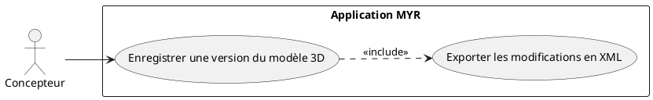
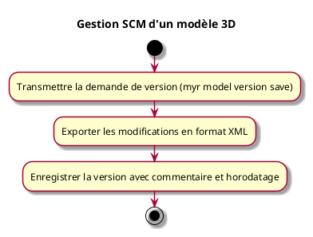

---
categorie: Automatisation
titre: "Gestion SCM d'un modèle 3D"
probabilite: 1
impact: 5
importance: 5
etat: relire
tags:
  - couche/expression
  - type/use-case
  - famille/UCAUT
  - domaine/model
  - domaine/payment
  - domaine/role
  - uc/UCAUT04
---

# Gestion SCM d'un modèle 3D

## Diagramme d'acteurs

## Contexte

L'utilisateur peut enregistrer par un format XML les modifications liées à un travail sur un modèle 3D (Source Control Management), indépendamment des soumissions blockchain.

Conformément au principe de parité CLI/REST, l'enregistrement et la consultation de versions SCM doivent être exposables en CLI au même titre que via l'interface graphique.

## Pré-conditions

- Être connecté au réseau
- Avoir un modèle 3D en cours d'édition

## Scénario

**Étape initiale :** `myr model version save <id> --comment <texte>` est exécutée (ou l'appel API équivalent), pendant l'édition d'un modèle 3D

### Flux nominal — Version enregistrée

1. Les modifications du modèle sont exportées en format XML
2. La version est enregistrée avec le commentaire fourni et un horodatage
3. L'historique des versions est consultable (`myr model version list <id>`)

## Post-conditions

- Les modifications sont versionnées et exportables en XML
- L'historique des versions est traçable

## Diagramme d'activités

<!-- liens-obsidian:begin — section de traçabilité générée à partir des références du document : ne pas l'éditer à la main -->
## Liens

**Navigation**
- [Carte des specs › UCAUT — Automatisation](../../Carte_des_specs.md#UCAUT%20—%20Automatisation)
- [UCAUT04 — couche analyse](../../2-Analyse/UCAUT-Automatisation/UCAUT04.md)
- [Traçabilité UCAUT04 vers le code](../../../docs/code/Tracabilite_UC_Code.md#UCAUT04)

**Exigences fonctionnelles couvertes**
- [EF47 — Gérer les versions SCM d'un modèle 3D](../Matrice_Tracabilite.md#1.%20Exigences%20fonctionnelles%20et%20UC%20couvrant)

**Cité par**
- [Expression_des_besoins_Intro](../Expression_des_besoins_Intro.md)
- [Matrice_Tracabilite](../Matrice_Tracabilite.md)
- [todo (expression)](../todo.md)
- [Analyse_des_besoins](../../2-Analyse/Analyse_des_besoins.md)
- [todo (analyse)](../../2-Analyse/todo.md)
- [API_REST](../../3-Conception/API_REST.md)
- [DC_CLI_Model](../../3-Conception/DC_CLI_Model.md)
- [DC_D9_Automatisation](../../3-Conception/DC_D9_Automatisation.md)
- [todo (conception)](../../3-Conception/todo.md)
- [roadmap_dev](../../roadmap_dev.md)

<!-- liens-obsidian:end -->
