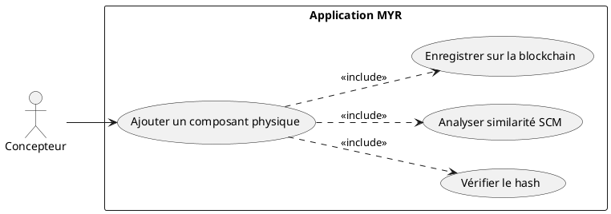
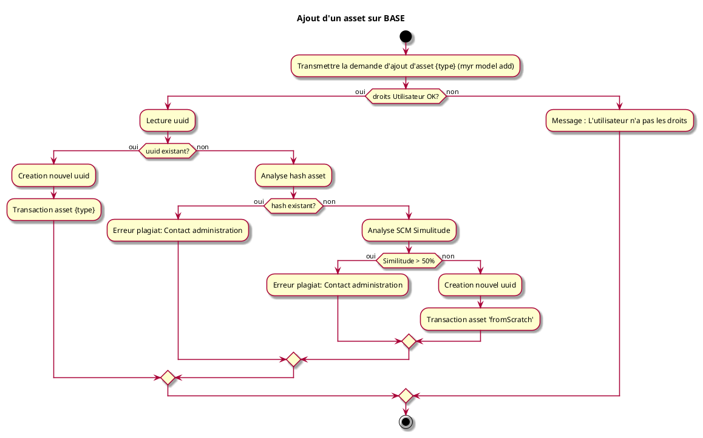
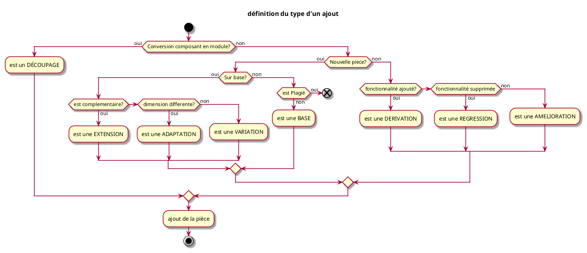

---
categorie: Composant Ecriture
titre: "Ajout d'un composant Physique"
probabilite: 3
impact: 5
importance: 15
etat: relire
tags:
  - couche/expression
  - type/use-case
  - famille/UCCE
  - domaine/model
  - uc/UCCE01
---

# Ajout d'un composant Physique

## Diagramme d'acteurs

## Contexte

Ajout d'une création de l'utilisateur sous forme de composant physique (pièce CAO, produit matériel...) dans le réseau MYR.

## Pré-conditions

- Être connecté au réseau
- Avoir les droits de création de composants
- Disposer d'un fichier 3D/CAO du composant

## Scénario

**Étape initiale :** `myr model add roue.stl --name "Roue avant" --channel greenchannel --category base` est exécutée (ou l'appel API équivalent), pour le compte du Concepteur

### Flux nominal — Composant nouveau

1. Le fichier 3D est importé
2. Le système vérifie le hash du fichier : aucun doublon détecté
3. L'analyse SCM de similarité est effectuée (seuil 50%)
4. Les métadonnées sont renseignées (nom, licence, auteur)
5. La transaction "fromScratch" est soumise sur la blockchain
6. Un UUID est créé et attribué au composant

### Flux alternatif — Import depuis un format CAO non natif (STL, STEP, OBJ)

1. Le fichier est fourni dans un format de CAO non natif (STL, STEP, OBJ…)
2. Le système accepte le fichier et calcule son hash normalement
3. Les métadonnées géométriques (dimensions, volume) sont extraites automatiquement selon le format
4. Les métadonnées non extractibles automatiquement (description, licence) sont renseignées explicitement
5. La transaction est soumise normalement

### Flux erreur — Hash déjà existant

1. Erreur métier : "Composant déjà existant - risque de plagiat" — invite à contacter l'administration

### Flux erreur — Similarité supérieure à 50%

1. Erreur métier : "Similarité trop élevée avec un composant existant" — invite à contacter l'administration

## Post-conditions

- Le composant physique est enregistré sur la blockchain
- Un UUID unique lui est attribué
- Le droit d'auteur est enregistré

## Diagrammes

### Flux d'ajout d'un asset depuis zéro (fromScratch)

### Taxonomie — Détermination du type d'un nouvel asset

<!-- liens-obsidian:begin — section de traçabilité générée à partir des références du document : ne pas l'éditer à la main -->
## Liens

**Navigation**
- [Carte des specs › UCCE — Composant Ecriture](../../Carte_des_specs.md#UCCE%20—%20Composant%20Ecriture)
- [UCCE01 — couche analyse](../../2-Analyse/UCCE-Composant_Ecriture/UCCE01.md)
- [Traçabilité UCCE01 vers le code](../../../docs/code/Tracabilite_UC_Code.md#UCCE01)

**Exigences fonctionnelles couvertes**
- [EF10 — Enregistrer un composant physique sur la blockchain](../Matrice_Tracabilite.md#1.%20Exigences%20fonctionnelles%20et%20UC%20couvrant)
- [EF15 — Vérifier l'unicité d'un composant (anti-plagiat SHA-256 + SCM > 50 %)](../Matrice_Tracabilite.md#1.%20Exigences%20fonctionnelles%20et%20UC%20couvrant)

**Cité par**
- [Expression_des_besoins_Intro](../Expression_des_besoins_Intro.md)
- [Matrice_Tracabilite](../Matrice_Tracabilite.md)
- [UCAUT03 (expression)](../UCAUT-Automatisation/UCAUT03.md)
- [todo (expression)](../todo.md)
- [Analyse_des_besoins](../../2-Analyse/Analyse_des_besoins.md)
- [UCAUT03 (analyse)](../../2-Analyse/UCAUT-Automatisation/UCAUT03.md)
- [UCCE03 (analyse)](../../2-Analyse/UCCE-Composant_Ecriture/UCCE03.md)
- [UCCE04 (analyse)](../../2-Analyse/UCCE-Composant_Ecriture/UCCE04.md)
- [UCCE06 (analyse)](../../2-Analyse/UCCE-Composant_Ecriture/UCCE06.md)
- [todo (analyse)](../../2-Analyse/todo.md)
- [API_REST](../../3-Conception/API_REST.md)
- [Architecture_Composition](../../3-Conception/Architecture_Composition.md)
- [Chaincode](../../3-Conception/Chaincode.md)
- [Conception_intro](../../3-Conception/Conception_intro.md)
- [DC_CLI_Model](../../3-Conception/DC_CLI_Model.md)
- [Sequence_soumission_asset](../../3-Conception/Sequence_soumission_asset.md)
- [roadmap_dev](../../roadmap_dev.md)

<!-- liens-obsidian:end -->
