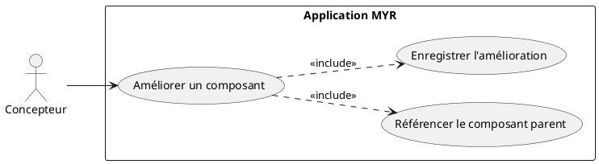
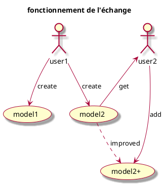
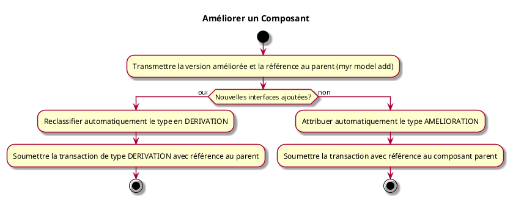

---
categorie: Composant Ecriture
titre: "Améliorer un Composant"
probabilite: 2
impact: 5
importance: 10
etat: relire
tags:
  - couche/expression
  - type/use-case
  - famille/UCCE
  - domaine/model
  - uc/UCCE04
---

# Améliorer un Composant

## Diagramme d'acteurs

## Contexte

Un composant existant peut être amélioré (mêmes fonctionnalités mais renforcées) par un utilisateur autorisé. Il s'agit d'une AMELIORATION dans la taxonomie MYR.

## Pré-conditions

- Être connecté au réseau
- Avoir les droits d'amélioration sur le composant
- Composant de base existant sur le réseau

## Scénario

**Étape initiale :** `myr model add roue_v2.stl --name "Roue avant v2" --channel greenchannel --category amelioration --parent <id-parent> --license <id-licence>` est exécutée (ou l'appel API équivalent), pour le compte du Concepteur

### Flux nominal — Amélioration réussie

1. Le type AMELIORATION est automatiquement attribué
2. La version améliorée du composant est importée avec les modifications apportées
3. La transaction est soumise avec référence au composant parent — la compatibilité de licence entre le parent et la dérivation est vérifiée

### Flux alternatif — Amélioration avec ajout d'interfaces

1. La version améliorée du composant introduit de nouvelles interfaces non présentes dans la version parente
2. Le système détecte l'ajout de fonctionnalités et reclassifie le type en DERIVATION (le flag `--category` explicite prévaut si fourni)
3. La transaction est soumise avec le type final (DERIVATION) et la référence au composant parent

## Post-conditions

- Une nouvelle version améliorée du composant est enregistrée
- Elle est liée au composant parent via sa dépendance blockchain

## Diagrammes

### Cycle de vie — création, partage et amélioration d'un composant

### Diagramme d'activités

<!-- liens-obsidian:begin — section de traçabilité générée à partir des références du document : ne pas l'éditer à la main -->
## Liens

**Navigation**
- [Carte des specs › UCCE — Composant Ecriture](../../Carte_des_specs.md#UCCE%20—%20Composant%20Ecriture)
- [UCCE04 — couche analyse](../../2-Analyse/UCCE-Composant_Ecriture/UCCE04.md)
- [Traçabilité UCCE04 vers le code](../../../docs/code/Tracabilite_UC_Code.md#UCCE04)

**Exigences fonctionnelles couvertes**
- [EF13 — Faire évoluer un composant (amélioration, dérivation, extension)](../Matrice_Tracabilite.md#1.%20Exigences%20fonctionnelles%20et%20UC%20couvrant)
- [EF16 — Vérifier la compatibilité de licence lors d'une dérivation](../Matrice_Tracabilite.md#1.%20Exigences%20fonctionnelles%20et%20UC%20couvrant)

**Cité par**
- [Expression_des_besoins_Intro](../Expression_des_besoins_Intro.md)
- [Matrice_Tracabilite](../Matrice_Tracabilite.md)
- [todo (expression)](../todo.md)
- [Analyse_des_besoins](../../2-Analyse/Analyse_des_besoins.md)
- [UCCE05 (analyse)](../../2-Analyse/UCCE-Composant_Ecriture/UCCE05.md)
- [UCCE06 (analyse)](../../2-Analyse/UCCE-Composant_Ecriture/UCCE06.md)
- [UCMOD01 (analyse)](../../2-Analyse/UCMOD-Module/UCMOD01.md)
- [todo (analyse)](../../2-Analyse/todo.md)
- [Architecture_Composition](../../3-Conception/Architecture_Composition.md)
- [DC_CLI_Model](../../3-Conception/DC_CLI_Model.md)
- [roadmap_dev](../../roadmap_dev.md)

<!-- liens-obsidian:end -->
