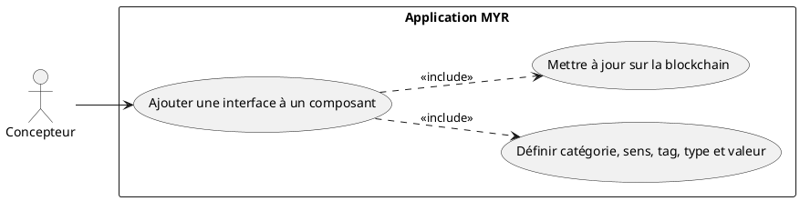
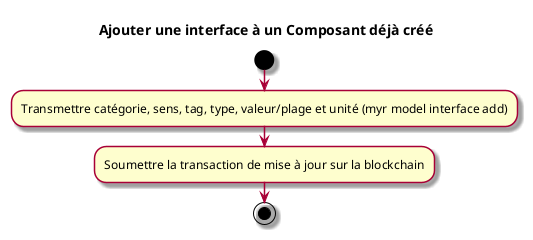

---
categorie: Composant Ecriture
titre: "Ajouter une interface à un Composant déjà créé"
probabilite: 2
impact: 3
importance: 6
etat: relire
tags:
  - couche/expression
  - type/use-case
  - famille/UCCE
  - domaine/model
  - uc/UCCE06
---

# Ajouter une interface à un Composant déjà créé

## Diagramme d'acteurs

## Contexte

Un utilisateur peut ajouter manuellement une interface à un composant qu'il a déjà créé, utile lorsque la détection automatique n'a pas pu être réalisée.

## Pré-conditions

- Être connecté au réseau
- Être propriétaire du composant
- Avoir les droits d'édition

## Scénario

**Étape initiale :** `myr model interface add <assetID> --category MECA --type "vis M6" --direction bidir --value-min 5 --value-max 6 --unit mm` est exécutée (ou l'appel API équivalent), pour le compte du propriétaire du composant

### Flux nominal — Interface ajoutée

1. La catégorie (Électrique, Mécanique, Hydraulique...) est définie
2. Le sens (Entrée, Sortie, Bidirectionnel) est défini
3. Le tag (Câble, connecteur, vis...) et le type (ex : USB-C) sont renseignés
4. La valeur ou plage de valeur et l'unité (Volt, mm...) sont renseignées
5. La transaction de mise à jour est soumise sur la blockchain
6. L'interface devient disponible pour les liaisons (voir UCAM01)

## Post-conditions

- L'interface est ajoutée au composant sur le réseau
- Elle est disponible pour les liaisons (voir UCAM01)

## Diagramme d'activités

<!-- liens-obsidian:begin — section de traçabilité générée à partir des références du document : ne pas l'éditer à la main -->
## Liens

**Navigation**
- [Carte des specs › UCCE — Composant Ecriture](../../Carte_des_specs.md#UCCE%20—%20Composant%20Ecriture)
- [UCCE06 — couche analyse](../../2-Analyse/UCCE-Composant_Ecriture/UCCE06.md)
- [Traçabilité UCCE06 vers le code](../../../docs/code/Tracabilite_UC_Code.md#UCCE06)

**Exigences fonctionnelles couvertes**
- [EF14 — Ajouter une interface à un composant existant](../Matrice_Tracabilite.md#1.%20Exigences%20fonctionnelles%20et%20UC%20couvrant)

**Use cases cités**
- [UCAM01 — Liaison entre interfaces](../UCAM-Assemblage_Module/UCAM01.md)

**Cité par**
- [Expression_des_besoins_Intro](../Expression_des_besoins_Intro.md)
- [Matrice_Tracabilite](../Matrice_Tracabilite.md)
- [todo (expression)](../todo.md)
- [Analyse_des_besoins](../../2-Analyse/Analyse_des_besoins.md)
- [UCCE01 (analyse)](../../2-Analyse/UCCE-Composant_Ecriture/UCCE01.md)
- [UCCE05 (analyse)](../../2-Analyse/UCCE-Composant_Ecriture/UCCE05.md)
- [UCDEV02 (analyse)](../../2-Analyse/UCDEV-Developpement/UCDEV02.md)
- [todo (analyse)](../../2-Analyse/todo.md)
- [Architecture_Composition](../../3-Conception/Architecture_Composition.md)
- [Conception_intro](../../3-Conception/Conception_intro.md)
- [DC_CLI_Model](../../3-Conception/DC_CLI_Model.md)
- [Sequence_soumission_asset](../../3-Conception/Sequence_soumission_asset.md)
- [roadmap_dev](../../roadmap_dev.md)

<!-- liens-obsidian:end -->
