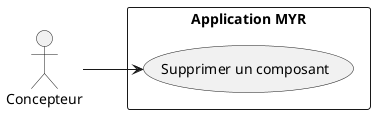
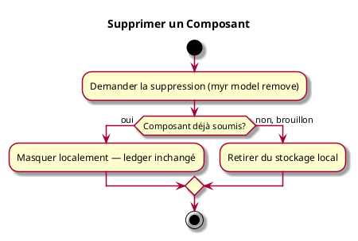

# Supprimer un Composant

## Diagramme d'acteurs

## Contexte

Un composant qui n'a plus d'usage doit pouvoir être supprimé par son propriétaire, qu'il soit encore en brouillon ou déjà soumis. Un composant soumis ne peut jamais être retiré de la blockchain (RM06) : le supprimer le masque des listes du système, sans jamais toucher à son enregistrement blockchain.

## Pré-conditions

- Être connecté au réseau
- Être propriétaire du composant

## Scénario

**Étape initiale :** `myr model remove <id>` est exécutée (ou l'appel API équivalent `DELETE /api/components/:id`)

### Flux nominal — Composant en brouillon

1. Le composant, jamais soumis, est retiré du stockage local
2. Il n'existe plus nulle part

### Flux nominal — Composant déjà soumis

1. Le composant est masqué des listes retournées par le système
2. Son enregistrement sur la blockchain reste inchangé, consultable par identifiant direct

## Post-conditions

- Le composant n'apparaît plus dans les listes
- Son enregistrement blockchain (s'il existait) n'est jamais modifié

## Diagramme d'activités

