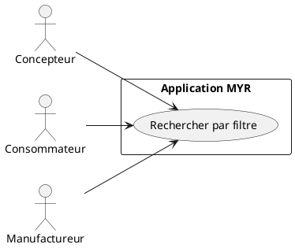
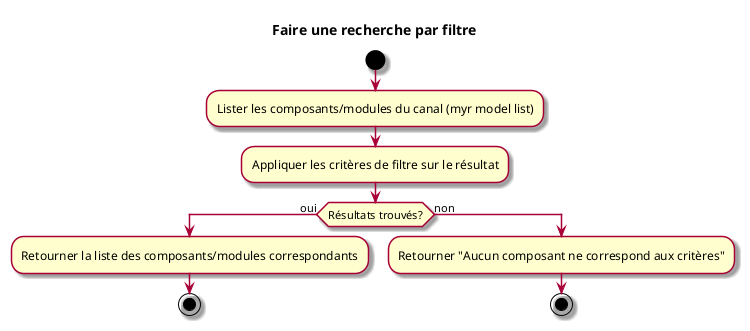

---
categorie: Composant Lecture
titre: "Faire une recherche par filtre"
probabilite: 4
impact: 4
importance: 16
etat: relire
tags:
  - couche/expression
  - type/use-case
  - famille/UCCL
  - domaine/model
  - uc/UCCL01
---

# Faire une recherche par filtre

## Diagramme d'acteurs

## Contexte

La recherche par filtre permet de trouver des composants ou Modules selon des critères précis (type, catégorie, interface, licence, auteur...).

## Pré-conditions

- Être connecté au réseau
- La parité de filtrage entre le résultat brut de la liste et un filtrage serveur dédié reste partielle, voir flux nominal

## Scénario

**Étape initiale :** `myr model list [--channel <id>]` est exécutée (ou l'appel API équivalent) pour obtenir la liste des composants et modules du canal

### Flux nominal — Résultats trouvés

1. Un ou plusieurs critères de filtre (texte, catégorie, auteur, tags…) sont appliqués sur le résultat de la liste
2. La liste des composants/modules correspondants est retournée
3. `myr model get <id>` permet de consulter un composant/module précis une fois son identifiant connu

### Flux nominal — Aucun résultat

1. La réponse indique qu'aucun composant ne correspond aux critères

## Post-conditions

- La liste des composants/modules correspondant aux critères est affichée

## Diagramme d'activités

<!-- liens-obsidian:begin — section de traçabilité générée à partir des références du document : ne pas l'éditer à la main -->
## Liens

**Navigation**
- [Carte des specs › UCCL — Composant Lecture](../../Carte_des_specs.md#UCCL%20—%20Composant%20Lecture)
- [UCCL01 — couche analyse](../../2-Analyse/UCCL-Composant_Lecture/UCCL01.md)
- [Traçabilité UCCL01 vers le code](../../../docs/code/Tracabilite_UC_Code.md#UCCL01)

**Exigences fonctionnelles couvertes**
- [EF17 — Rechercher et filtrer les composants disponibles sur le réseau](../Matrice_Tracabilite.md#1.%20Exigences%20fonctionnelles%20et%20UC%20couvrant)

**Cité par**
- [Expression_des_besoins_Intro](../Expression_des_besoins_Intro.md)
- [Matrice_Tracabilite](../Matrice_Tracabilite.md)
- [UCMOD02 (expression)](../UCMOD-Module/UCMOD02.md)
- [todo (expression)](../todo.md)
- [Analyse_des_besoins](../../2-Analyse/Analyse_des_besoins.md)
- [UCMOD02 (analyse)](../../2-Analyse/UCMOD-Module/UCMOD02.md)
- [UCMOD07 (analyse)](../../2-Analyse/UCMOD-Module/UCMOD07.md)
- [UCREC01 (analyse)](../../2-Analyse/UCREC-Recherche/UCREC01.md)
- [todo (analyse)](../../2-Analyse/todo.md)
- [API_REST](../../3-Conception/API_REST.md)
- [Chaincode](../../3-Conception/Chaincode.md)
- [DC_CLI_Model](../../3-Conception/DC_CLI_Model.md)
- [DC_D1_Auth_Identity](../../3-Conception/DC_D1_Auth_Identity.md)
- [roadmap_dev](../../roadmap_dev.md)

<!-- liens-obsidian:end -->
