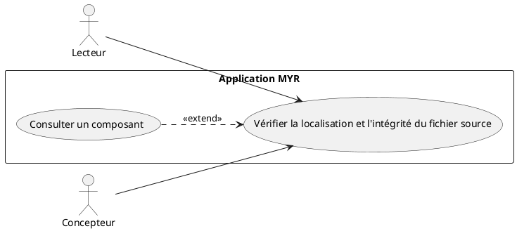
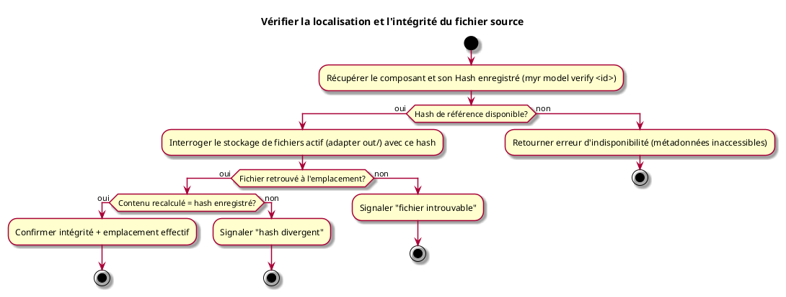

# Vérifier la localisation et l'intégrité du fichier source

## Diagramme d'acteurs

## Contexte

Un composant qui porte un fichier ressource (`Hash` non vide) a été téléversé une fois vers un stockage de fichiers — local aujourd'hui, IPFS ou toute autre technologie demain (voir § Interchangeabilité technologique). Quelle que soit cette technologie, Myr sait retrouver l'emplacement effectif du fichier associé à un composant et vérifier à la demande qu'il y est toujours présent et que son contenu correspond toujours au hash enregistré à la soumission.

Cette vérification est indépendante de l'intégrité de la transaction blockchain (RM06/RM07, qui portent sur les métadonnées immuables du ledger) : elle porte sur le fichier réel dans le dépôt de stockage, qui reste mutable ou supprimable en dehors de Myr (perte de disque, migration de technologie incomplète, suppression manuelle...).

## Pré-conditions

- Être connecté au réseau (rôle Lecteur minimum)
- L'identifiant du composant est connu

## Scénario

**Étape initiale :** `myr model verify <id>` est exécutée (ou l'appel API équivalent `POST /api/components/{id}/verify`)

### Flux nominal — Fichier présent et intègre

1. Le système récupère le composant et son `Hash` enregistré (brouillon local ou blockchain selon son état, RM16)
2. Le système interroge le stockage de fichiers actif avec ce hash pour obtenir l'emplacement effectif du fichier (chemin local, CID IPFS, ou toute autre référence selon l'adapter actif)
3. Le fichier est retrouvé à cet emplacement ; son contenu est recalculé et correspond au hash enregistré
4. Le système confirme l'intégrité et retourne l'emplacement effectif du fichier

### Flux erreur — Fichier introuvable à l'emplacement enregistré

1. Aucun fichier n'est retrouvé à l'emplacement attendu (perte de disque, migration de technologie de stockage incomplète, suppression manuelle hors de Myr...)
2. Le système signale explicitement l'absence du fichier — distinct du cas « hash divergent »

### Flux erreur — Hash divergent

1. Un fichier est présent à l'emplacement enregistré, mais son contenu recalculé ne correspond plus au hash enregistré (corruption, remplacement non autorisé)
2. Le système signale explicitement la divergence — distinct du cas « fichier introuvable »

### Flux erreur — Métadonnées indisponibles

1. Le hash de référence ne peut pas être obtenu : le composant n'est pas un brouillon local et la blockchain est injoignable
2. Le système retourne une erreur d'indisponibilité — la vérification du fichier ne peut pas être exécutée sans hash de référence

## Post-conditions

- Aucune donnée n'est modifiée (opération de lecture seule)
- L'appelant reçoit un statut explicite parmi : intègre (avec emplacement), fichier introuvable, hash divergent, ou vérification impossible — jamais un simple résultat booléen opaque qui masquerait la cause

## Diagramme d'activités

