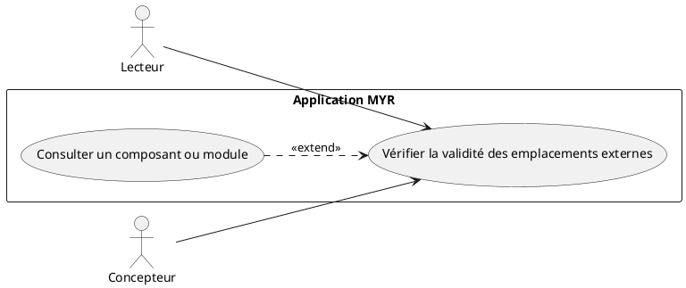
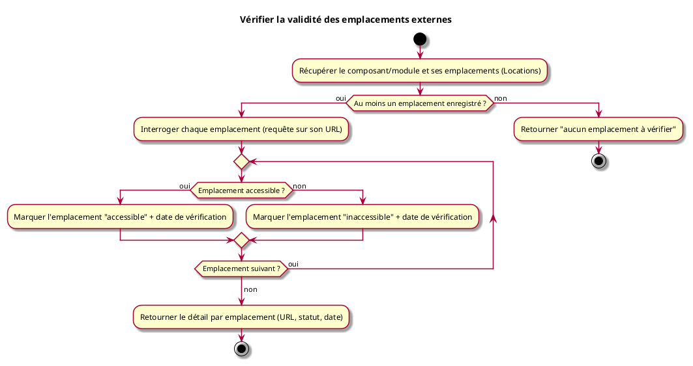

# Vérifier la validité des emplacements externes d'un composant ou module

## Diagramme d'acteurs

## Contexte

L'intérêt premier de Myr est de tracer un produit et ses composants — savoir où ils existent, pas héberger leur fichier ressource : Myr ne conserve jamais de copie du fichier transmis, seule son empreinte (`Model3D.Hash`, calculée une fois à la soumission, RM01) est retenue. Un composant ou un module peut donc porter un ou plusieurs **emplacements externes** (`Locations`) : boutique, dépôt de fichiers tiers (ex. plateforme de partage de fichiers CAO), fiche produit d'un fabricant… Chacun est une simple URL déclarée par le Concepteur.

Ces emplacements externes ne sont pas sous le contrôle de Myr : une boutique peut fermer, une fiche produit être retirée, une plateforme de partage supprimer un dépôt. Cette vérification permet de savoir, à la demande, si chaque emplacement déclaré reste effectivement accessible — sans jamais prétendre garantir que le contenu qui y est exposé correspond au fichier ressource : une page boutique ou une fiche produit n'est pas tenue d'exposer le fichier brut, et Myr n'ayant lui-même aucune copie à comparer, seul le demandeur peut, en récupérant le fichier depuis un emplacement, en recalculer le hash et le confronter à `Model3D.Hash`.

## Pré-conditions

- Être connecté au réseau (rôle Lecteur minimum)
- L'identifiant du composant ou module est connu
- Le composant ou module porte au moins un emplacement externe (`Locations` non vide) — sinon rien à vérifier (voir flux erreur)

## Scénario

**Étape initiale :** `myr model location check <id>` est exécutée (ou l'appel API équivalent `POST /api/components/{id}/locations/check` / `POST /api/modules/{id}/locations/check`)

### Flux nominal — Tous les emplacements accessibles

1. Le système récupère le composant ou module et la liste de ses emplacements externes enregistrés (`Locations`)
2. Pour chaque emplacement, une requête est effectuée sur son URL
3. Chaque emplacement répond de façon à confirmer son accessibilité
4. Le système met à jour le statut et la date de vérification de chaque emplacement, et retourne le détail complet (accessible pour chacun)

### Flux nominal — Un ou plusieurs emplacements inaccessibles

1. Le système récupère le composant ou module et la liste de ses emplacements externes enregistrés
2. Pour chaque emplacement, une requête est effectuée sur son URL
3. Un ou plusieurs emplacements ne répondent pas ou signalent une erreur (page supprimée, domaine expiré, délai dépassé…)
4. Le système met à jour le statut de chacun individuellement — les emplacements accessibles et inaccessibles sont distingués explicitement, jamais fondus en un statut global — et retourne le détail complet, permettant de repérer précisément quel emplacement n'est plus valide

### Flux erreur — Aucun emplacement enregistré

1. Le composant ou module ne porte aucun emplacement externe (`Locations` vide)
2. Le système retourne une réponse explicite indiquant qu'il n'y a rien à vérifier, sans erreur bloquante

## Post-conditions

- Le statut et la date de dernière vérification de chaque emplacement externe du composant/module sont à jour
- Aucune autre donnée de l'asset n'est modifiée
- L'appelant reçoit un détail par emplacement (URL, statut, date de vérification) — jamais un résultat unique agrégé qui masquerait quel emplacement précis a échoué
- Cette vérification ne se prononce jamais sur l'intégrité du contenu exposé par l'emplacement — seule son accessibilité ; Myr ne conservant aucune copie du fichier ressource, il n'a lui-même rien à comparer au hash enregistré

## Diagramme d'activités

<!-- liens-obsidian:begin — section de traçabilité générée à partir des références du document : ne pas l'éditer à la main -->
## Liens

**Navigation**
- [Carte des specs › UCCL — Composant Lecture](../../Carte_des_specs.md#UCCL%20—%20Composant%20Lecture)
- [Traçabilité UCCL03 vers le code](../../../docs/code/Tracabilite_UC_Code.md#UCCL03)

**Règles métier**
- [RM01 — Anti-plagiat obligatoire](../Regles_Metier.md#1.%20Assets%20et%20composants)

**Cité par**
- [UCCE01 (analyse)](../../2-Analyse/UCCE-Composant_Ecriture/UCCE01.md)
- [Architecture_Composition](../../3-Conception/Architecture_Composition.md)
- [DC_CLI_Model](../../3-Conception/DC_CLI_Model.md)
- [Modele_Domaine](../../3-Conception/Modele_Domaine.md)

<!-- liens-obsidian:end -->
