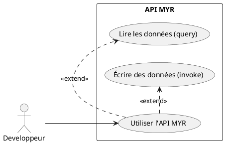
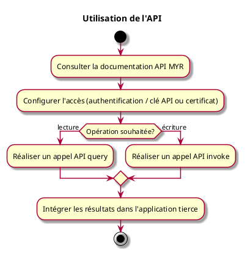

---
categorie: Développement autour de MYR
titre: "Utilisation de l'API"
probabilite: 1
importance: 0
tags:
  - couche/expression
  - type/use-case
  - famille/UCDEV
  - uc/UCDEV01
---

# Utilisation de l'API

## Diagramme d'acteurs

## Contexte

Les développeurs peuvent utiliser l'API REST MYR pour intégrer ses fonctionnalités dans leurs applications tierces (boutiques, éditeurs 3D, plugins CAO...).

## Pré-conditions

- Avoir les droits d'accès à l'API (rôle Développeur)
- Clé API ou certificat disponible

## Scénario

**Étape initiale :** Le développeur consulte la documentation API MYR

### Flux nominal — Intégration réussie

1. Le développeur configure l'accès (authentification)
2. Il réalise des appels API (query pour lecture, invoke pour écriture)
3. Il intègre les résultats dans son application tierce

## Post-conditions

- L'application tierce est intégrée avec le réseau MYR

## Diagramme d'activités

<!-- liens-obsidian:begin — section de traçabilité générée à partir des références du document : ne pas l'éditer à la main -->
## Liens

**Navigation**
- [Carte des specs › UCDEV — Developpement](../../Carte_des_specs.md#UCDEV%20—%20Developpement)
- [UCDEV01 — couche analyse](../../2-Analyse/UCDEV-Developpement/UCDEV01.md)
- [Traçabilité UCDEV01 vers le code](../../../docs/code/Tracabilite_UC_Code.md#UCDEV01)

**Exigences fonctionnelles couvertes**
- [EF55 — Exposer une API REST pour les intégrations tierces](../Matrice_Tracabilite.md#1.%20Exigences%20fonctionnelles%20et%20UC%20couvrant)

**Cité par**
- [Expression_des_besoins_Intro](../Expression_des_besoins_Intro.md)
- [Matrice_Tracabilite](../Matrice_Tracabilite.md)
- [UCDEV02 (expression)](UCDEV02.md)
- [Analyse_des_besoins](../../2-Analyse/Analyse_des_besoins.md)
- [UCDEV02 (analyse)](../../2-Analyse/UCDEV-Developpement/UCDEV02.md)
- [todo (analyse)](../../2-Analyse/todo.md)
- [roadmap_dev](../../roadmap_dev.md)

<!-- liens-obsidian:end -->
