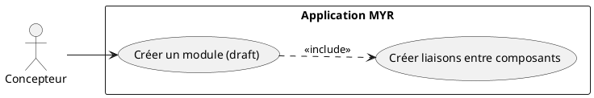
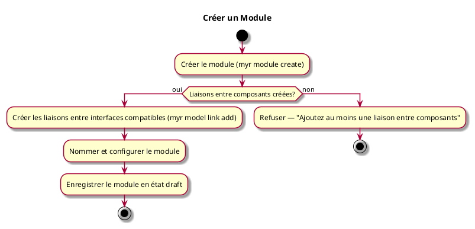

---
categorie: Module
titre: "Créer un Module"
probabilite: 3
impact: 5
importance: 15
etat: relire
tags:
  - couche/expression
  - type/use-case
  - famille/UCMOD
  - domaine/model
  - uc/UCMOD01
---

# Créer un Module

## Diagramme d'acteurs

## Contexte

Assemblage de plusieurs composants ou de Modules existants selon les compatibilités de leurs interfaces pour créer un Module à part entière.

Un module nouvellement créé est en état **draft** (brouillon) : il existe localement mais n'est pas encore ancré sur la blockchain. L'état draft est modifiable à volonté — le concepteur peut ajouter, retirer ou reconfigurer des liaisons autant de fois que nécessaire avant de publier. Un nom par défaut lui est attribué à la création (`<identité du concepteur>_<date>_<heure>`), modifiable ensuite (voir UCMOD03).

Lorsque le module est prêt, la soumission à la blockchain (voir UCMOD06) est une étape distincte et explicite. Elle crée une **ModuleVersion** immuable — snapshot figé et horodaté de l'assemblage, non modifiable après publication. Toute évolution ultérieure nécessite la création d'une nouvelle version.

Un module peut aussi être créé à partir d'un module déjà soumis (`--parent-id`), pour reprendre un travail existant sans reconstruire manuellement l'assemblage — sa composition (instances et liaisons internes) est alors dupliquée dans le nouveau brouillon.

## Pré-conditions

- Être connecté au réseau
- Avoir les droits de création
- Avoir des composants ou modules existants

## Scénario

**Étape initiale :** `myr module create --name <nom> --channel <id> [--owner-id <id>] [--description <texte>] [--license <id>]` est exécutée (ou l'appel API équivalent), pour le compte du Concepteur

### Flux nominal — Module créé (draft)

1. Le module est initialisé en état **draft**
2. Les liaisons entre les interfaces compatibles des composants sont créées (`myr model instance add` puis `myr model link add`, voir UCAM01)
3. Le module est nommé et configuré
4. Le module est enregistré en état **draft**

### Flux alternatif — Dérivation d'un module existant

1. `myr module create --parent-id <id> [--license <id>]` référence un module déjà soumis
2. Si une licence est fournie, sa compatibilité avec celle du module parent est vérifiée
3. Le nouveau module est créé en état **draft**, avec la composition complète du module parent (instances et liaisons) déjà dupliquée dedans

### Flux erreur — Aucune liaison créée

1. Le service refuse de nommer ou sauvegarder un module sans au moins un assemblage
2. Message d'erreur : "Ajoutez au moins une liaison entre composants"

### Flux erreur — Licence incompatible avec le module parent

1. Une dérivation est demandée avec une licence incompatible avec celle du module parent
2. Le service refuse la création : "Incompatibilité de licence"

## Post-conditions

- Le module est en état **draft**
- Les interfaces libres du module sont visibles
- Le module n'est pas encore visible sur le réseau (soumission requise — voir UCMOD06)

## Diagramme d'activités

<!-- liens-obsidian:begin — section de traçabilité générée à partir des références du document : ne pas l'éditer à la main -->
## Liens

**Étape suivante — analyse**
- [UCMOD01 — analyse](../../2-Analyse/UCMOD-Module/UCMOD01.md)

<!-- liens-obsidian:end -->
