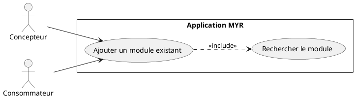
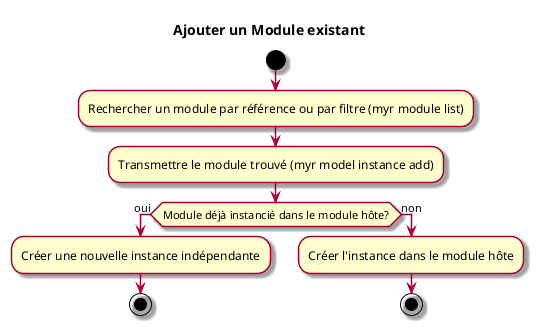

---
categorie: Module
titre: "Ajouter un Module existant"
probabilite: 3
impact: 5
importance: 15
etat: relire
tags:
  - couche/expression
  - type/use-case
  - famille/UCMOD
  - domaine/model
  - uc/UCMOD02
---

# Ajouter un Module existant

## Diagramme d'acteurs

## Contexte

Un Module déjà existant (Contrôleurs, Caméra, Visserie...) peut être ajouté comme instance dans un module hôte, par une action directe sur ce dernier.

## Pré-conditions

- Être connecté au réseau
- Module existant et disponible sur le réseau ou une boutique partenaire

## Scénario

**Étape initiale :** Un module existant est recherché par référence ou par filtre (`myr module list` / `myr model list`, ou l'appel API équivalent — voir UCREC01/UCCL01), pour le compte du Concepteur ou du Consommateur

### Flux nominal — Module ajouté

1. `myr model instance add <moduleID> <assetID>` (ou l'appel API équivalent) est exécutée avec le module trouvé — une nouvelle instance est créée dans le module hôte
2. Une fois les liaisons créées (`myr model link add`, voir UCAM01), elles sont rattachées au module hôte avec `myr module add-assembly <moduleID> <connID>`

### Flux alternatif — Module déjà instancié dans le module hôte

1. Le module ciblé possède déjà une instance dans le module hôte
2. `myr model instance add` crée une nouvelle instance indépendante à chaque appel, y compris si le module est déjà présent — chaque instance a ses propres connexions indépendantes

## Post-conditions

- Le module est disponible en tant qu'instance dans le module hôte

## Diagramme d'activités

<!-- liens-obsidian:begin — section de traçabilité générée à partir des références du document : ne pas l'éditer à la main -->
## Liens

**Navigation**
- [Carte des specs › UCMOD — Module](../../Carte_des_specs.md#UCMOD%20—%20Module)
- [UCMOD02 — couche analyse](../../2-Analyse/UCMOD-Module/UCMOD02.md)
- [Traçabilité UCMOD02 vers le code](../../../docs/code/Tracabilite_UC_Code.md#UCMOD02)

**Exigences fonctionnelles couvertes**
- [EF28 — Ajouter un module existant à l'espace de travail](../Matrice_Tracabilite.md#1.%20Exigences%20fonctionnelles%20et%20UC%20couvrant)

**Use cases cités**
- [UCAM01 — Liaison entre interfaces](../UCAM-Assemblage_Module/UCAM01.md)
- [UCCL01 — Faire une recherche par filtre](../UCCL-Composant_Lecture/UCCL01.md)
- [UCREC01 — Rechercher une référence existante](../UCREC-Recherche/UCREC01.md)

**Cité par**
- [Expression_des_besoins_Intro](../Expression_des_besoins_Intro.md)
- [Matrice_Tracabilite](../Matrice_Tracabilite.md)
- [UCAM08 (expression)](../UCAM-Assemblage_Module/UCAM08.md)
- [todo (expression)](../todo.md)
- [Analyse_des_besoins](../../2-Analyse/Analyse_des_besoins.md)
- [UCDEV02 (analyse)](../../2-Analyse/UCDEV-Developpement/UCDEV02.md)
- [UCMOD03 (analyse)](../../2-Analyse/UCMOD-Module/UCMOD03.md)
- [todo (analyse)](../../2-Analyse/todo.md)
- [Architecture_Composition](../../3-Conception/Architecture_Composition.md)
- [DC_CLI_Model](../../3-Conception/DC_CLI_Model.md)
- [Sequence_soumission_module](../../3-Conception/Sequence_soumission_module.md)
- [roadmap_dev](../../roadmap_dev.md)

<!-- liens-obsidian:end -->
