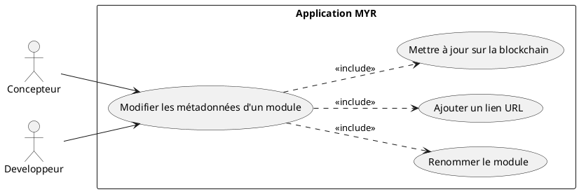
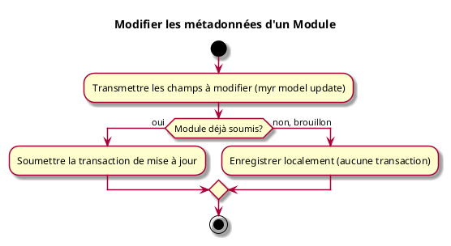

# Modifier les métadonnées d'un Module

## Diagramme d'acteurs

## Contexte

Modifier le nom, la description, la licence, les tags ou les URL de référence (fiche produit, boutique, documentation) d'un Module existant. Un module reçoit un nom généré automatiquement à sa création (voir UCMOD01) ; le renommer via cet UC est l'usage le plus courant.

Généralisation à un module de UCCE02 (« Configurer un Composant ») : mêmes champs modifiables, même mécanisme.

## Pré-conditions

- Être connecté au réseau
- Être propriétaire du module ou avoir les droits d'édition

## Scénario

**Étape initiale :** `myr model update <moduleID> [--name <nom>] [--description <texte>] [--license <id>] [--add-link <url>]` est exécutée (ou l'appel API équivalent), pour le compte du propriétaire du module

### Flux nominal — Métadonnées modifiées

1. Un ou plusieurs champs sont transmis (nom, description, licence, tags, lien)
2. Les champs transmis sont appliqués au module — les autres restent inchangés
3. La mise à jour est enregistrée localement (module brouillon) ou soumise sur la blockchain (module déjà soumis)

### Flux erreur — Droits insuffisants ou champ invalide

1. Le service refuse la mise à jour et retourne un message d'erreur explicite

## Post-conditions

- Les métadonnées modifiées sont associées au module
- Le statut du module (`draft`/`submitted`) n'est pas modifié par cet UC

## Diagramme d'activités

<!-- liens-obsidian:begin — section de traçabilité générée à partir des références du document : ne pas l'éditer à la main -->
## Liens

**Navigation**
- [Carte des specs › UCMOD — Module](../../Carte_des_specs.md#UCMOD%20—%20Module)
- [UCMOD03 — couche analyse](../../2-Analyse/UCMOD-Module/UCMOD03.md)
- [Traçabilité UCMOD03 vers le code](../../../docs/code/Tracabilite_UC_Code.md#UCMOD03)

**Exigences fonctionnelles couvertes**
- [EF61 — Modifier les métadonnées d'un module (nom, description, licence, tags, liens)](../Matrice_Tracabilite.md#1.%20Exigences%20fonctionnelles%20et%20UC%20couvrant)

**Use cases cités**
- [UCCE02 — Configurer un Composant](../UCCE-Composant_Ecriture/UCCE02.md)
- [UCMOD01 — Créer un Module](UCMOD01.md)

**Cité par**
- [Expression_des_besoins_Intro](../Expression_des_besoins_Intro.md)
- [Matrice_Tracabilite](../Matrice_Tracabilite.md)
- [UCMOD01 (expression)](UCMOD01.md)
- [todo (expression)](../todo.md)
- [Analyse_des_besoins](../../2-Analyse/Analyse_des_besoins.md)
- [UCCE02 (analyse)](../../2-Analyse/UCCE-Composant_Ecriture/UCCE02.md)
- [UCDEV02 (analyse)](../../2-Analyse/UCDEV-Developpement/UCDEV02.md)
- [UCMOD01 (analyse)](../../2-Analyse/UCMOD-Module/UCMOD01.md)
- [todo (analyse)](../../2-Analyse/todo.md)
- [API_REST](../../3-Conception/API_REST.md)
- [Architecture_Composition](../../3-Conception/Architecture_Composition.md)
- [DC_CLI_Model](../../3-Conception/DC_CLI_Model.md)
- [roadmap_dev](../../roadmap_dev.md)

<!-- liens-obsidian:end -->
