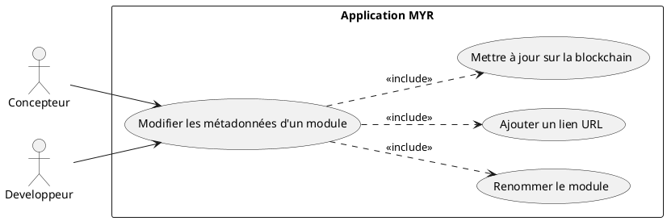
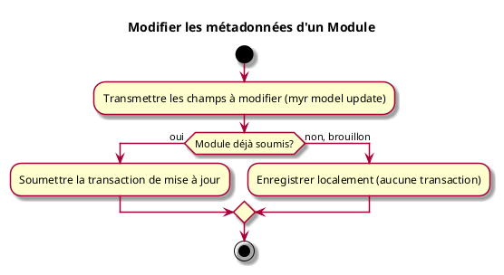

# Modifier les métadonnées d'un Module

## Diagramme d'acteurs

## Contexte

Modifier le nom, la description, la licence, les tags ou les URL de référence (fiche produit, boutique, documentation) d'un Module existant. Un module reçoit un nom généré automatiquement à sa création (voir UCMOD01) ; le renommer via cet UC est l'usage le plus courant.

Généralisation à un module de UCCE02 (« Configurer un Composant ») : mêmes champs modifiables, même mécanisme.

## Pré-conditions

- Être connecté au réseau
- Être propriétaire du module ou avoir les droits d'édition

## Scénario

**Étape initiale :** `myr model update <moduleID> [--name <nom>] [--description <texte>] [--license <id>] [--add-link <url>]` est exécutée (ou l'appel API équivalent), pour le compte du propriétaire du module

### Flux nominal — Métadonnées modifiées

1. Un ou plusieurs champs sont transmis (nom, description, licence, tags, lien)
2. Les champs transmis sont appliqués au module — les autres restent inchangés
3. La mise à jour est enregistrée localement (module brouillon) ou soumise sur la blockchain (module déjà soumis)

### Flux erreur — Droits insuffisants ou champ invalide

1. Le service refuse la mise à jour et retourne un message d'erreur explicite

## Post-conditions

- Les métadonnées modifiées sont associées au module
- Le statut du module (`draft`/`submitted`) n'est pas modifié par cet UC

## Diagramme d'activités

