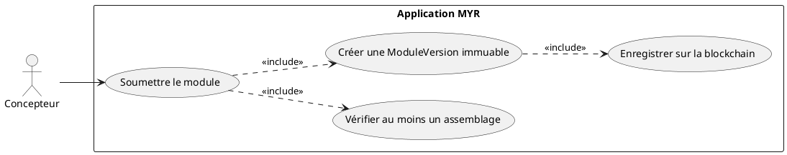
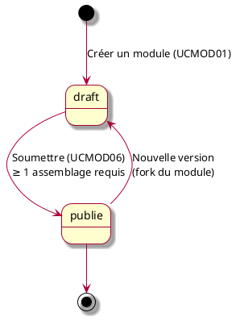
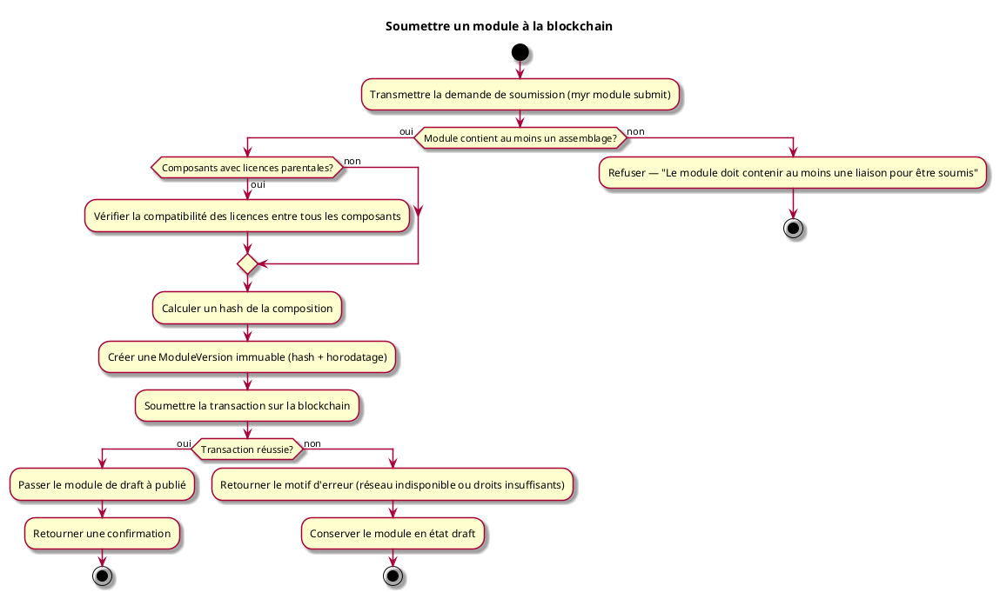

---
categorie: Module
titre: "Soumettre un module à la blockchain"
probabilite: 3
impact: 5
importance: 15
etat: relire
tags:
  - couche/expression
  - type/use-case
  - famille/UCMOD
  - domaine/model
  - uc/UCMOD06
  - rm/RM17
---

# Soumettre un module à la blockchain

## Diagramme d'acteurs

## Contexte

Un module en état **draft** (voir UCMOD01) peut être soumis à la blockchain par son auteur. Cette soumission crée une **ModuleVersion** immuable horodatée avec un hash de l'assemblage. Une fois soumis, le module est visible sur le réseau et ne peut plus être modifié — toute évolution nécessite une nouvelle version.

## Pré-conditions

- Être connecté au réseau
- Être propriétaire du module
- Le module doit être en état **draft**
- Le module doit contenir **au moins un assemblage** (liaison entre composants)

## Scénario

**Étape initiale :** `myr module submit <moduleID> [--note <texte>]` est exécutée (ou l'appel API équivalent), pour le compte du propriétaire du module

### Flux nominal — Soumission réussie

1. Le service vérifie que le module contient au moins un assemblage (RM17)
2. Un hash de la composition est calculé
3. Une `ModuleVersion` immuable est créée avec le hash et l'horodatage
4. La transaction est soumise sur la blockchain
5. Le module passe de l'état **draft** à l'état **publié**
6. Une confirmation est retournée

### Flux alternatif — Module avec composants sous licences parentales

1. Le module contient des composants dérivés d'assets parents avec des licences définies
2. Avant la soumission, le service vérifie automatiquement la compatibilité des licences entre tous les composants du module
3. Toutes les licences sont compatibles : la soumission se poursuit normalement
4. La transaction blockchain inclut la liste des dépendances de licences vérifiées

### Flux erreur — Aucun assemblage

1. Le service détecte l'absence de liaison entre composants
2. Message d'erreur : "Le module doit contenir au moins une liaison pour être soumis" (RM17)

### Flux erreur — Échec de la transaction blockchain

1. La transaction échoue (réseau indisponible, droits insuffisants)
2. Message d'erreur explicite avec le motif
3. Le module reste en état **draft** — aucune donnée n'est perdue

## Post-conditions

- La `ModuleVersion` est enregistrée sur la blockchain de manière immuable
- Le module est visible sur le réseau par les autres utilisateurs
- Toute modification ultérieure nécessite la création d'une nouvelle version

## Diagramme

### Cycle de vie d'un module

### Diagramme d'activités

<!-- liens-obsidian:begin — section de traçabilité générée à partir des références du document : ne pas l'éditer à la main -->
## Liens

**Navigation**
- [Carte des specs › UCMOD — Module](../../Carte_des_specs.md#UCMOD%20—%20Module)
- [UCMOD06 — couche analyse](../../2-Analyse/UCMOD-Module/UCMOD06.md)
- [Traçabilité UCMOD06 vers le code](../../../docs/code/Tracabilite_UC_Code.md#UCMOD06)

**Exigences fonctionnelles couvertes**
- [EF16 — Vérifier la compatibilité de licence lors d'une dérivation](../Matrice_Tracabilite.md#1.%20Exigences%20fonctionnelles%20et%20UC%20couvrant)
- [EF27 — Soumettre un module à la blockchain (ModuleVersion immuable)](../Matrice_Tracabilite.md#1.%20Exigences%20fonctionnelles%20et%20UC%20couvrant)

**Use cases cités**
- [UCMOD01 — Créer un Module](UCMOD01.md)

**Règles métier**
- [RM17 — Assemblage requis pour soumission (module uniquement)](../Regles_Metier.md#5.%20Modules%20et%20cycle%20de%20vie%20des%20assets)

**Cité par**
- [Expression_des_besoins_Intro](../Expression_des_besoins_Intro.md)
- [Matrice_Tracabilite](../Matrice_Tracabilite.md)
- [UCMOD01 (expression)](UCMOD01.md)
- [todo (expression)](../todo.md)
- [Analyse_des_besoins](../../2-Analyse/Analyse_des_besoins.md)
- [UCDEV02 (analyse)](../../2-Analyse/UCDEV-Developpement/UCDEV02.md)
- [UCMOD01 (analyse)](../../2-Analyse/UCMOD-Module/UCMOD01.md)
- [UCMOD03 (analyse)](../../2-Analyse/UCMOD-Module/UCMOD03.md)
- [todo (analyse)](../../2-Analyse/todo.md)
- [Architecture_Composition](../../3-Conception/Architecture_Composition.md)
- [Chaincode](../../3-Conception/Chaincode.md)
- [DC_CLI_Model](../../3-Conception/DC_CLI_Model.md)
- [Sequence_soumission_module](../../3-Conception/Sequence_soumission_module.md)
- [roadmap_dev](../../roadmap_dev.md)

<!-- liens-obsidian:end -->
