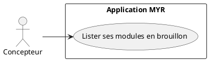
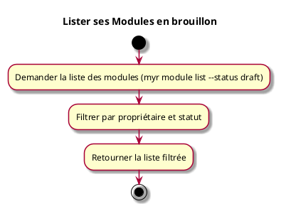

# Lister ses Modules en brouillon

## Diagramme d'acteurs

## Contexte

Retrouver la liste de ses propres modules encore en brouillon (non soumis), pour continuer un travail déjà commencé sans reconstruire ni recharger l'ensemble du catalogue.

## Pré-conditions

- Être connecté au réseau

## Scénario

**Étape initiale :** `myr module list --owner-id <id> --status draft` est exécutée (ou l'appel API équivalent `GET /api/modules?owner_id=&status=draft`)

### Flux nominal — Modules en brouillon retournés

1. Les modules sont filtrés par propriétaire et par statut `draft`
2. La liste résultante est retournée au client

## Post-conditions

- Seuls les modules correspondant aux filtres sont retournés

## Diagramme d'activités

<!-- liens-obsidian:begin — section de traçabilité générée à partir des références du document : ne pas l'éditer à la main -->
## Liens

**Navigation**
- [Carte des specs › UCMOD — Module](../../Carte_des_specs.md#UCMOD%20—%20Module)
- [UCMOD07 — couche analyse](../../2-Analyse/UCMOD-Module/UCMOD07.md)
- [Traçabilité UCMOD07 vers le code](../../../docs/code/Tracabilite_UC_Code.md#UCMOD07)

**Exigences fonctionnelles couvertes**
- [EF63 — Lister ses modules en brouillon, filtrés par propriétaire et par statut](../Matrice_Tracabilite.md#1.%20Exigences%20fonctionnelles%20et%20UC%20couvrant)

**Cité par**
- [Matrice_Tracabilite](../Matrice_Tracabilite.md)
- [roadmap_dev](../../roadmap_dev.md)

<!-- liens-obsidian:end -->
