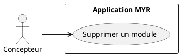
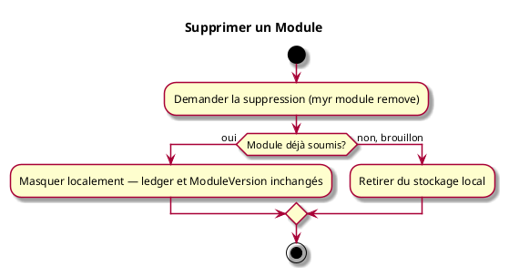

# Supprimer un Module

## Diagramme d'acteurs

## Contexte

Un module qui n'a plus d'usage doit pouvoir être supprimé par son propriétaire, qu'il soit encore en brouillon ou déjà soumis — comportement identique à la suppression d'un composant (UCCE07). Un module soumis ne peut jamais être retiré de la blockchain (RM06) : le supprimer le masque des listes du système sans toucher à son enregistrement blockchain ni à ses `ModuleVersion`. Le Concepteur peut ainsi soit le supprimer, soit le conserver pour le dériver plus tard sans reconstruire sa composition (voir UCMOD01).

## Pré-conditions

- Être connecté au réseau
- Être propriétaire du module

## Scénario

**Étape initiale :** `myr module remove <id>` est exécutée (ou l'appel API équivalent `DELETE /api/modules/:id`)

### Flux nominal — Module en brouillon

1. Le module, jamais soumis, est retiré du stockage local
2. Il n'existe plus nulle part

### Flux nominal — Module déjà soumis

1. Le module est masqué des listes retournées par le système
2. Son enregistrement blockchain, y compris ses `ModuleVersion`, reste inchangé et consultable par identifiant direct

## Post-conditions

- Le module n'apparaît plus dans les listes
- Son enregistrement blockchain (s'il existait) n'est jamais modifié

## Diagramme d'activités

<!-- liens-obsidian:begin — section de traçabilité générée à partir des références du document : ne pas l'éditer à la main -->
## Liens

**Étape suivante — analyse**
- [UCMOD08 — analyse](../../2-Analyse/UCMOD-Module/UCMOD08.md)

<!-- liens-obsidian:end -->
