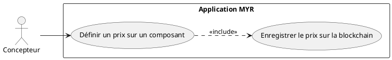
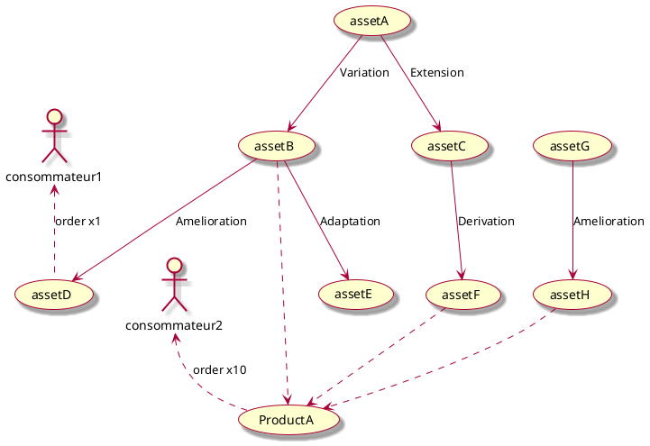
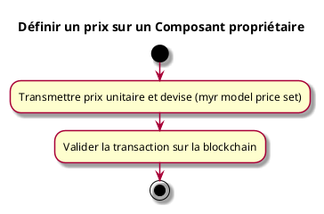

---
categorie: Propriété Intellectuelle
titre: "Définir un prix sur un Composant proprietaire"
probabilite: 3
impact: 5
importance: 15
etat: relire
tags:
  - couche/expression
  - type/use-case
  - famille/UCPI
  - domaine/model
  - domaine/payment
  - uc/UCPI04
  - rm/RM03
  - rm/RM23
  - rm/RM24
  - rm/RM31
  - rm/RM33
  - relecture/question
---

# Définir un prix sur un Composant proprietaire

## Diagramme d'acteurs

## Contexte

L'auteur d'un composant peut définir un prix unitaire pour l'utilisation commerciale ou la commande de celui-ci, enregistré sur la blockchain.

Conformément au principe de parité CLI/REST, la définition d'un prix sur un composant doit être exposable en CLI au même titre que via l'interface graphique.

## Pré-conditions

- Être connecté au réseau
- Être propriétaire du composant
- Avoir les droits de tarification

## Scénario

**Étape initiale :** `myr model price set <id> <montant> --currency <devise>` est exécutée (ou l'appel API équivalent), pour le compte du propriétaire du composant

### Flux nominal — Prix défini

1. Le prix unitaire et la devise sont transmis
2. La transaction est validée sur la blockchain

## Post-conditions

- Le prix est enregistré sur le réseau et appliqué lors des commandes

## Diagrammes

### Arbre de dérivation des assets et impact sur la tarification

Le prix d'un composant dérivé est fixé librement par son propriétaire (RM31, RM33), indépendamment du prix de ses parents. La compatibilité de licence avec chaque composant parent de la chaîne de dérivation est vérifiée séparément, à la soumission (RM03).

#question La distribution de commission (RM23/RM24) traverse-t-elle la chaîne de dérivation (un auteur reçoit-il une part quand un composant dérivé de son travail est vendu) ou se limite-t-elle à la composition d'un module (seuls les auteurs des composants directement inclus dans le module livré sont rémunérés) ? Voir `specs/1-Expression/Regles_Metier.md` RM23 pour le détail de l'ambiguïté.

### Diagramme d'activités

<!-- liens-obsidian:begin — section de traçabilité générée à partir des références du document : ne pas l'éditer à la main -->
## Liens

**Navigation**
- [Carte des specs › UCPI — Propriete Intellectuelle](../../Carte_des_specs.md#UCPI%20—%20Propriete%20Intellectuelle)
- [UCPI04 — couche analyse](../../2-Analyse/UCPI-Propriete_Intellectuelle/UCPI04.md)
- [Traçabilité UCPI04 vers le code](../../../docs/code/Tracabilite_UC_Code.md#UCPI04)

**Exigences fonctionnelles couvertes**
- [EF32 — Définir un prix sur un composant propriétaire](../Matrice_Tracabilite.md#1.%20Exigences%20fonctionnelles%20et%20UC%20couvrant)

**Règles métier**
- [RM03 — Compatibilité de licence](../Regles_Metier.md#1.%20Assets%20et%20composants)
- [RM23 — Distribution automatique des commissions](../Regles_Metier.md#7.%20Propriété%20intellectuelle%20et%20commissions)
- [RM24 — Répartition proportionnelle multi-auteurs](../Regles_Metier.md#7.%20Propriété%20intellectuelle%20et%20commissions)
- [RM31 — Modification de prix — effet sur les commandes futures uniquement](../Regles_Metier.md#7.%20Propriété%20intellectuelle%20et%20commissions)
- [RM33 — Devise unique par réseau](../Regles_Metier.md#7.%20Propriété%20intellectuelle%20et%20commissions)

**Documents cités**
- [Regles_Metier](../Regles_Metier.md)

**Cité par**
- [Expression_des_besoins_Intro](../Expression_des_besoins_Intro.md)
- [Matrice_Tracabilite](../Matrice_Tracabilite.md)
- [UCPI03 (expression)](UCPI03.md)
- [UCPI11 (expression)](UCPI11.md)
- [todo (expression)](../todo.md)
- [Analyse_des_besoins](../../2-Analyse/Analyse_des_besoins.md)
- [UCAUT02 (analyse)](../../2-Analyse/UCAUT-Automatisation/UCAUT02.md)
- [UCPI03 (analyse)](../../2-Analyse/UCPI-Propriete_Intellectuelle/UCPI03.md)
- [UCPI05 (analyse)](../../2-Analyse/UCPI-Propriete_Intellectuelle/UCPI05.md)
- [UCPI11 (analyse)](../../2-Analyse/UCPI-Propriete_Intellectuelle/UCPI11.md)
- [UCREC05 (analyse)](../../2-Analyse/UCREC-Recherche/UCREC05.md)
- [todo (analyse)](../../2-Analyse/todo.md)
- [API_REST](../../3-Conception/API_REST.md)
- [Chaincode](../../3-Conception/Chaincode.md)
- [DC_CLI_Model](../../3-Conception/DC_CLI_Model.md)
- [DC_D7_Payment](../../3-Conception/DC_D7_Payment.md)
- [DC_D8_Recherche](../../3-Conception/DC_D8_Recherche.md)
- [todo (conception)](../../3-Conception/todo.md)
- [roadmap_dev](../../roadmap_dev.md)

<!-- liens-obsidian:end -->
