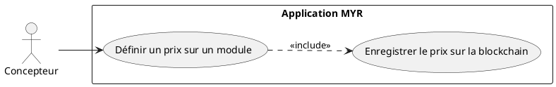
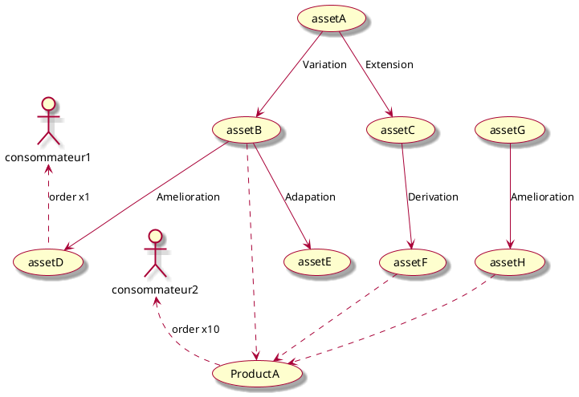
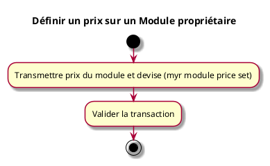

---
categorie: Propriété Intellectuelle
titre: "Définir un prix sur un Module proprietaire"
probabilite: 3
impact: 5
importance: 15
etat: relire
tags:
  - couche/expression
  - type/use-case
  - famille/UCPI
  - domaine/model
  - domaine/payment
  - uc/UCPI05
  - rm/RM23
  - rm/RM24
  - rm/RM30
---

# Définir un prix sur un Module proprietaire

## Diagramme d'acteurs

## Contexte

L'auteur d'un module peut définir un prix pour l'utilisation commerciale ou la commande de celui-ci.

Conformément au principe de parité CLI/REST, la définition d'un prix sur un module doit être exposable en CLI au même titre que via l'interface graphique.

## Pré-conditions

- Être connecté au réseau
- Être propriétaire du module
- Avoir les droits de tarification

## Scénario

**Étape initiale :** `myr module price set <id> <montant> --currency <devise>` est exécutée (ou l'appel API équivalent), pour le compte du propriétaire du module

### Flux nominal — Prix défini

1. Le prix du module et la devise sont transmis
2. La transaction est validée

## Post-conditions

- Le prix du module est enregistré sur le réseau
- Le prix agrège les commissions des composants constitutifs

## Diagrammes

### Arbre de dérivation des assets et agrégation du prix d'un module

Le prix d'un module (ProductA) agrège les prix unitaires de chaque composant constitutif (assetB, assetF, assetH) — RM30. Les commissions dues à chaque auteur sont calculées séparément, au moment de la livraison de la commande (RM23/RM24), à partir de ce prix agrégé — elles ne sont pas "remontées" dans le prix lui-même.

### Diagramme d'activités

<!-- liens-obsidian:begin — section de traçabilité générée à partir des références du document : ne pas l'éditer à la main -->
## Liens

**Navigation**
- [Carte des specs › UCPI — Propriete Intellectuelle](../../Carte_des_specs.md#UCPI%20—%20Propriete%20Intellectuelle)
- [UCPI05 — couche analyse](../../2-Analyse/UCPI-Propriete_Intellectuelle/UCPI05.md)
- [Traçabilité UCPI05 vers le code](../../../docs/code/Tracabilite_UC_Code.md#UCPI05)

**Exigences fonctionnelles couvertes**
- [EF33 — Définir un prix sur un module propriétaire](../Matrice_Tracabilite.md#1.%20Exigences%20fonctionnelles%20et%20UC%20couvrant)

**Règles métier**
- [RM23 — Distribution automatique des commissions](../Regles_Metier.md#7.%20Propriété%20intellectuelle%20et%20commissions)
- [RM24 — Répartition proportionnelle multi-auteurs](../Regles_Metier.md#7.%20Propriété%20intellectuelle%20et%20commissions)
- [RM30 — Calcul automatique du prix d'un module](../Regles_Metier.md#7.%20Propriété%20intellectuelle%20et%20commissions)

**Cité par**
- [Expression_des_besoins_Intro](../Expression_des_besoins_Intro.md)
- [Matrice_Tracabilite](../Matrice_Tracabilite.md)
- [UCPI03 (expression)](UCPI03.md)
- [UCPI11 (expression)](UCPI11.md)
- [todo (expression)](../todo.md)
- [Analyse_des_besoins](../../2-Analyse/Analyse_des_besoins.md)
- [UCAUT02 (analyse)](../../2-Analyse/UCAUT-Automatisation/UCAUT02.md)
- [UCPI03 (analyse)](../../2-Analyse/UCPI-Propriete_Intellectuelle/UCPI03.md)
- [UCPI11 (analyse)](../../2-Analyse/UCPI-Propriete_Intellectuelle/UCPI11.md)
- [UCREC05 (analyse)](../../2-Analyse/UCREC-Recherche/UCREC05.md)
- [todo (analyse)](../../2-Analyse/todo.md)
- [Chaincode](../../3-Conception/Chaincode.md)
- [DC_CLI_Model](../../3-Conception/DC_CLI_Model.md)
- [DC_D7_Payment](../../3-Conception/DC_D7_Payment.md)
- [DC_D8_Recherche](../../3-Conception/DC_D8_Recherche.md)
- [todo (conception)](../../3-Conception/todo.md)
- [roadmap_dev](../../roadmap_dev.md)

<!-- liens-obsidian:end -->
