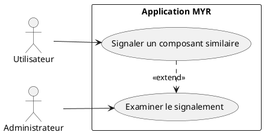
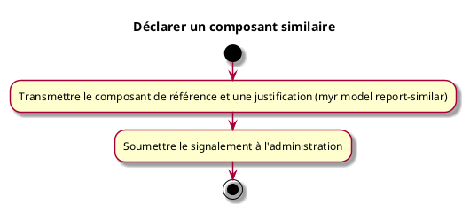

---
categorie: Propriété Intellectuelle
titre: "Déclarer un composant similaire"
probabilite: 1
impact: 5
importance: 5
etat: relire
tags:
  - couche/expression
  - type/use-case
  - famille/UCPI
  - domaine/model
  - domaine/payment
  - uc/UCPI06
  - rm/RM01
---

# Déclarer un composant similaire

## Diagramme d'acteurs

## Contexte

Signaler un composant similaire à un autre non pris en compte par le système. Forme de protection communautaire pour garantir la pertinence et l'intégrité du réseau, complémentaire à RM01.

Conformément au principe de parité CLI/REST, le signalement d'un composant similaire doit pouvoir être initié en CLI pour le compte d'un utilisateur, au même titre que via l'interface graphique.

## Pré-conditions

- Être connecté au réseau
- Avoir identifié deux composants similaires non liés dans le système

## Scénario

**Étape initiale :** `myr model report-similar <id> <referenceID>` est exécutée (ou l'appel API équivalent)

### Flux nominal — Signalement soumis

1. Le composant de référence (similaire existant) est transmis
2. Une justification est ajoutée
3. Le signalement est soumis à l'administration

## Post-conditions

- Le signalement est enregistré et soumis à l'examen de l'administration

## Diagramme d'activités

<!-- liens-obsidian:begin — section de traçabilité générée à partir des références du document : ne pas l'éditer à la main -->
## Liens

**Navigation**
- [Carte des specs › UCPI — Propriete Intellectuelle](../../Carte_des_specs.md#UCPI%20—%20Propriete%20Intellectuelle)
- [UCPI06 — couche analyse](../../2-Analyse/UCPI-Propriete_Intellectuelle/UCPI06.md)
- [Traçabilité UCPI06 vers le code](../../../docs/code/Tracabilite_UC_Code.md#UCPI06)

**Exigences fonctionnelles couvertes**
- [EF34 — Signaler un composant similaire à un existant](../Matrice_Tracabilite.md#1.%20Exigences%20fonctionnelles%20et%20UC%20couvrant)

**Règles métier**
- [RM01 — Anti-plagiat obligatoire](../Regles_Metier.md#1.%20Assets%20et%20composants)

**Cité par**
- [Expression_des_besoins_Intro](../Expression_des_besoins_Intro.md)
- [Matrice_Tracabilite](../Matrice_Tracabilite.md)
- [todo (expression)](../todo.md)
- [Analyse_des_besoins](../../2-Analyse/Analyse_des_besoins.md)
- [UCAUT03 (analyse)](../../2-Analyse/UCAUT-Automatisation/UCAUT03.md)
- [todo (analyse)](../../2-Analyse/todo.md)
- [DC_CLI_Model](../../3-Conception/DC_CLI_Model.md)
- [DC_D7_Payment](../../3-Conception/DC_D7_Payment.md)
- [todo (conception)](../../3-Conception/todo.md)
- [roadmap_dev](../../roadmap_dev.md)

<!-- liens-obsidian:end -->
