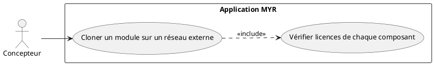
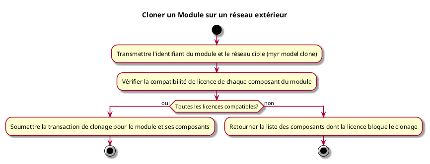

# Cloner un Module sur un réseau exterieur

## Diagramme d'acteurs

## Contexte

Un module peut être cloné vers un réseau MYR externe, ce qui implique la vérification de licence de tous ses composants constitutifs.

Conformément au principe de parité CLI/REST, le clonage d'un module vers un réseau externe doit pouvoir être déclenché en CLI, au même titre que via l'interface graphique.

## Pré-conditions

- Être connecté au réseau source
- Avoir les droits de clonage sur le module et tous ses composants
- Réseau de destination accessible

## Scénario

**Étape initiale :** `myr model clone <id> --target-network <id>` est exécutée (ou l'appel API équivalent)

### Flux nominal — Clonage autorisé

1. Le réseau de destination est transmis
2. Le système vérifie la compatibilité de licence de chaque composant du module
3. La transaction de clonage est soumise pour le module et ses composants sur les deux réseaux

### Flux erreur — Licence incompatible sur un composant

1. Erreur métier : liste des composants dont la licence bloque le clonage

## Post-conditions

- Le module et ses composants sont disponibles sur le réseau de destination

## Diagramme d'activités

<!-- liens-obsidian:begin — section de traçabilité générée à partir des références du document : ne pas l'éditer à la main -->
## Liens

**Navigation**
- [Carte des specs › UCPI — Propriete Intellectuelle](../../Carte_des_specs.md#UCPI%20—%20Propriete%20Intellectuelle)
- [UCPI09 — couche analyse](../../2-Analyse/UCPI-Propriete_Intellectuelle/UCPI09.md)
- [Traçabilité UCPI09 vers le code](../../../docs/code/Tracabilite_UC_Code.md#UCPI09)

**Exigences fonctionnelles couvertes**
- [EF37 — Cloner un module sur un réseau externe](../Matrice_Tracabilite.md#1.%20Exigences%20fonctionnelles%20et%20UC%20couvrant)

**Cité par**
- [Expression_des_besoins_Intro](../Expression_des_besoins_Intro.md)
- [Matrice_Tracabilite](../Matrice_Tracabilite.md)
- [todo (expression)](../todo.md)
- [Analyse_des_besoins](../../2-Analyse/Analyse_des_besoins.md)
- [todo (analyse)](../../2-Analyse/todo.md)
- [DC_CLI_Model](../../3-Conception/DC_CLI_Model.md)
- [DC_D7_Payment](../../3-Conception/DC_D7_Payment.md)
- [todo (conception)](../../3-Conception/todo.md)
- [roadmap_dev](../../roadmap_dev.md)

<!-- liens-obsidian:end -->
