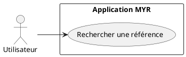
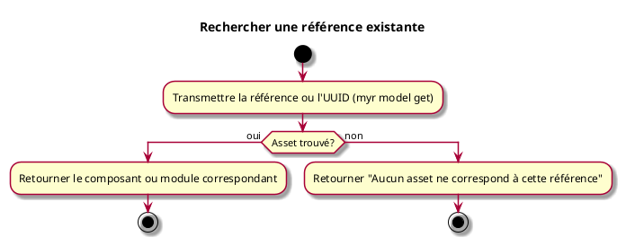

---
categorie: Recherche
titre: "Rechercher une référence existante"
probabilite: 4
impact: 5
importance: 20
etat: relire
tags:
  - couche/expression
  - type/use-case
  - famille/UCREC
  - domaine/model
  - uc/UCREC01
---

# Rechercher une référence existante

## Diagramme d'acteurs

## Contexte

La recherche par référence permet de trouver précisément un composant ou un module par son identifiant ou sa référence exacte.

## Pré-conditions

- Être connecté au réseau

## Scénario

**Étape initiale :** `myr model get <id>` est exécutée avec la référence ou l'UUID recherché (ou l'appel API équivalent)

### Flux nominal — Référence trouvée

1. Le composant ou module correspondant est retourné

### Flux nominal — Référence introuvable

1. La réponse indique qu'aucun asset ne correspond à cette référence

### Flux alternatif — Référence exacte inconnue

1. `myr model list [--channel <id>]` permet de parcourir les assets du canal pour retrouver la référence recherchée

## Post-conditions

- L'asset trouvé est disponible pour consultation ou édition (voir UCCE02)

## Diagramme d'activités

<!-- liens-obsidian:begin — section de traçabilité générée à partir des références du document : ne pas l'éditer à la main -->
## Liens

**Navigation**
- [Carte des specs › UCREC — Recherche](../../Carte_des_specs.md#UCREC%20—%20Recherche)
- [UCREC01 — couche analyse](../../2-Analyse/UCREC-Recherche/UCREC01.md)
- [Traçabilité UCREC01 vers le code](../../../docs/code/Tracabilite_UC_Code.md#UCREC01)

**Exigences fonctionnelles couvertes**
- [EF39 — Rechercher un asset par référence ou filtre](../Matrice_Tracabilite.md#1.%20Exigences%20fonctionnelles%20et%20UC%20couvrant)

**Use cases cités**
- [UCCE02 — Configurer un Composant](../UCCE-Composant_Ecriture/UCCE02.md)

**Cité par**
- [Expression_des_besoins_Intro](../Expression_des_besoins_Intro.md)
- [Matrice_Tracabilite](../Matrice_Tracabilite.md)
- [UCMOD02 (expression)](../UCMOD-Module/UCMOD02.md)
- [todo (expression)](../todo.md)
- [Analyse_des_besoins](../../2-Analyse/Analyse_des_besoins.md)
- [UCMOD02 (analyse)](../../2-Analyse/UCMOD-Module/UCMOD02.md)
- [todo (analyse)](../../2-Analyse/todo.md)
- [Chaincode](../../3-Conception/Chaincode.md)
- [DC_CLI_Model](../../3-Conception/DC_CLI_Model.md)
- [DC_D8_Recherche](../../3-Conception/DC_D8_Recherche.md)
- [roadmap_dev](../../roadmap_dev.md)

<!-- liens-obsidian:end -->
