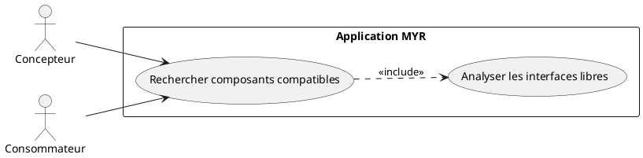
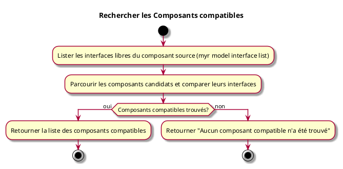

---
categorie: Recherche
titre: "Rechercher les Composants compatibles"
probabilite: 3
impact: 4
importance: 12
etat: relire
tags:
  - couche/expression
  - type/use-case
  - famille/UCREC
  - domaine/model
  - uc/UCREC02
  - rm/RM10
  - rm/RM11
---

# Rechercher les Composants compatibles

## Diagramme d'acteurs

## Contexte

À partir d'un composant sélectionné, lister tous les composants du réseau dont les interfaces sont compatibles avec les interfaces libres de celui-ci.

## Pré-conditions

- Être connecté au réseau
- Avoir un identifiant de composant source
- Recherche approximative uniquement — sans application de l'algorithme de compatibilité (voir flux nominal)

## Scénario

**Étape initiale :** Les interfaces libres du composant source sont listées (`myr model interface list <assetID>`, ou l'appel API équivalent)

### Flux nominal — Compatibles trouvés (recherche approximative)

1. Les interfaces libres du composant source sont récupérées
2. Les composants candidats du réseau sont parcourus (`myr model list [--channel <id>]`) et leurs interfaces comparées (`myr model interface list <candidateID>`)
3. La liste des composants compatibles est retournée — cette comparaison manuelle n'applique pas l'algorithme de compatibilité (RM10/RM11)

### Flux nominal — Aucun compatible

1. La réponse indique qu'aucun composant compatible n'a été trouvé

## Post-conditions

- La liste des composants compatibles avec le composant sélectionné est affichée

## Diagramme d'activités

<!-- liens-obsidian:begin — section de traçabilité générée à partir des références du document : ne pas l'éditer à la main -->
## Liens

**Navigation**
- [Carte des specs › UCREC — Recherche](../../Carte_des_specs.md#UCREC%20—%20Recherche)
- [UCREC02 — couche analyse](../../2-Analyse/UCREC-Recherche/UCREC02.md)
- [Traçabilité UCREC02 vers le code](../../../docs/code/Tracabilite_UC_Code.md#UCREC02)

**Exigences fonctionnelles couvertes**
- [EF40 — Identifier les composants compatibles entre eux (interfaces)](../Matrice_Tracabilite.md#1.%20Exigences%20fonctionnelles%20et%20UC%20couvrant)

**Règles métier**
- [RM10 — Vérification de compatibilité automatique](../Regles_Metier.md#3.%20Interfaces%20et%20liaisons)
- [RM11 — Critères de compatibilité d'interfaces](../Regles_Metier.md#3.%20Interfaces%20et%20liaisons)

**Cité par**
- [Expression_des_besoins_Intro](../Expression_des_besoins_Intro.md)
- [Matrice_Tracabilite](../Matrice_Tracabilite.md)
- [todo (expression)](../todo.md)
- [Analyse_des_besoins](../../2-Analyse/Analyse_des_besoins.md)
- [todo (analyse)](../../2-Analyse/todo.md)
- [API_REST](../../3-Conception/API_REST.md)
- [DC_CLI_Model](../../3-Conception/DC_CLI_Model.md)
- [DC_D8_Recherche](../../3-Conception/DC_D8_Recherche.md)
- [todo (conception)](../../3-Conception/todo.md)
- [roadmap_dev](../../roadmap_dev.md)

<!-- liens-obsidian:end -->
