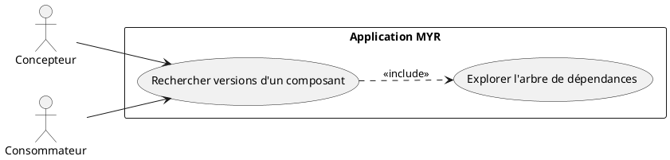
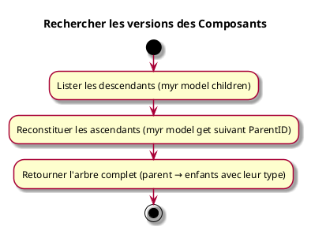

---
categorie: Recherche
titre: "Rechercher les versions des Composants"
probabilite: 3
impact: 4
importance: 12
tags:
  - couche/expression
  - type/use-case
  - famille/UCREC
  - domaine/model
  - uc/UCREC03
---

# Rechercher les versions des Composants

## Diagramme d'acteurs

## Contexte

À partir d'un composant, lister les différentes versions qu'elles soient parentes ou enfants (améliorations, variations, adaptations, extensions, dérivations...).

## Pré-conditions

- Être connecté au réseau
- Avoir un identifiant de composant

## Scénario

**Étape initiale :** Les descendants directs et récursifs sont listés (`myr model children <parentID>`, ou l'appel API équivalent)

### Flux nominal — Arbre de versions retourné

1. Les descendants directs et récursifs sont listés (`myr model children <parentID>`)
2. Les ascendants sont reconstitués par appels successifs à `myr model get <parentID>` en suivant `ParentID` jusqu'à la racine
3. L'arbre complet (ascendants + descendants) est recomposé, avec le type de chaque version (AMELIORATION, VARIATION, ADAPTATION...)

## Post-conditions

- L'arbre complet des versions du composant est visible

## Diagramme d'activités

<!-- liens-obsidian:begin — section de traçabilité générée à partir des références du document : ne pas l'éditer à la main -->
## Liens

**Navigation**
- [Carte des specs › UCREC — Recherche](../../Carte_des_specs.md#UCREC%20—%20Recherche)
- [UCREC03 — couche analyse](../../2-Analyse/UCREC-Recherche/UCREC03.md)
- [Traçabilité UCREC03 vers le code](../../../docs/code/Tracabilite_UC_Code.md#UCREC03)

**Exigences fonctionnelles couvertes**
- [EF41 — Consulter l'arbre de versions d'un composant](../Matrice_Tracabilite.md#1.%20Exigences%20fonctionnelles%20et%20UC%20couvrant)

**Cité par**
- [Expression_des_besoins_Intro](../Expression_des_besoins_Intro.md)
- [Matrice_Tracabilite](../Matrice_Tracabilite.md)
- [todo (expression)](../todo.md)
- [Analyse_des_besoins](../../2-Analyse/Analyse_des_besoins.md)
- [todo (analyse)](../../2-Analyse/todo.md)
- [API_REST](../../3-Conception/API_REST.md)
- [DC_CLI_Model](../../3-Conception/DC_CLI_Model.md)
- [DC_D8_Recherche](../../3-Conception/DC_D8_Recherche.md)
- [todo (conception)](../../3-Conception/todo.md)
- [roadmap_dev](../../roadmap_dev.md)

<!-- liens-obsidian:end -->
