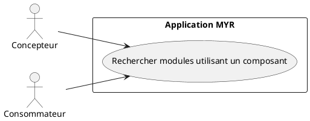
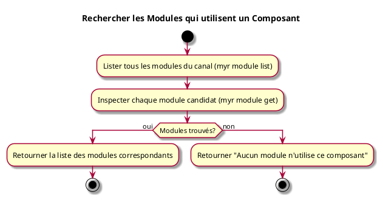

---
categorie: Recherche
titre: "Rechercher les Modules qui utilisent un Composant"
probabilite: 3
impact: 4
importance: 12
tags:
  - couche/expression
  - type/use-case
  - famille/UCREC
  - domaine/model
  - uc/UCREC04
---

# Rechercher les Modules qui utilisent un Composant

## Diagramme d'acteurs

## Contexte

À partir d'un composant sélectionné, lister tous les modules du réseau qui l'intègrent dans leur assemblage.

## Pré-conditions

- Être connecté au réseau
- Avoir un identifiant de composant
- Recherche par inspection individuelle des modules — sans filtre serveur dédié (voir flux nominal)

## Scénario

**Étape initiale :** `myr module list` est exécutée pour obtenir tous les modules du canal (ou l'appel API équivalent)

### Flux nominal — Modules trouvés (parité limitée)

1. Tous les modules du canal sont listés
2. Chaque module candidat est inspecté individuellement (`myr module get <id>` — composition, liste des instances) pour vérifier la présence du composant recherché
3. La liste des modules correspondants est retournée

### Flux nominal — Aucun module

1. La réponse indique qu'aucun module n'utilise ce composant

## Post-conditions

- La liste des modules utilisant le composant est visible

## Diagramme d'activités

<!-- liens-obsidian:begin — section de traçabilité générée à partir des références du document : ne pas l'éditer à la main -->
## Liens

**Navigation**
- [Carte des specs › UCREC — Recherche](../../Carte_des_specs.md#UCREC%20—%20Recherche)
- [UCREC04 — couche analyse](../../2-Analyse/UCREC-Recherche/UCREC04.md)
- [Traçabilité UCREC04 vers le code](../../../docs/code/Tracabilite_UC_Code.md#UCREC04)

**Exigences fonctionnelles couvertes**
- [EF42 — Identifier tous les modules qui intègrent un composant donné](../Matrice_Tracabilite.md#1.%20Exigences%20fonctionnelles%20et%20UC%20couvrant)

**Cité par**
- [Expression_des_besoins_Intro](../Expression_des_besoins_Intro.md)
- [Matrice_Tracabilite](../Matrice_Tracabilite.md)
- [todo (expression)](../todo.md)
- [Analyse_des_besoins](../../2-Analyse/Analyse_des_besoins.md)
- [todo (analyse)](../../2-Analyse/todo.md)
- [API_REST](../../3-Conception/API_REST.md)
- [DC_CLI_Model](../../3-Conception/DC_CLI_Model.md)
- [DC_D8_Recherche](../../3-Conception/DC_D8_Recherche.md)
- [todo (conception)](../../3-Conception/todo.md)
- [roadmap_dev](../../roadmap_dev.md)

<!-- liens-obsidian:end -->
