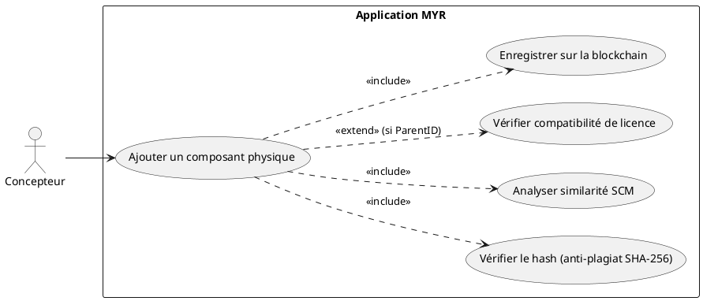
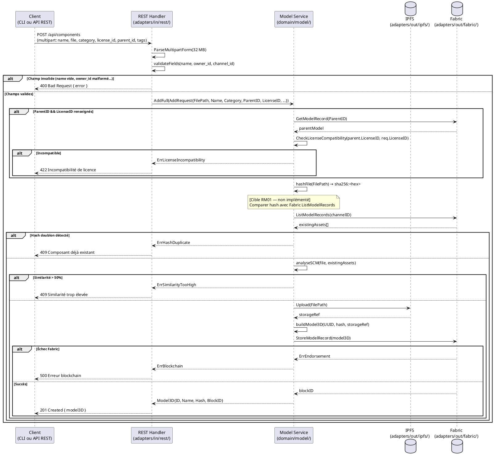

# Ajout d'un composant Physique

## Diagramme d'acteurs

## Contexte

L'ajout d'un composant physique est le use case fondamental du domaine D3. Il permet à un **Concepteur** d'enregistrer une création originale (pièce CAO, fichier 3D/STL/STEP/OBJ…) sur la blockchain Fabric, établissant ainsi son droit d'auteur de façon immuable.

L'entité produite est un `Model3D` avec `Hash` renseigné et `WorkspaceInstances` vide — c'est la définition d'un **Composant** dans la terminologie MYR.

La catégorie `base` est la seule catégorie qui ne requiert pas de `ParentID`. C'est aussi la seule catégorie soumise à la vérification anti-plagiat complète (SHA-256 + SCM > 50%). Les 7 autres catégories impliquent toutes un `ParentID` et un fichier parent existant sur le réseau.

**Écart code connu (E4) :** `service.AddFull()` calcule le SHA-256 du fichier soumis mais ne compare pas ce hash avec les assets déjà inscrits sur Fabric. La vérification complète (RM01) est une cible à implémenter.

## Pré-conditions

- Le Concepteur est authentifié avec le rôle `contributor` (session REST valide).
- Un canal Fabric est opérationnel et accessible.
- Le Concepteur dispose d'un fichier 3D/CAO valide (STL, STEP, OBJ, ou format natif).
- Pour une catégorie non-`base` : l'asset parent existe sur le canal et son ID est connu.

## Scénario

**Étape initiale :** `POST /api/components` est appelée (ou l'équivalent CLI `myr model add`) avec le fichier 3D et les métadonnées

### Flux nominal — Composant base nouveau

1. Le fichier 3D est transmis (champ `file` ou `stl` — multipart/form-data).
2. Les métadonnées sont transmises : nom, description, licence, tags, catégorie (`base`).
3. Le REST Handler valide les champs : `name` non vide (max 256), `owner_id` valide, `channel_id` valide.
4. Le handler appelle `service.AddFull(AddRequest{...})`.
5. Le service calcule le SHA-256 du fichier : `sha256:<hex>`.
6. **[Cible RM01]** Le service interroge Fabric (`ListModelRecords`) et compare le hash avec tous les assets existants.
7. Si aucun doublon : le service analyse la similarité SCM (seuil 50%) avec les assets existants.
8. Le service construit le `Model3D` avec un UUID généré (`generateID()`) et le hash — le fichier transmis n'est jamais conservé par Myr, qui priorise la traçabilité (savoir où le composant existe, voir UCCL03) plutôt que l'hébergement.
9. Le service soumet la transaction `StoreModel` sur Fabric (`blockchain.StoreModelRecord(m)`).
10. Fabric valide la transaction et ancre le bloc.
11. L'API retourne `201 Created` avec le `Model3D` JSON (ID, name, hash, blockID…).

### Flux alternatif — Import depuis un format CAO non natif (STL, STEP, OBJ)

1. Le fichier est dans un format supporté mais non natif.
2. Le système accepte le fichier et calcule son SHA-256 normalement.
3. Les métadonnées géométriques extractibles automatiquement (dimensions, volume) sont pré-renseignées selon le format.
4. Le Concepteur complète les métadonnées non extractibles (description, licence).
5. La transaction est soumise normalement (flux nominal à partir de l'étape 7).

### Flux alternatif — Création en brouillon (soumission différée, RM16/RM19)

1. Le Concepteur transmet `draft: true` (ou `myr model add --draft`) en plus des champs habituels.
2. Le service crée le `Model3D` avec `Status: draft` — la transaction Fabric initiale est tout de même soumise (comme pour un module en `draft`, RM16) mais l'asset reste modifiable par convention métier tant qu'il n'est pas soumis.
3. Le Concepteur peut alors ajouter ou modifier des interfaces (UCCE06, UCAM03) — ces changements restent en brouillon local (`InterfaceStore`, ADR-02) et n'émettent aucune transaction Fabric supplémentaire.
4. Quand le Concepteur est prêt, il appelle l'action de soumission (`POST /api/components/:id/submit` ou `myr model submit <id>` — voir `specs/3-Conception/DC_CLI_Model.md`) : le service relit le brouillon, embarque `Interfaces` dans le `Model3D`, soumet une dernière transaction Fabric et passe `Status` à `submitted`.
5. Une fois `submitted`, l'asset est immuable (règle 7, RM19) — toute nouvelle interface exige un fork (voir UCCE06).

> Ce flux est **optionnel** : le flux nominal (sans `draft: true`) reste inchangé — un composant est créé et soumis en une seule transaction, comme aujourd'hui. `draft` sert uniquement au cas où le Concepteur veut affiner les interfaces après création, sans les connaître entièrement à l'import du fichier.

### Flux alternatif — Catégorie dérivée (non-`base`)

1. Le Concepteur sélectionne une catégorie dérivée (`amelioration`, `variation`, `adaptation`, `derivation`, `extension`, `regression`, `decoupage`).
2. Il renseigne le `parent_id` (UUID de l'asset parent sur le canal).
3. Si une `license_id` est fournie : le service vérifie la compatibilité de licence avec le parent (`CheckLicenseCompatibility`). En cas d'incompatibilité : erreur retournée avant soumission Fabric.
4. La vérification anti-plagiat SHA-256 + SCM n'est **pas** déclenchée pour les catégories dérivées.
5. La transaction est soumise avec `ParentID` renseigné.

### Flux erreur — Hash déjà existant (RM01)

1. La comparaison des hashes (étape 7) détecte un doublon exact.
2. Le service retourne une erreur avant toute soumission Fabric.
3. L'API retourne `409 Conflict` : `{ "error": "Composant déjà existant — risque de plagiat. Contacter l'administration." }`.

### Flux erreur — Similarité SCM > 50% (RM01)

1. L'analyse SCM (étape 8) détecte une similarité structurelle supérieure à 50% avec un asset existant.
2. Le service retourne une erreur avant toute soumission Fabric.
3. L'API retourne `409 Conflict` : `{ "error": "Similarité trop élevée avec un composant existant. Contacter l'administration." }`.

### Flux erreur — Incompatibilité de licence (RM03)

1. `CheckLicenseCompatibility(parentLicenseID, req.LicenseID)` retourne `Compatible: false`.
2. Le service retourne l'erreur avant toute soumission Fabric.
3. L'API retourne `422 Unprocessable Entity` : `{ "error": "Incompatibilité de licence : <raison>." }`.

### Flux erreur — Échec endorsement Fabric

1. `blockchain.StoreModelRecord(m)` retourne une erreur Fabric (nœud indisponible, politique non satisfaite).
2. Le fichier uploadé sur IPFS reste (orphelin temporaire — acceptable).
3. L'API retourne `500 Internal Server Error` : `{ "error": "Erreur blockchain : <message>. Aucune donnée enregistrée." }`.

## Post-conditions

- Le `Model3D` est inscrit sur la blockchain Fabric (immuable — RM07).
- Un UUID unique est attribué au composant (généré par le service, non par le client — RM04).
- Le fichier 3D est stocké dans IPFS avec une référence dans `Versions[0].Hash`.
- Le droit d'auteur est enregistré via `OwnerID`.

## Diagramme de séquence

## Règles métier déclenchées

| Règle | Description |
|-------|-------------|
| **RM01** | Anti-plagiat obligatoire pour tout asset `base` : SHA-256 + SCM > 50% → rejet |
| **RM02** | Catégorie obligatoire parmi les 8 types : `base`, `amelioration`, `variation`, `adaptation`, `derivation`, `extension`, `regression`, `decoupage` |
| **RM03** | Si `ParentID != ""` et `LicenseID != ""` : vérification de compatibilité de licence obligatoire |
| **RM04** | UUID généré par le service, jamais par le client |
| **RM05** | `ParentID` obligatoire pour tout asset non-`base` |
| **RM07** | Validation complète côté serveur avant toute soumission blockchain |
| **RM16** | `draft: true` optionnel → composant créé en `draft` (soumission différée) ; par défaut, un composant est directement `submitted` |
| **RM19** | Une fois `submitted`, l'asset est immuable — toute modification ultérieure (ex. ajouter une interface, UCCE06) exige un fork |

## Exigences non-fonctionnelles

| ID | Exigence |
|----|---------|
| **EF10** | Import de fichiers 3D (STL, STEP, OBJ minimum) |
| **EF11** | Vérification anti-plagiat obligatoire avant enregistrement |
| **ENF12** | Contrôle du rôle `contributor` côté serveur avant toute écriture |
| **ENF30** | En cas d'échec blockchain, l'état local (draft) est conservé intact |

## Notes d'implémentation

**Route existante :** `POST /api/components` → `handler.createAsset()` → `service.AddFull()` → `fabric.StoreModelRecord()`.

**Commande CLI équivalente (existante, à étendre) :** `myr model add <file> --name <nom> --channel <id> --category base [--description <texte>] [--tags <a,b>] [--owner-id <id>] [--draft]` (voir `specs/3-Conception/DC_CLI_Model.md` § 3.1). Aujourd'hui `adapters/in/cli/model.go` ne câble que `--name`/`--channel`/`--tags` via `modelSvc.Add()` — un sous-ensemble de `AddRequest`. Cible : basculer sur `modelSvc.AddFull(AddRequest{...})`, la même méthode que le handler REST `createAsset()`, pour exposer aussi `--category`, `--parent`, `--license` et `--draft` (RM16). Une fois câblée, la commande déclenche les mêmes règles (anti-plagiat RM01, compatibilité de licence RM03) que le flux REST — seul le canal de sortie change (texte terminal vs JSON HTTP). La soumission différée d'un composant en brouillon s'effectue via `myr model submit <id>` (§ 3.6bis).

**Écart E4 (RM01 incomplet) :** `service.AddFull()` calcule le SHA-256 mais ne compare pas avec les assets existants. À implémenter : appel `blockchain.ListModelRecords(channelID)` suivi d'une comparaison de hashes avant l'enregistrement blockchain (`StoreModelRecord`).

**Écart E1 (catégorie `decoupage` absente) :** `domain/model/entity.go` ne définit pas `CategoryDecoupage`. À ajouter : `CategoryDecoupage Category = "decoupage"`. Cette catégorie est la seule qui transforme un composant en module (UCAM05).

**Écart E8 (`Status` composant, cf. `specs/2-Analyse/Analyse_des_besoins.md` § Écarts structurels connus) :** `domain/model/entity.go` ne traite `Status` que pour les modules aujourd'hui. À corriger pour permettre `AddFull(AddRequest{Draft: true, ...})` de créer un composant avec `Status: draft`, et pour exposer une méthode de soumission (réutilisation de la logique de `SubmitModule`, généralisée à tout `Model3D`) qui embarque `Interfaces` et passe `Status` à `submitted`.

**Analyse SCM :** L'algorithme de similarité structurelle (SCM > 50%) est un service domaine indépendant à créer dans `domain/model/` — il n'est pas encore implémenté.

**Multipart fields acceptés :** `name`, `description`, `owner_id`, `channel_id`, `category`, `parent_id`, `license_id`, `tags` (CSV), `links` (JSON array), `file` ou `stl` (fichier binaire), `thumbnail` (data-URL).

<!-- liens-obsidian:begin — section de traçabilité générée à partir des références du document : ne pas l'éditer à la main -->
## Liens

**Navigation**
- [Carte des specs › UCCE — Composant Ecriture](../../Carte_des_specs.md#UCCE%20—%20Composant%20Ecriture)
- [UCCE01 — couche expression](../../1-Expression/UCCE-Composant_Ecriture/UCCE01.md)
- [Traçabilité UCCE01 vers le code](../../../docs/code/Tracabilite_UC_Code.md#UCCE01)

**Exigences fonctionnelles couvertes**
- [EF10 — Enregistrer un composant physique sur la blockchain](../../1-Expression/Matrice_Tracabilite.md#1.%20Exigences%20fonctionnelles%20et%20UC%20couvrant)
- [EF15 — Vérifier l'unicité d'un composant (anti-plagiat SHA-256 + SCM > 50 %)](../../1-Expression/Matrice_Tracabilite.md#1.%20Exigences%20fonctionnelles%20et%20UC%20couvrant)

**Use cases cités**
- [UCAM03 — Créer une interface sur un composant](../UCAM-Assemblage_Module/UCAM03.md)
- [UCAM05 — Transformation d'un composant en module](../UCAM-Assemblage_Module/UCAM05.md)
- [UCCE06 — Ajouter une interface à un Composant déjà créé](UCCE06.md)
- [UCCL03 — Vérifier la validité des emplacements externes d'un composant ou module](../../1-Expression/UCCL-Composant_Lecture/UCCL03.md)

**Règles métier**
- [RM01 — Anti-plagiat obligatoire](../../1-Expression/Regles_Metier.md#1.%20Assets%20et%20composants)
- [RM02 — Catégorie d'asset obligatoire](../../1-Expression/Regles_Metier.md#1.%20Assets%20et%20composants)
- [RM03 — Compatibilité de licence](../../1-Expression/Regles_Metier.md#1.%20Assets%20et%20composants)
- [RM04 — UUID unique](../../1-Expression/Regles_Metier.md#1.%20Assets%20et%20composants)
- [RM05 — ParentID obligatoire pour les dérivés](../../1-Expression/Regles_Metier.md#1.%20Assets%20et%20composants)
- [RM07 — Validation préalable obligatoire](../../1-Expression/Regles_Metier.md#2.%20Blockchain%20et%20immuabilité)
- [RM16 — État draft](../../1-Expression/Regles_Metier.md#5.%20Modules%20et%20cycle%20de%20vie%20des%20assets)
- [RM19 — Fork d'un asset soumis](../../1-Expression/Regles_Metier.md#5.%20Modules%20et%20cycle%20de%20vie%20des%20assets)

**Exigences non fonctionnelles**
- [ENF12 — Contrôle d'accès par rôle](../../1-Expression/Exigences_Non_Fonctionnelles.md#Tableau%20des%20exigences%20non-fonctionnelles)
- [ENF30 — Intégrité en cas d'échec blockchain](../../1-Expression/Exigences_Non_Fonctionnelles.md#Tableau%20des%20exigences%20non-fonctionnelles)

**Documents cités**
- [Analyse_des_besoins](../Analyse_des_besoins.md)
- [DC_CLI_Model](../../3-Conception/DC_CLI_Model.md)

**Cité par**
- [Expression_des_besoins_Intro](../../1-Expression/Expression_des_besoins_Intro.md)
- [Matrice_Tracabilite](../../1-Expression/Matrice_Tracabilite.md)
- [UCAUT03 (expression)](../../1-Expression/UCAUT-Automatisation/UCAUT03.md)
- [todo (expression)](../../1-Expression/todo.md)
- [Analyse_des_besoins](../Analyse_des_besoins.md)
- [UCAUT03 (analyse)](../UCAUT-Automatisation/UCAUT03.md)
- [UCCE03 (analyse)](UCCE03.md)
- [UCCE04 (analyse)](UCCE04.md)
- [UCCE06 (analyse)](UCCE06.md)
- [todo (analyse)](../todo.md)
- [API_REST](../../3-Conception/API_REST.md)
- [Architecture_Composition](../../3-Conception/Architecture_Composition.md)
- [Chaincode](../../3-Conception/Chaincode.md)
- [Conception_intro](../../3-Conception/Conception_intro.md)
- [DC_CLI_Model](../../3-Conception/DC_CLI_Model.md)
- [Sequence_soumission_asset](../../3-Conception/Sequence_soumission_asset.md)
- [roadmap_dev](../../roadmap_dev.md)

<!-- liens-obsidian:end -->
