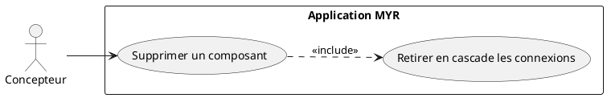
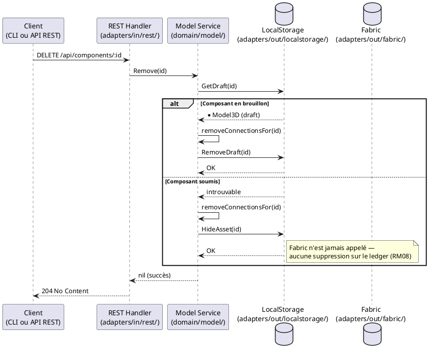

# Supprimer un Composant

## Diagramme d'acteurs

## Contexte

Un composant qui n'a plus d'usage pour son propriétaire (brouillon abandonné, ou composant déjà soumis mais devenu obsolète) doit pouvoir être supprimé. Aucune opération de suppression n'existe sur la blockchain Fabric (RM06, RM08) : un composant déjà soumis y reste inscrit en permanence, de façon immuable.

La suppression a donc un effet différent selon l'état du composant :
- **Brouillon (`draft`)** : le composant est réellement retiré du stockage local (`DraftStore`) — il n'a jamais existé sur la blockchain.
- **Soumis (`submitted`)** : le composant est masqué localement (il disparaît des listes retournées par `GET /api/components`) mais son enregistrement sur la blockchain n'est jamais modifié ni retiré. Il reste consultable directement par son identifiant (`GET /api/components/:id`) — par exemple parce qu'un autre asset le référence comme parent, ou qu'un client en a gardé une référence directe.

Dans les deux cas, les connexions impliquant ce composant sont retirées en cascade (même mécanisme que RM14/UCAM08).

## Pré-conditions

- Le Concepteur est authentifié avec le rôle `contributor`
- Le Concepteur est propriétaire du composant (`OwnerID` correspond à son identité)
- Le composant existe (brouillon local ou soumis)

## Scénario

**Étape initiale :** `DELETE /api/components/:id` est appelée (ou l'équivalent CLI `myr model remove`)

### Flux nominal — Suppression d'un brouillon

1. Le composant est retrouvé dans le stockage local (`DraftStore`)
2. Les connexions impliquant ce composant sont retirées en cascade
3. Le composant est retiré du stockage local
4. L'API retourne `204 No Content`
5. Le composant n'apparaît plus dans aucune liste ni lecture directe — il n'a jamais existé sur la blockchain

### Flux nominal — Suppression (masquage) d'un composant soumis

1. Le composant est retrouvé sur la blockchain (déjà soumis)
2. Les connexions impliquant ce composant sont retirées en cascade
3. L'identifiant du composant est enregistré dans le registre local de masquage — aucune écriture blockchain n'est effectuée
4. L'API retourne `204 No Content`
5. Le composant disparaît de `GET /api/components` mais reste accessible via `GET /api/components/:id` et reste inscrit sur la blockchain, inchangé

### Flux erreur — Composant introuvable

1. Aucun composant ne correspond à l'identifiant fourni
2. L'API retourne `404 Not Found`

### Flux erreur — Droits insuffisants

1. L'identité n'est pas propriétaire du composant
2. L'API retourne `403 Forbidden`

## Post-conditions

- Le composant n'apparaît plus dans `GET /api/components`
- Si le composant était un brouillon : il n'existe plus nulle part
- Si le composant était soumis : son enregistrement blockchain reste inchangé et consultable par identifiant direct
- Les connexions impliquant le composant sont retirées

## Diagramme de séquence

## Règles métier déclenchées

| Règle | Description | Point d'application |
|-------|-------------|---------------------|
| **RM06** | Immuabilité des transactions — aucune suppression sur le ledger | `Remove()` n'appelle jamais d'opération de suppression blockchain |
| **RM08** | Masquage local, ledger jamais modifié | `Remove()` — brouillon retiré, asset soumis masqué via le registre local |
| **RM14** (généralisée) | Retrait en cascade des connexions impliquant l'asset supprimé | `removeConnectionsFor()` |

## Exigences non-fonctionnelles

- **ENF12** : Contrôle d'ownership côté serveur obligatoire

## Notes d'implémentation

**Endpoint REST utilisé :**
- `DELETE /api/components/:id` → `service.Remove()` (handlers.go — `deleteComponent`)

**Registre de masquage :** le port `RemovedAssetStore` (`domain/model/ports.go`) est implémenté par le store local consolidé (`adapters/out/localstorage/json_blockchain.go`, au même titre que `DraftStore`/`ConnectionStore`). `List()`/`ListModules()` excluent les identifiants masqués ; `Get()`/`GetModule()` restent volontairement non filtrés, pour rester résolvables par identifiant direct (ex. vérification de licence d'un composant dérivé dont le parent a été supprimé).

**Commande CLI équivalente :** `myr model remove <id>` appelle la même méthode `Remove()`.

**Voir aussi UCMOD08** (« Supprimer un Module ») — comportement strictement identique, RM08 s'applique de façon générique à tout asset, composant ou module.

<!-- liens-obsidian:begin — section de traçabilité générée à partir des références du document : ne pas l'éditer à la main -->
## Liens

**Étape suivante — conception**
- **API_REST** : [§ 4. D3/D4/D6 — Composants (ressource unique, ADR-11)](../../3-Conception/API_REST.md#4.%20D3/D4/D6%20—%20Composants%20%28ressource%20unique,%20ADR-11%29)

<!-- liens-obsidian:end -->
