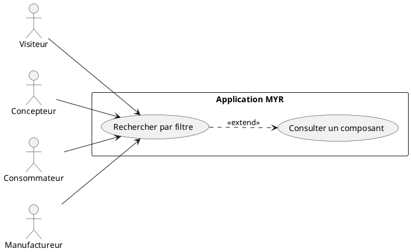
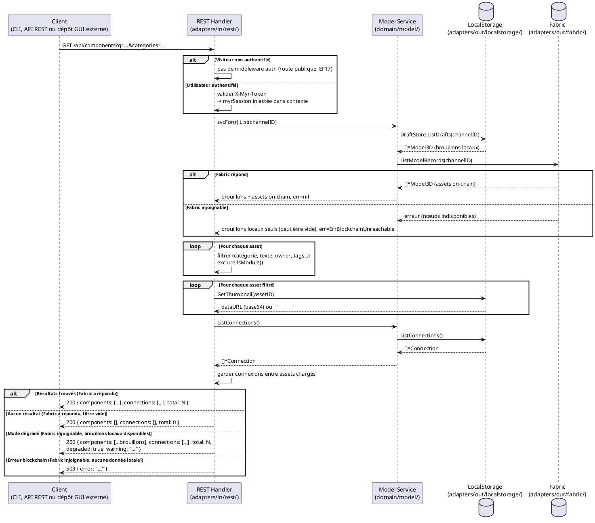

# Faire une recherche par filtre

## Diagramme d'acteurs



## Contexte

La recherche par filtre est le point d'entrée principal sur les assets du réseau. Elle doit être accessible sans authentification pour les visiteurs (accès public), conformément à l'exigence EF17 du domaine D4.

Le système interroge la blockchain via `GET /api/components` avec des paramètres de filtre. Le résultat est un graphe `{ components, connections, total }` décrivant les assets correspondants et leurs liaisons.

## Pré-conditions

- Le serveur Myr est démarré et joignable
- Pour un visiteur : aucune authentification requise (lecture publique, EF17)
- Pour un utilisateur authentifié : token de session opaque valide dans l'en-tête `X-Myr-Token`
- La blockchain accessible n'est requise que pour obtenir la liste complète (assets on-chain inclus) — voir Flux alternatif « Mode dégradé » pour le cas où seuls des brouillons locaux peuvent être retournés

## Scénario

> La présentation des résultats (MenuBar, Search UI, Explorer UI) relève du dépôt GUI externe — hors périmètre de ce document. Seuls les contrats REST et CLI ci-dessous font partie de `myr`.

### Flux nominal — Résultats trouvés

1. Le client fournit un ou plusieurs critères de filtre :
   - texte libre (`q`) : recherche dans nom, description, tags
   - catégories (`categories`) : `base`, `amelioration`, `variation`, `adaptation`, `derivation`, `extension`, `regression`
   - auteur (`owner_id`), parent (`parent_id`), hash exact (`hash`), tags (`tags`)
   - limite de résultats (`limit`, défaut 200, max 1000)
2. Le client envoie `GET /api/components?q=...&categories=...&limit=...`
3. Le handler `listGraph` interroge le service domaine via `svcFor(r).List(channel)`
4. Le service appelle `blockchain.ListModelRecords(channelID)` — retourne tous les assets du canal
5. Le handler filtre côté serveur (catégorie, texte, owner, parent, hash, tags) et exclut les modules
6. Les DTOs `componentDTO` sont construits avec miniatures (thumbnails)
7. Les connexions entre assets chargés sont incluses dans la réponse
8. Le client reçoit `{ components: [...], connections: [...], total: N }`

<!-- tests-obsidian:begin — tests rattachés à cette exigence, section générée : ne pas l'éditer à la main -->
> [!check]- Tests — 0 explicite(s) · 70 déduit(s)
> - 🟡 [TestAPIIntegration_AssetLifecycle](../../../docs/tests/adapters-in-rest/TestAPIIntegration_AssetLifecycle.md) — déduit : teste route `/api/components/`
> - 🟡 [TestAPIIntegration_ConcurrentAssetCreation](../../../docs/tests/adapters-in-rest/TestAPIIntegration_ConcurrentAssetCreation.md) — déduit : teste route `/api/components/`
> - 🟡 [TestAPIIntegration_InterfaceLifecycle](../../../docs/tests/adapters-in-rest/TestAPIIntegration_InterfaceLifecycle.md) — déduit : teste route `/api/components/`
> - 🟡 [TestComponentInterfaces_GET](../../../docs/tests/adapters-in-rest/TestComponentInterfaces_GET.md) — déduit : teste route `/api/components/`
> - 🟡 [TestComponentInterfaces_POST_BadJSON](../../../docs/tests/adapters-in-rest/TestComponentInterfaces_POST_BadJSON.md) — déduit : teste route `/api/components/`
> - 🟡 [TestComponentInterfaces_POST_Created](../../../docs/tests/adapters-in-rest/TestComponentInterfaces_POST_Created.md) — déduit : teste route `/api/components/`
> - 🟡 [TestComponentTree_GET](../../../docs/tests/adapters-in-rest/TestComponentTree_GET.md) — déduit : teste route `/api/components/`
> - 🟡 [TestComponentTree_MethodNotAllowed](../../../docs/tests/adapters-in-rest/TestComponentTree_MethodNotAllowed.md) — déduit : teste route `/api/components/`
> - 🟡 [TestComponent_AddAssembly](../../../docs/tests/adapters-in-rest/TestComponent_AddAssembly.md) — déduit : teste route `/api/components/`
> - 🟡 [TestComponent_AddAssembly_MissingConnectionID](../../../docs/tests/adapters-in-rest/TestComponent_AddAssembly_MissingConnectionID.md) — déduit : teste route `/api/components/`
> - 🟡 [TestComponent_AddInstance](../../../docs/tests/adapters-in-rest/TestComponent_AddInstance.md) — déduit : teste route `/api/components/`
> - 🟡 [TestComponent_AddInstance_MissingAssetID](../../../docs/tests/adapters-in-rest/TestComponent_AddInstance_MissingAssetID.md) — déduit : teste route `/api/components/`
> - 🟡 [TestComponent_AddTwoInstancesSequentially](../../../docs/tests/adapters-in-rest/TestComponent_AddTwoInstancesSequentially.md) — déduit : teste route `/api/components/`
> - 🟡 [TestComponent_DELETE_NoContent](../../../docs/tests/adapters-in-rest/TestComponent_DELETE_NoContent.md) — déduit : teste route `/api/components/`
> - 🟡 [TestComponent_DELETE_ServiceError](../../../docs/tests/adapters-in-rest/TestComponent_DELETE_ServiceError.md) — déduit : teste route `/api/components/`
> - … et 55 autre(s) : voir la [matrice de couverture](../../../docs/tests/Matrice_Couverture_Tests.md)
<!-- tests-obsidian:end -->

### Flux nominal — Aucun résultat

1. Le filtrage ne retourne aucun asset correspondant
2. La réponse est `{ components: [], connections: [], total: 0 }`

<!-- tests-obsidian:begin — tests rattachés à cette exigence, section générée : ne pas l'éditer à la main -->
> [!warning] Tests — aucun test ne couvre cette exigence
> [Matrice de couverture](../../../docs/tests/Matrice_Couverture_Tests.md)
<!-- tests-obsidian:end -->

### Flux alternatif — Affinement des filtres

1. Le client fournit un ou plusieurs critères mis à jour
2. Une nouvelle requête `GET /api/components` est émise avec les critères mis à jour

<!-- tests-obsidian:begin — tests rattachés à cette exigence, section générée : ne pas l'éditer à la main -->
> [!check]- Tests — 0 explicite(s) · 69 déduit(s)
> - 🟡 [TestAPIIntegration_AssetLifecycle](../../../docs/tests/adapters-in-rest/TestAPIIntegration_AssetLifecycle.md) — déduit : teste route `/api/components/`
> - 🟡 [TestAPIIntegration_ConcurrentAssetCreation](../../../docs/tests/adapters-in-rest/TestAPIIntegration_ConcurrentAssetCreation.md) — déduit : teste route `/api/components/`
> - 🟡 [TestAPIIntegration_InterfaceLifecycle](../../../docs/tests/adapters-in-rest/TestAPIIntegration_InterfaceLifecycle.md) — déduit : teste route `/api/components/`
> - 🟡 [TestComponentInterfaces_GET](../../../docs/tests/adapters-in-rest/TestComponentInterfaces_GET.md) — déduit : teste route `/api/components/`
> - 🟡 [TestComponentInterfaces_POST_BadJSON](../../../docs/tests/adapters-in-rest/TestComponentInterfaces_POST_BadJSON.md) — déduit : teste route `/api/components/`
> - 🟡 [TestComponentInterfaces_POST_Created](../../../docs/tests/adapters-in-rest/TestComponentInterfaces_POST_Created.md) — déduit : teste route `/api/components/`
> - 🟡 [TestComponentTree_GET](../../../docs/tests/adapters-in-rest/TestComponentTree_GET.md) — déduit : teste route `/api/components/`
> - 🟡 [TestComponentTree_MethodNotAllowed](../../../docs/tests/adapters-in-rest/TestComponentTree_MethodNotAllowed.md) — déduit : teste route `/api/components/`
> - 🟡 [TestComponent_AddAssembly](../../../docs/tests/adapters-in-rest/TestComponent_AddAssembly.md) — déduit : teste route `/api/components/`
> - 🟡 [TestComponent_AddAssembly_MissingConnectionID](../../../docs/tests/adapters-in-rest/TestComponent_AddAssembly_MissingConnectionID.md) — déduit : teste route `/api/components/`
> - 🟡 [TestComponent_AddInstance](../../../docs/tests/adapters-in-rest/TestComponent_AddInstance.md) — déduit : teste route `/api/components/`
> - 🟡 [TestComponent_AddInstance_MissingAssetID](../../../docs/tests/adapters-in-rest/TestComponent_AddInstance_MissingAssetID.md) — déduit : teste route `/api/components/`
> - 🟡 [TestComponent_AddTwoInstancesSequentially](../../../docs/tests/adapters-in-rest/TestComponent_AddTwoInstancesSequentially.md) — déduit : teste route `/api/components/`
> - 🟡 [TestComponent_DELETE_NoContent](../../../docs/tests/adapters-in-rest/TestComponent_DELETE_NoContent.md) — déduit : teste route `/api/components/`
> - 🟡 [TestComponent_DELETE_ServiceError](../../../docs/tests/adapters-in-rest/TestComponent_DELETE_ServiceError.md) — déduit : teste route `/api/components/`
> - … et 54 autre(s) : voir la [matrice de couverture](../../../docs/tests/Matrice_Couverture_Tests.md)
<!-- tests-obsidian:end -->

### Flux alternatif — Mode dégradé (blockchain injoignable, brouillons locaux disponibles)

1. `blockchain.ListModelRecords()` échoue (panne réseau ou nœuds indisponibles — pas une absence de configuration)
2. Le service dispose malgré tout de brouillons locaux non soumis (`DraftStore`) pour le canal demandé
3. Le service retourne ces brouillons accompagnés de l'erreur d'origine plutôt que de ne rien retourner — il ne masque jamais silencieusement une liste partielle
4. Le handler distingue ce cas d'un échec total et renvoie `HTTP 200 { components: [...brouillons], connections: [...], total: N, degraded: true, warning: "..." }` — le client sait explicitement que la liste est incomplète (composants on-chain absents) plutôt que de la croire complète

<!-- tests-obsidian:begin — tests rattachés à cette exigence, section générée : ne pas l'éditer à la main -->
> [!warning] Tests — aucun test ne couvre cette exigence
> [Matrice de couverture](../../../docs/tests/Matrice_Couverture_Tests.md)
<!-- tests-obsidian:end -->

### Flux erreur — Blockchain indisponible, aucune donnée locale

1. `blockchain.ListModelRecords()` échoue et aucun brouillon local n'est disponible pour ce canal
2. Le handler renvoie HTTP 503 avec `{ "error": "..." }` (panne transitoire de l'infrastructure, à distinguer d'une erreur de données — voir `specs/3-Conception/Architecture_Hexagonale.md` §1.1)

<!-- tests-obsidian:begin — tests rattachés à cette exigence, section générée : ne pas l'éditer à la main -->
> [!warning] Tests — aucun test ne couvre cette exigence
> [Matrice de couverture](../../../docs/tests/Matrice_Couverture_Tests.md)
<!-- tests-obsidian:end -->

### Flux erreur — Écriture non authentifiée

1. Un client non authentifié tente une écriture (`POST`/`PUT`/`PATCH`/`DELETE`) sur `/api/components`
2. Le middleware `requireRole("contributor")` renvoie HTTP 401 `{ "error": "authentification requise" }`

<!-- tests-obsidian:begin — tests rattachés à cette exigence, section générée : ne pas l'éditer à la main -->
> [!check]- Tests — 0 explicite(s) · 69 déduit(s)
> - 🟡 [TestAPIIntegration_AssetLifecycle](../../../docs/tests/adapters-in-rest/TestAPIIntegration_AssetLifecycle.md) — déduit : teste route `/api/components/`
> - 🟡 [TestAPIIntegration_ConcurrentAssetCreation](../../../docs/tests/adapters-in-rest/TestAPIIntegration_ConcurrentAssetCreation.md) — déduit : teste route `/api/components/`
> - 🟡 [TestAPIIntegration_InterfaceLifecycle](../../../docs/tests/adapters-in-rest/TestAPIIntegration_InterfaceLifecycle.md) — déduit : teste route `/api/components/`
> - 🟡 [TestComponentInterfaces_GET](../../../docs/tests/adapters-in-rest/TestComponentInterfaces_GET.md) — déduit : teste route `/api/components/`
> - 🟡 [TestComponentInterfaces_POST_BadJSON](../../../docs/tests/adapters-in-rest/TestComponentInterfaces_POST_BadJSON.md) — déduit : teste route `/api/components/`
> - 🟡 [TestComponentInterfaces_POST_Created](../../../docs/tests/adapters-in-rest/TestComponentInterfaces_POST_Created.md) — déduit : teste route `/api/components/`
> - 🟡 [TestComponentTree_GET](../../../docs/tests/adapters-in-rest/TestComponentTree_GET.md) — déduit : teste route `/api/components/`
> - 🟡 [TestComponentTree_MethodNotAllowed](../../../docs/tests/adapters-in-rest/TestComponentTree_MethodNotAllowed.md) — déduit : teste route `/api/components/`
> - 🟡 [TestComponent_AddAssembly](../../../docs/tests/adapters-in-rest/TestComponent_AddAssembly.md) — déduit : teste route `/api/components/`
> - 🟡 [TestComponent_AddAssembly_MissingConnectionID](../../../docs/tests/adapters-in-rest/TestComponent_AddAssembly_MissingConnectionID.md) — déduit : teste route `/api/components/`
> - 🟡 [TestComponent_AddInstance](../../../docs/tests/adapters-in-rest/TestComponent_AddInstance.md) — déduit : teste route `/api/components/`
> - 🟡 [TestComponent_AddInstance_MissingAssetID](../../../docs/tests/adapters-in-rest/TestComponent_AddInstance_MissingAssetID.md) — déduit : teste route `/api/components/`
> - 🟡 [TestComponent_AddTwoInstancesSequentially](../../../docs/tests/adapters-in-rest/TestComponent_AddTwoInstancesSequentially.md) — déduit : teste route `/api/components/`
> - 🟡 [TestComponent_DELETE_NoContent](../../../docs/tests/adapters-in-rest/TestComponent_DELETE_NoContent.md) — déduit : teste route `/api/components/`
> - 🟡 [TestComponent_DELETE_ServiceError](../../../docs/tests/adapters-in-rest/TestComponent_DELETE_ServiceError.md) — déduit : teste route `/api/components/`
> - … et 54 autre(s) : voir la [matrice de couverture](../../../docs/tests/Matrice_Couverture_Tests.md)
<!-- tests-obsidian:end -->

## Post-conditions

- La liste des composants correspondant aux critères est retournée au client — complète si la blockchain a répondu, limitée aux brouillons locaux sinon (mode dégradé signalé explicitement, jamais silencieux)
- Les connexions entre les composants retournés sont incluses
- L'état du système est inchangé (lecture seule)

## Diagramme de séquence



## Règles métier déclenchées

Aucune règle métier de modification n'est déclenchée (lecture seule). Points de conformité :

- **EF17** — Accès public (sans authentification) aux composants d'un réseau Myr : la route `GET /api/components` doit être accessible aux visiteurs
- La distinction composant/module est assurée par `Model3D.IsModule()` — les modules sont exclus de cette route (exposés via `/api/modules`)
- Le canal actif est résolu depuis la session (`sess.Channel`) ou depuis la configuration du réseau (`netInfo.Channel`)

## Exigences non-fonctionnelles

- **ENF01 / ENF14** — Temps de réponse : `< 2 s` pour 100 assets (objectif charge nominale)
- **ENF12** — Contrôle d'accès vérifié côté serveur (pas côté client uniquement)
- La pagination côté serveur (paramètre `limit`) protège contre les réponses trop volumineuses (max 1000)

## Notes d'implémentation

**Routage `/api/components` — lecture publique, écriture protégée :**
Dans `adapters/in/rest/server.go`, la route `/api/components` distingue la méthode HTTP :

```go
// Lecture publique, écriture restreinte au rôle contributor
mux.HandleFunc("/api/components", func(w http.ResponseWriter, r *http.Request) {
    switch r.Method {
    case http.MethodPost, http.MethodPut, http.MethodPatch, http.MethodDelete:
        s.handler.requireRole("contributor", s.handler.handleComponents)(w, r)
    default:
        s.handler.handleComponents(w, r) // GET : public
    }
})
```

**Paramètres de filtre supportés par `listGraph` :**

| Paramètre    | Type   | Description                                      |
|-------------|--------|--------------------------------------------------|
| `q`          | string | Recherche textuelle (nom, description, tags)    |
| `categories` | string | Catégories séparées par virgule                 |
| `owner_id`   | string | Filtrer par propriétaire                         |
| `parent_id`  | string | Filtrer par asset parent (lignée)                |
| `hash`       | string | Hash SHA-256 exact                               |
| `tags`       | string | Tags séparés par virgule (match OR)              |
| `limit`      | int    | Nombre max de résultats (défaut 200, max 1000)   |

**Miniatures :** Récupérées depuis `ThumbnailStore` (SQLite ou local JSON). Si absente, `thumbnail` est une chaîne vide dans le DTO.

**Connexions :** Seules les connexions dont `From` ET `To` font partie des assets filtrés sont incluses dans la réponse — évite les connexions orphelines côté client.

**Commande CLI équivalente (alias limité) :** `myr model list [--channel <id>]` appelle la même méthode `List(channelID)` que `GET /api/components` avant filtrage. Le filtrage par critère (`q`, `categories`, `owner_id`, `parent_id`, `hash`, `tags`) est effectué aujourd'hui dans le handler REST (`adapters/in/rest/`), pas dans `ModelService` — il n'existe donc pas de méthode de filtre serveur réutilisable directement par le CLI. Une commande `myr model search --filter <critère>` est documentée comme cible ouverte : elle devra reproduire côté adaptateur CLI la même logique de filtrage que `listGraph`, sans changement de domaine requis (voir `specs/3-Conception/DC_CLI_Model.md` § 6 point 2). En l'absence de cette commande, `myr model search` reste un simple alias de `myr model list`. En mode dégradé, `myr model list` affiche le même avertissement explicite que la réponse REST (`degraded`/`warning`), suivi du tableau des brouillons locaux disponibles.

<!-- liens-obsidian:begin — section de traçabilité générée à partir des références du document : ne pas l'éditer à la main -->
## Liens

**Étape suivante — conception**
- **API_REST** : [§ 4. D3/D4/D6 — Composants (ressource unique, ADR-11)](../../3-Conception/API_REST.md#4.%20D3/D4/D6%20—%20Composants%20%28ressource%20unique,%20ADR-11%29)
- **Chaincode** : [§ 4. Fonctions chaincode — Store/Read (D3/D4/D6)](../../3-Conception/Chaincode.md#4.%20Fonctions%20chaincode%20—%20Store/Read%20%28D3/D4/D6%29)
- **DC_CLI_Model** : [§ DC — CLI Modèle : Référence des commandes composant / interfaces / module](../../3-Conception/DC_CLI_Model.md#DC%20—%20CLI%20Modèle%20:%20Référence%20des%20commandes%20composant%20/%20interfaces%20/%20module) · [§ 2. Arbre de commandes](../../3-Conception/DC_CLI_Model.md#2.%20Arbre%20de%20commandes) · [§ 5. Table de correspondance méthode domaine → commande CLI → use case](../../3-Conception/DC_CLI_Model.md#5.%20Table%20de%20correspondance%20méthode%20domaine%20→%20commande%20CLI%20→%20use%20case) · [§ 6. Écarts et points ouverts](../../3-Conception/DC_CLI_Model.md#6.%20Écarts%20et%20points%20ouverts)
- **DC_D1_Auth_Identity** : [§ 6. Décisions de conception](../../3-Conception/DC_D1_Auth_Identity.md#6.%20Décisions%20de%20conception)

<!-- liens-obsidian:end -->
