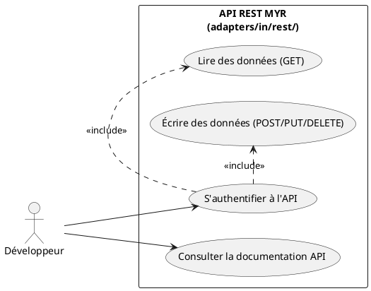
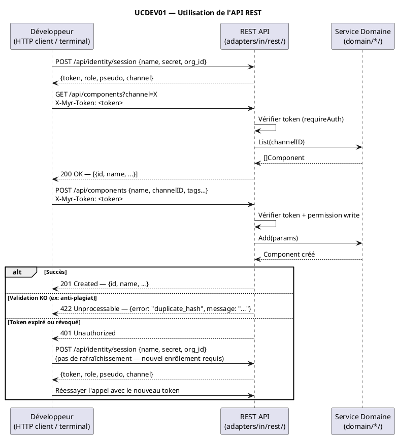

# Utilisation de l'API

## Diagramme d'acteurs

## Contexte

Les développeurs tiers peuvent utiliser l'API REST MYR pour intégrer ses fonctionnalités dans leurs applications (boutiques, éditeurs 3D, plugins CAO, systèmes de gestion). L'API REST est exposée sous le préfixe `/api/` par `myr-api`.

L'API (`adapters/in/rest/`) couvre les opérations sur les composants, modules, liaisons, canaux, réseaux, licences et l'identité (enrôlement CA, sessions par token opaque — pas de JWT, voir `specs/3-Conception/DC_D1_Auth_Identity.md`).

L'acteur "Développeur" est distinct de l'Administrateur : il accède à MYR exclusivement via l'API REST depuis son environnement (jamais via le CLI qui est réservé au serveur). Il possède un compte avec un rôle approprié (minimum Lecteur pour les lectures, Concepteur pour les écritures).

## Pré-conditions

- `myr-api` est en cours d'exécution et accessible
- Le développeur dispose d'un compte MYR avec les droits nécessaires (rôle Lecteur minimum)
- Le développeur dispose d'un token de session opaque valide (obtenu via `POST /api/identity/session` ou `POST /api/identity/guest`)
- La documentation de l'API REST (spec OpenAPI dans `api/`) est disponible

## Scénario

**Étape initiale :** Le développeur consulte la documentation API MYR

### Flux nominal — Lecture de données (query)

1. Le développeur obtient un token de session via `POST /api/identity/session` (secret CA) ou `POST /api/identity/guest` (accès invité)
2. Il effectue un appel GET avec l'en-tête `X-Myr-Token: <token>`
3. Exemple : `GET /api/components?channel=greenchannel`
4. Le serveur vérifie le token (`requireAuth`)
5. Le handler retourne les données en JSON
6. Le développeur intègre les données dans son application tierce

### Flux nominal — Écriture de données (invoke)

1. Le développeur dispose d'un token de session dont le rôle porte la permission `write` (rôle `contributor` par défaut — voir `specs/3-Conception/DC_D1_Auth_Identity.md` et `specs/roadmap_dev.md` § Écarts Identité & Session pour l'état de la synchronisation avec le rôle CA)
2. Il effectue un appel POST/PUT/PATCH/DELETE avec l'en-tête `X-Myr-Token`
3. Exemple : `POST /api/components` avec body JSON
4. Le serveur vérifie le token ET la permission (`requireRole(rbac.PermWrite, ...)`)
5. La validation métier est effectuée côté serveur
6. Si valide : la transaction est soumise à Fabric ; la réponse JSON confirme le succès

### Flux alternatif — Token expiré ou invalide

1. Le développeur effectue un appel avec un token expiré ou révoqué
2. Le serveur retourne `401 Unauthorized`
3. **Il n'existe pas de mécanisme de rafraîchissement** — le développeur doit ré-obtenir un nouveau token via `POST /api/identity/session` (nouvel enrôlement CA) ou `POST /api/identity/guest`
4. Le développeur réessaie l'appel avec le nouveau token

### Flux erreur — Droits insuffisants

1. Le développeur tente une écriture avec un rôle Lecteur
2. Le serveur retourne `403 Forbidden` : "Droits insuffisants"
3. Aucune modification n'est effectuée

### Flux erreur — Ressource introuvable

1. Le développeur appelle `GET /api/components/{id}` avec un ID inexistant
2. Le serveur retourne `404 Not Found`
3. Un corps JSON structuré décrit l'erreur

## Post-conditions

- Pour une lecture : les données sont retournées en JSON, prêtes à être intégrées
- Pour une écriture : la ressource est créée/modifiée sur la blockchain Fabric ; l'ID est retourné
- Le token de session reste valide pour les appels suivants jusqu'à son expiration (7 jours) ou sa révocation par un administrateur

## Diagramme de séquence

## Règles métier déclenchées

- **EF55** (ENF55) : API REST disponible pour les intégrations tierces
- **RM07** : Validation côté serveur avant toute soumission blockchain
- **ENF12** : Vérification du rôle côté serveur (jamais côté client uniquement)
- **RM01** : Anti-plagiat SHA-256 + similarité SCM > 50 % avant ajout d'asset `base`
- **RM08** : Vérification compatibilité de licence si `ParentID != ""` et `LicenseID != ""`

## Exigences non-fonctionnelles

- L'API doit répondre en moins de 500 ms pour les opérations de lecture (hors Fabric)
- Le format JSON des erreurs doit être standardisé (code machine + message lisible)
- L'API est versionnée implicitement — les changements cassants doivent être anticipés
- La documentation de l'API doit couvrir toutes les routes exposées dans `server.go`

## Notes d'implémentation

**Routes exposées** dans `adapters/in/rest/server.go` :
- Identité : `/api/identity/policy`, `/api/identity/enroll`, `/api/identity/session`, `/api/identity/guest`, `/api/identity/request`, `/api/identity/requests`, `/api/identity/wallets`, `/api/identity/status`
- Données : `/api/components`, `/api/components/`, `/api/connections`, `/api/connections/`, `/api/assembly-links`, `/api/virtual-connect`, `/api/modules`, `/api/modules/`, `/api/interfaces/`
- Référentiel : `/api/refs`, `/api/refs/categories`, `/api/refs/types`, `/api/refs/units`
- Réseau : `/api/channels`, `/api/networks`, `/api/networks/active`
- Utilitaire : `/api/ping`, `/api/status`, `/api/health`, `/metrics`
- Licences : `/api/licenses`, `/api/licenses/`
- Admin : `/api/admin/sessions`, `/api/admin/sessions/`

**Authentification :** token opaque de session (`X-Myr-Token`) via `requireAuth()` — pas de JWT. Accès en lecture : permission `read` (rôle Lecteur minimum). Accès en écriture (POST/PUT/PATCH/DELETE) : permission `write` (rôle Concepteur `contributor` par défaut) via le middleware `contrib`, vérifiée par `domain/role.RoleService.HasPermission`.

**Documentation API :** `api/` contient les specs OpenAPI — la manière de la publier (portail statique, Swagger UI, etc.) relève du dépôt GUI externe ou de tout autre outil de documentation, hors périmètre de `myr`.

<!-- liens-obsidian:begin — section de traçabilité générée à partir des références du document : ne pas l'éditer à la main -->
## Liens

**Navigation**
- [Carte des specs › UCDEV — Developpement](../../Carte_des_specs.md#UCDEV%20—%20Developpement)
- [UCDEV01 — couche expression](../../1-Expression/UCDEV-Developpement/UCDEV01.md)
- [Traçabilité UCDEV01 vers le code](../../../docs/code/Tracabilite_UC_Code.md#UCDEV01)

**Exigences fonctionnelles couvertes**
- [EF55 — Exposer une API REST pour les intégrations tierces](../../1-Expression/Matrice_Tracabilite.md#1.%20Exigences%20fonctionnelles%20et%20UC%20couvrant)

**Règles métier**
- [RM01 — Anti-plagiat obligatoire](../../1-Expression/Regles_Metier.md#1.%20Assets%20et%20composants)
- [RM07 — Validation préalable obligatoire](../../1-Expression/Regles_Metier.md#2.%20Blockchain%20et%20immuabilité)
- [RM08 — Masquage local, ledger jamais modifié](../../1-Expression/Regles_Metier.md#2.%20Blockchain%20et%20immuabilité)

**Exigences non fonctionnelles**
- [ENF12 — Contrôle d'accès par rôle](../../1-Expression/Exigences_Non_Fonctionnelles.md#Tableau%20des%20exigences%20non-fonctionnelles)

**Documents cités**
- [DC_D1_Auth_Identity](../../3-Conception/DC_D1_Auth_Identity.md)
- [roadmap_dev](../../roadmap_dev.md)

**Cité par**
- [Expression_des_besoins_Intro](../../1-Expression/Expression_des_besoins_Intro.md)
- [Matrice_Tracabilite](../../1-Expression/Matrice_Tracabilite.md)
- [UCDEV02 (expression)](../../1-Expression/UCDEV-Developpement/UCDEV02.md)
- [Analyse_des_besoins](../Analyse_des_besoins.md)
- [UCDEV02 (analyse)](UCDEV02.md)
- [todo (analyse)](../todo.md)
- [roadmap_dev](../../roadmap_dev.md)

<!-- liens-obsidian:end -->
