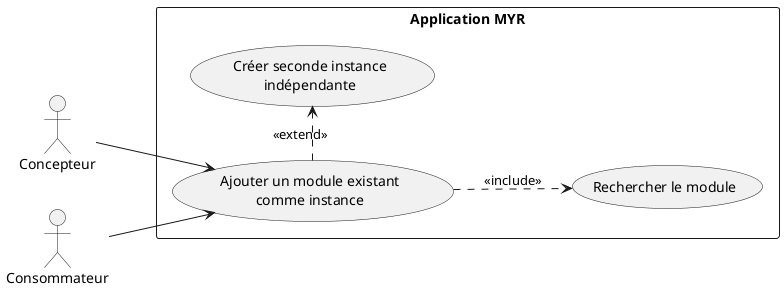
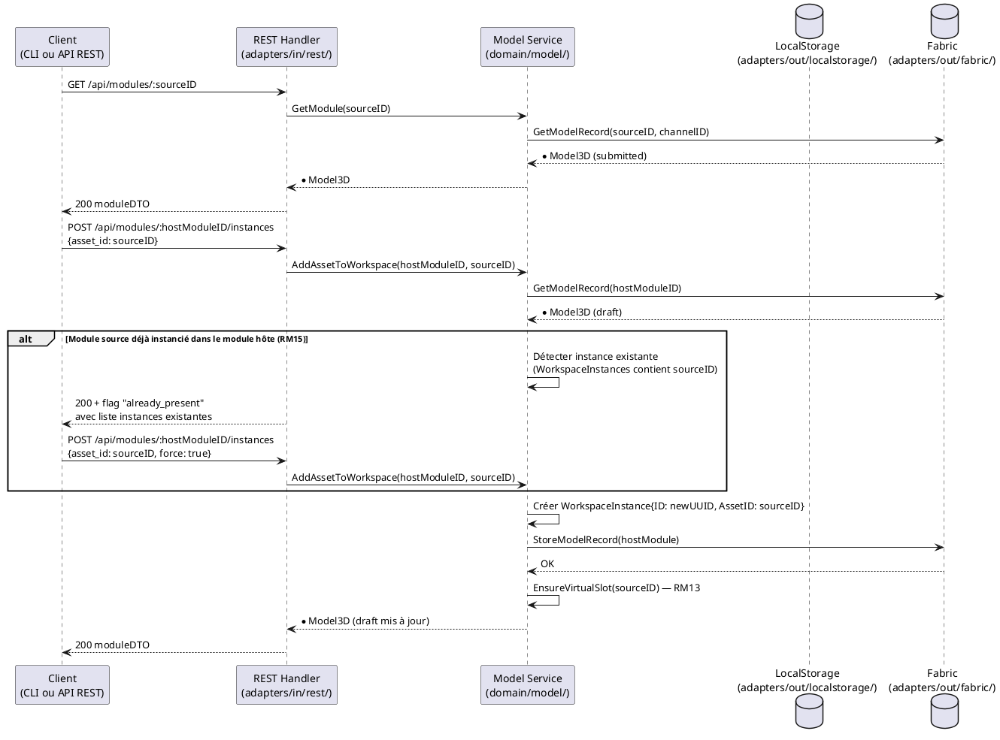

# Ajouter un Module existant

## Diagramme d'acteurs

## Contexte

Un Concepteur ou Consommateur souhaite réutiliser un Module déjà existant (contrôleur, caméra, visserie, sous-assemblage…) comme instance dans son propre module hôte. Le Module source peut provenir :
- du réseau blockchain (Module soumis, visible publiquement)
- d'une boutique partenaire liée au réseau

La clé de cette opération est la gestion des **instances indépendantes** (RM15) : le même Module peut être instancié plusieurs fois dans un module hôte, chaque instance ayant ses propres Liaisons sans affecter les autres. Cette règle est symétrique avec l'ajout de Composants (UCAM01).

## Pré-conditions

- Identité authentifiée avec rôle **Concepteur** (`contributor`) ou **Consommateur** (`consumer`)
- Un module hôte existe, en état `draft` (voir UCMOD01)
- Le Module cible est accessible sur la blockchain ou une boutique partenaire (état `submitted`)

## Scénario

**Étape initiale :** Le Module source est identifié par référence ou filtre (voir UCREC01/UCCL01), puis `POST /api/modules/:hostModuleID/instances` est appelée avec son identifiant (ou l'équivalent CLI `myr model instance add`)

### Flux nominal — Module ajouté (première instance)

1. Le Module source est récupéré depuis la blockchain (`GET /api/modules/:id`)
2. `POST /api/modules/:hostModuleID/instances` est appelée avec `{asset_id: moduleSource.ID}`
3. Service : `AddAssetToWorkspace(hostModuleID, assetID)` crée une `WorkspaceInstance` indépendante
4. Le slot virtuel est garanti automatiquement (RM13)
5. Le Module source est instancié dans le module hôte, avec ses interfaces exposées

<!-- tests-obsidian:begin — tests rattachés à cette exigence, section générée : ne pas l'éditer à la main -->
> [!check]- Tests — 0 explicite(s) · 5 déduit(s)
> - 🟡 [TestAPIIntegration_ModuleLifecycle](../../../docs/tests/adapters-in-rest/TestAPIIntegration_ModuleLifecycle.md) — déduit : teste route `/api/modules/`
> - 🟡 [TestLegacyModulesAlias_GET_DelegatesToComponents](../../../docs/tests/adapters-in-rest/TestLegacyModulesAlias_GET_DelegatesToComponents.md) — déduit : teste route `/api/modules/`
> - 🟡 [TestLegacyModulesAlias_ListRoute](../../../docs/tests/adapters-in-rest/TestLegacyModulesAlias_ListRoute.md) — déduit : teste route `/api/modules/`
> - 🟡 [TestModules_RegenerateThumbnail_OK](../../../docs/tests/adapters-in-rest/TestModules_RegenerateThumbnail_OK.md) — déduit : teste route `/api/modules/`
> - 🟡 [TestModules_Verify_OK](../../../docs/tests/adapters-in-rest/TestModules_Verify_OK.md) — déduit : teste route `/api/modules/`
<!-- tests-obsidian:end -->

### Flux alternatif — Module déjà instancié dans le module hôte (RM15)

1. Le Module cible possède déjà au moins une `WorkspaceInstance` dans le module hôte
2. `POST /api/modules/:hostModuleID/instances` avec `{asset_id: sourceID, force: true}` crée une nouvelle `WorkspaceInstance` avec un nouvel ID unique
3. La nouvelle instance est indépendante — ses futures Liaisons n'impactent pas la première instance
4. Les deux instances sont consultables via `GET /api/modules/:hostModuleID/instances`

<!-- tests-obsidian:begin — tests rattachés à cette exigence, section générée : ne pas l'éditer à la main -->
> [!check]- Tests — 0 explicite(s) · 5 déduit(s)
> - 🟡 [TestAPIIntegration_ModuleLifecycle](../../../docs/tests/adapters-in-rest/TestAPIIntegration_ModuleLifecycle.md) — déduit : teste route `/api/modules/`
> - 🟡 [TestLegacyModulesAlias_GET_DelegatesToComponents](../../../docs/tests/adapters-in-rest/TestLegacyModulesAlias_GET_DelegatesToComponents.md) — déduit : teste route `/api/modules/`
> - 🟡 [TestLegacyModulesAlias_ListRoute](../../../docs/tests/adapters-in-rest/TestLegacyModulesAlias_ListRoute.md) — déduit : teste route `/api/modules/`
> - 🟡 [TestModules_RegenerateThumbnail_OK](../../../docs/tests/adapters-in-rest/TestModules_RegenerateThumbnail_OK.md) — déduit : teste route `/api/modules/`
> - 🟡 [TestModules_Verify_OK](../../../docs/tests/adapters-in-rest/TestModules_Verify_OK.md) — déduit : teste route `/api/modules/`
<!-- tests-obsidian:end -->

### Flux erreur — Module introuvable sur la blockchain

1. L'ID ou la référence transmise ne correspond à aucun asset sur la blockchain
2. Message : "Module introuvable — vérifiez la référence"
3. Le module hôte reste inchangé

<!-- tests-obsidian:begin — tests rattachés à cette exigence, section générée : ne pas l'éditer à la main -->
> [!warning] Tests — aucun test ne couvre cette exigence
> [Matrice de couverture](../../../docs/tests/Matrice_Couverture_Tests.md)
<!-- tests-obsidian:end -->

### Flux erreur — Module non soumis (état draft d'un autre utilisateur)

1. Le Module cible existe mais est en état `draft` — il n'est pas visible sur le réseau
2. Le système retourne une erreur d'accès interdit
3. Message : "Ce module n'est pas encore publié sur le réseau"

<!-- tests-obsidian:begin — tests rattachés à cette exigence, section générée : ne pas l'éditer à la main -->
> [!warning] Tests — aucun test ne couvre cette exigence
> [Matrice de couverture](../../../docs/tests/Matrice_Couverture_Tests.md)
<!-- tests-obsidian:end -->

## Post-conditions

- Une nouvelle `WorkspaceInstance` est créée dans le module hôte avec un ID unique
- L'instance référence `AssetID` du Module source (pas une copie)
- Le module hôte reste en état `draft`
- Chaque instance dispose d'au moins un slot virtuel (RM13)
- Les Liaisons entre instances restent indépendantes (RM15)

## Diagramme de séquence

## Règles métier déclenchées

| Règle | Description | Point d'application |
|-------|-------------|---------------------|
| **RM13** | Slot virtuel garanti pour chaque asset instancié | `EnsureVirtualSlot()` dans `AddAssetToWorkspace()` |
| **RM15** | Seconde instance indépendante si le Module est déjà instancié dans le module hôte | Détection dans `AddAssetToWorkspace()` |

## Exigences non-fonctionnelles

- **ENF12** : Rôle vérifié côté serveur — seuls Concepteur et Consommateur peuvent ajouter un Module comme instance
- **ENF28** : Le Module source reste immuable — seule une référence (`AssetID`) est copiée, pas les données

## Notes d'implémentation

**Endpoints REST utilisés :**
- `GET /api/modules/:id` → récupère le Module source depuis la blockchain
- `POST /api/modules/:id/instances` → ajoute une instance au module hôte (handlers.go:~1127)

**Commande CLI équivalente :** `myr module list` (méthode `ListModules`) pour rechercher le Module source, puis `myr model instance add <hostModuleID> <sourceModuleID>` (méthode `AddAssetToWorkspace`) pour l'instancier dans le module hôte — chaque appel crée une nouvelle `WorkspaceInstance` indépendante, y compris pour une seconde instance du même Module (RM15). Une fois une Liaison créée, `myr module add-assembly <hostModuleID> <connID>` (méthode `AddAssemblyToModule`) la rattache au Module hôte. Voir `specs/3-Conception/DC_CLI_Model.md` § 5.

**RM15 — Détection de doublon :** `AddAssetToWorkspace()` inspecte `m.WorkspaceInstances` avant de créer l'instance et retourne un indicateur `already_present` dans la réponse si le même asset y figure déjà, sans bloquer l'ajout — à charge du client (script, CLI ou GUI) de décider s'il force une seconde instance.

**Note architecture :** L'instance créée est une référence (`AssetID`), pas une copie de l'entité — les modifications du Module source sur la blockchain n'affectent pas les snapshots `ModuleVersion` déjà soumis, mais sont reflétées à la prochaine lecture du module hôte.

<!-- liens-obsidian:begin — section de traçabilité générée à partir des références du document : ne pas l'éditer à la main -->
## Liens

**Étape suivante — conception**
- **Architecture_Composition** : [§ Architecture — Composition (D3/D5/D6 : composant, assemblage, module)](../../3-Conception/Architecture_Composition.md#Architecture%20—%20Composition%20%28D3/D5/D6%20:%20composant,%20assemblage,%20module%29)
- **DC_CLI_Model** : [§ DC — CLI Modèle : Référence des commandes composant / interfaces / module](../../3-Conception/DC_CLI_Model.md#DC%20—%20CLI%20Modèle%20:%20Référence%20des%20commandes%20composant%20/%20interfaces%20/%20module) · [§ 2. Arbre de commandes](../../3-Conception/DC_CLI_Model.md#2.%20Arbre%20de%20commandes) · [§ 3.6 `myr model assembly add` / `remove` (ex-`myr module add-assembly`/`remove-assembly`, ADR-11)](../../3-Conception/DC_CLI_Model.md#3.6%20`myr%20model%20assembly%20add`%20/%20`remove`%20%28ex-`myr%20module%20add-assembly`/`remove-assembly`,%20ADR-11%29) · [§ 5. Table de correspondance méthode domaine → commande CLI → use case](../../3-Conception/DC_CLI_Model.md#5.%20Table%20de%20correspondance%20méthode%20domaine%20→%20commande%20CLI%20→%20use%20case)
- **Sequence_soumission_module** : [§ Séquence — Composition et soumission d'un module (D5/D6)](../../3-Conception/Sequence_soumission_module.md#Séquence%20—%20Composition%20et%20soumission%20d'un%20module%20%28D5/D6%29)

<!-- liens-obsidian:end -->
