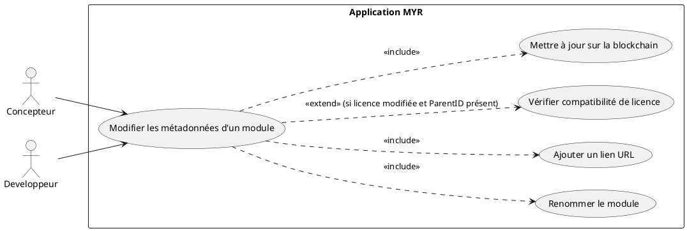
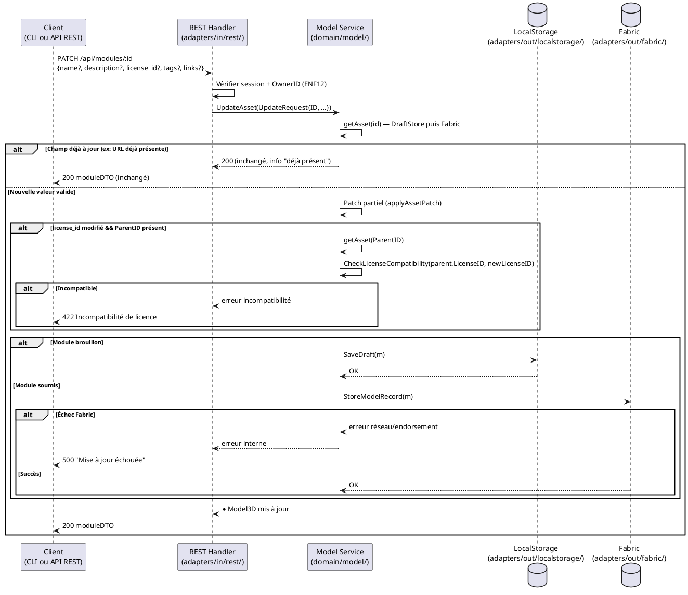

# Modifier les métadonnées d'un Module

## Diagramme d'acteurs

## Contexte

Après création, un module peut être reconfiguré par son propriétaire : nom, description, licence, tags, ou ajout d'une URL de référence (fiche produit boutique, documentation technique, dépôt GitHub, page fabricant). Cette opération ne modifie ni la composition (instances, liaisons — voir UCAM01/UCMOD02) ni le fichier associé — elle met à jour les métadonnées de l'asset.

Un module reçoit un nom généré automatiquement à sa création (`<identité du Concepteur>_<date>_<heure>`, voir UCMOD01) — le renommer est l'usage le plus courant de cet UC.

Cette opération est la généralisation à un module de UCCE02 (« Configurer un Composant ») : même service `service.UpdateAsset()`, mêmes champs modifiables (`name`, `description`, `license_id`, `tags`, `links`), même comportement de patch partiel, seule la route change (`PATCH /api/modules/:id` au lieu de `PATCH /api/components/:id`). Elle nécessite une transaction blockchain si le module est déjà soumis. Seul le propriétaire du Module (`OwnerID`) peut modifier ses métadonnées.

**Attention RM19 :** si le Module est en état `submitted`, toute modification de sa structure devrait selon les specs déclencher une nouvelle version. Dans l'implémentation actuelle, `UpdateAsset()` modifie directement le record blockchain sans créer de `ModuleVersion` — cet écart est documenté ci-dessous. Il ne concerne que les modifications touchant la composition ; le renommage ou l'ajout d'un lien restent des métadonnées hors composition.

## Pré-conditions

- Utilisateur authentifié avec rôle **Concepteur** ou **Développeur**
- Être propriétaire du Module (`OwnerID == userID`)
- Le Module existe (brouillon local ou soumis sur la blockchain)
- Si une URL est fournie : elle est syntaxiquement valide (format HTTP/HTTPS)

## Scénario

**Étape initiale :** `PATCH /api/modules/:id` est appelée (ou l'équivalent CLI `myr model update`) avec un ou plusieurs champs à modifier

### Flux nominal — Renommage du module

1. Un nouveau nom est transmis : `{name: "Chassis v2"}`
2. Le REST Handler valide le champ (name max 256 caractères)
3. Le handler appelle `service.UpdateAsset(UpdateRequest{ID, Name})`
4. Le service récupère l'asset existant (brouillon ou blockchain) et applique le patch partiel — seul `Name` change
5. Si le module est un brouillon : la modification reste locale (`DraftStore`), aucune transaction blockchain
6. Si le module est déjà soumis : la transaction est soumise (`StoreModelRecord`)
7. L'API retourne `200 OK` avec le `Model3D` mis à jour

### Flux nominal — URL ajoutée avec succès

1. L'URL de référence est transmise : `{links: [...existant, nouvelleURL]}`
2. Le service valide le format (doit commencer par `http://` ou `https://`)
3. Service : `UpdateAsset(UpdateRequest{ID, Links: [...]})` — patch partiel
4. L'adapter blockchain met à jour le record `Model3D` si le module est déjà soumis
5. La réponse confirme — l'URL apparaît dans la liste des liens du Module

### Flux alternatif — Patch partiel (un seul champ à la fois)

1. Seul un champ est transmis (nom, description, licence, tags ou liens)
2. Le service applique uniquement ce champ — les autres restent inchangés (`UpdateAsset` est un patch partiel)
3. Si `license_id` change et que le module a un `ParentID` : la compatibilité de licence avec le parent est vérifiée (RM03)

### Flux alternatif — Module en état draft

1. Le Module est encore en état `draft` (non soumis)
2. La mise à jour s'effectue de la même façon via `UpdateAsset()`, mais reste dans `DraftStore`
3. Aucune transaction Fabric n'est créée — la modification sera incluse dans la `ModuleVersion` lors de la soumission (UCMOD06)

### Flux alternatif — URL déjà présente

1. L'URL saisie est identique à une URL déjà dans `m.Links`
2. Le système détecte le doublon et n'ajoute pas d'entrée dupliquée
3. Message informatif : "Ce lien est déjà associé à ce module"

### Flux erreur — Incompatibilité de licence avec le parent (RM03)

1. Le module a un `ParentID` (voir UCMOD01, dérivation) et la nouvelle licence est incompatible avec celle du parent
2. `CheckLicenseCompatibility(parent.LicenseID, newLicenseID)` retourne `Compatible: false`
3. Le service retourne l'erreur avant toute soumission Fabric
4. L'API retourne `422 Unprocessable Entity` : `{ "error": "Incompatibilité de licence : <raison>." }`

### Flux erreur — Format URL invalide

1. La chaîne transmise ne respecte pas le format HTTP/HTTPS
2. Le serveur retourne `400 Bad Request`
3. Aucune modification persistée

### Flux erreur — Droits insuffisants

1. L'identité n'est pas propriétaire du Module (`OwnerID != userID`)
2. Le serveur retourne `403 Forbidden`
3. Message : "Vous n'êtes pas propriétaire de ce module"

### Flux erreur — Échec transaction blockchain

1. La transaction de mise à jour échoue (réseau Fabric indisponible, endorsement refusé)
2. Message : "Impossible de mettre à jour le module — réessayez"
3. Le Module reste dans son état précédent (ENF30)

## Post-conditions

- Les champs modifiés (`name`, `description`, `license_id`, `tags`, `links`) sont mis à jour — localement si le module est un brouillon, sur la blockchain (nouveau bloc) s'il est déjà soumis
- Le Module reste dans son état (`draft` ou `submitted`) — le statut n'est pas modifié par cet UC
- Les métadonnées mises à jour sont visibles immédiatement via `GET /api/modules/:id`

## Diagramme de séquence

## Règles métier déclenchées

| Règle | Description | Point d'application |
|-------|-------------|---------------------|
| **RM03** | Si `ParentID != ""` et `LicenseID` modifié : re-vérification de compatibilité de licence obligatoire | `UpdateAsset()`, même vérification que pour un composant (UCCE02) |
| **RM07** | Validation complète côté serveur avant toute transaction blockchain | Vérification `OwnerID` + format URL |
| **RM19** | Modification d'un module soumis → nouvelle version requise (composition uniquement) | **Écart E5** : non implémenté — `UpdateAsset()` modifie directement sans fork, y compris pour les métadonnées hors composition |

## Exigences non-fonctionnelles

- **ENF12** : Contrôle d'ownership côté serveur obligatoire
- **ENF30** : En cas d'échec Fabric, état local préservé intact

## Notes d'implémentation

**Endpoints REST utilisés :**
- `PATCH /api/modules/:id` → patch partiel via `UpdateAsset()` (handlers.go — `handleModule`, méthode PATCH)

**Champs acceptés dans le body JSON :** `name`, `description`, `license_id`, `tags` (tableau), `links` (tableau) — identiques à `PATCH /api/components/:id` (UCCE02). Aucun autre champ n'est modifiable par cette route (ni `owner_id`, ni `parent_id`, ni la composition — voir UCAM01/UCMOD02 pour la composition).

**Écart RM19 :** La spécification exige qu'un module `submitted` crée une nouvelle `ModuleVersion` à chaque modification de sa composition. Dans le code actuel, `UpdateAsset()` (service.go:~626) modifie directement le record blockchain sans vérifier le statut ni créer de version. L'implémentation cible doit :
1. Détecter `m.Status == ModuleSubmitted`
2. Créer une nouvelle `ModuleVersion` (fork) avant d'appliquer la modification, si elle touche la composition
3. Ou refuser la modification et proposer le fork explicitement (UCMOD06)

Cet écart ne bloque pas le renommage ou l'ajout de lien, qui sont des métadonnées hors composition.

**Routage :** `handleModule()` distingue la branche `PATCH /api/modules/:id` des branches `GET`/`DELETE` (UCMOD08) et route le patch vers `UpdateAsset`, exactement comme `handleComponent()` le fait pour `PATCH /api/components/:id` (UCCE02) — même helper de décodage partagé entre les deux routes.

**Commande CLI équivalente :** `myr model update <id> [--name <nom>] [--description <texte>] [--license <id>] [--tags <a,b>] [--add-link <url>]` appelle la même méthode de service (`UpdateAsset`) que `PATCH /api/modules/:id`, avec le même comportement de patch partiel. Voir `specs/3-Conception/DC_CLI_Model.md` § 5.
