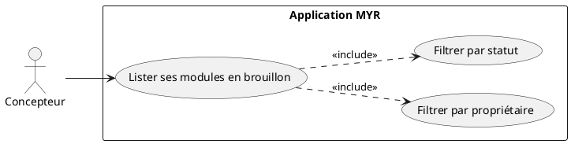
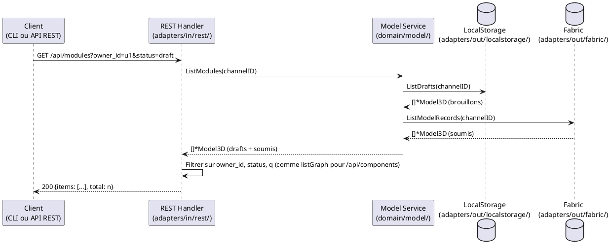

# Lister ses Modules en brouillon

## Diagramme d'acteurs

## Contexte

Un Concepteur travaille en permanence dans un Module en état `draft` (assemblage de composants, création de liaisons, ajout d'interfaces). Avant de continuer un travail déjà commencé, il doit pouvoir retrouver la liste de ses propres modules encore en brouillon, sans devoir recharger et filtrer côté client l'ensemble du catalogue (composants et modules confondus, tous propriétaires, tous statuts).

`GET /api/modules` accepte pour cela les mêmes filtres serveur que ceux déjà disponibles pour la liste des composants (`GET /api/components`, UCCL01) : un filtre par propriétaire (`owner_id`) et un filtre par statut (`status`, `draft` ou `submitted`). Le filtrage réduit la réponse côté serveur — le client ne reçoit que le sous-ensemble pertinent, quelle que soit la taille du catalogue.

## Pré-conditions

- Utilisateur authentifié (tout rôle ayant accès à `GET /api/modules`)
- Au moins un module existe (brouillon local ou soumis)

## Scénario

**Étape initiale :** `GET /api/modules?owner_id=<userID>&status=draft` est appelée (ou l'équivalent CLI `myr module list`)

### Flux nominal — Modules en brouillon d'un utilisateur

1. Le client appelle `GET /api/modules?owner_id=<userID>&status=draft`
2. Le service liste tous les modules (`ListModules(channelID)`) puis le handler REST filtre sur `OwnerID == userID` et `Status == draft`
3. Seuls les modules en brouillon appartenant à l'utilisateur sont retournés, avec leur `total`
4. Le client présente cette liste comme sélecteur pour continuer un travail existant ou en créer un nouveau (UCMOD01)

### Flux alternatif — Filtre texte combiné

1. Le paramètre `q` (recherche texte sur nom/description, déjà existant) est combiné à `owner_id` et `status`
2. Les trois filtres s'appliquent cumulativement

### Flux alternatif — Aucun filtre fourni

1. Aucun paramètre `owner_id`/`status` n'est transmis
2. Le comportement reste inchangé : tous les modules accessibles sont retournés (comportement historique de `GET /api/modules`)

### Flux erreur — Aucun module ne correspond

1. Aucun module ne correspond aux filtres fournis
2. La réponse contient une liste vide (`items: []`, `total: 0`) — ce n'est pas une erreur

## Post-conditions

- La liste retournée ne contient que les modules correspondant aux filtres demandés
- Aucune modification d'état — opération strictement en lecture

## Diagramme de séquence

## Règles métier déclenchées

Aucune règle métier nouvelle — opération de lecture pure, filtrage appliqué au niveau du handler REST comme pour `GET /api/components` (UCCL01).

## Exigences non-fonctionnelles

- **ENF12** : Accès en lecture restreint aux utilisateurs authentifiés (sauf configuration réseau Visiteur)
- **ENF01** : Le filtrage côté serveur évite de transférer et filtrer côté client l'ensemble du catalogue à chaque rafraîchissement du sélecteur

## Notes d'implémentation

**Endpoint REST utilisé :**
- `GET /api/modules?owner_id=&status=&q=&limit=` (handlers.go — `handleModules`, méthode GET)

**Cohérence avec `GET /api/components` :** le filtre `owner_id` reprend exactement le même nom de paramètre et la même sémantique que `listGraph` (`adapters/in/rest/handlers.go`, UCCL01) — aucune divergence de contrat entre les deux endpoints de listing.

**Commande CLI équivalente :** `myr module list` (méthode `ListModules`) — l'ajout de flags `--owner-id`/`--status` côté CLI reste un point ouvert, la CLI composants (`myr model list`) ne les expose pas non plus aujourd'hui ; pas de nouvelle asymétrie introduite par cet UC.

<!-- liens-obsidian:begin — section de traçabilité générée à partir des références du document : ne pas l'éditer à la main -->
## Liens

**Étape suivante — conception**
- _Aucun document de conception ne traite ce use case : la chaîne s'arrête à l'analyse._

**Code cité par cette analyse (sans conception : non relié)**
- REST `/api/modules/`
- REST `/api/components/`
- CLI `myr model list`
- `BlockchainPort.ListModelRecords`
- `DraftStore.ListDrafts`
- `ModelService.ListModules`

<!-- liens-obsidian:end -->
