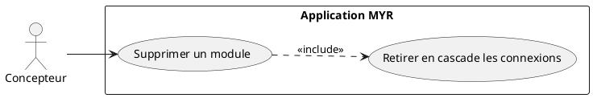
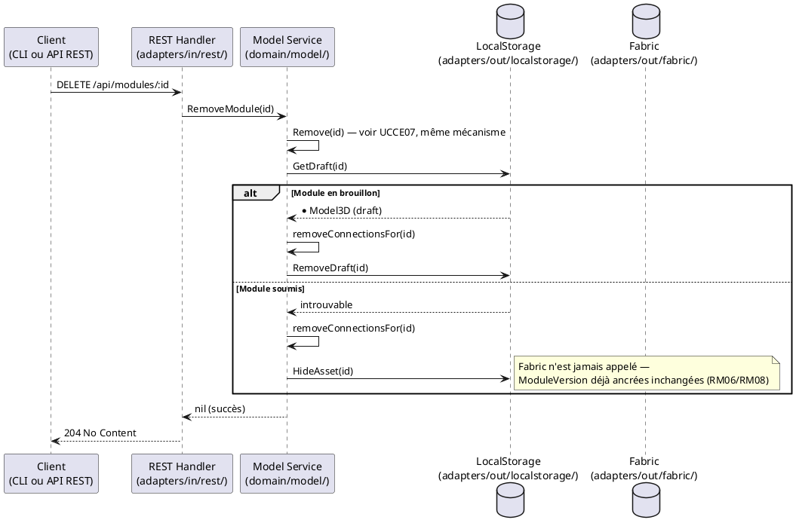

# Supprimer un Module

## Diagramme d'acteurs

## Contexte

Un module (brouillon abandonné, ou module déjà soumis mais devenu obsolète) doit pouvoir être supprimé par son propriétaire. Ce comportement est strictement identique à la suppression d'un composant (UCCE07) : `RemoveModule()` délègue au même `Remove()` que les composants, et RM08 s'applique de façon générique à tout asset — composant ou module.

Un module en état `draft` est réellement retiré (`DraftStore`). Un module déjà `submitted` est masqué localement (disparaît de `GET /api/modules`) mais son enregistrement blockchain — y compris la ou les `ModuleVersion` déjà ancrées — n'est jamais modifié. Le Concepteur choisit ainsi librement entre :
- **Supprimer** un module soumis dont il n'a plus l'usage (il disparaît de ses listes, sans perte d'intégrité du ledger).
- **Conserver** un module soumis pour le dériver plus tard sans reconstruire sa composition (voir UCMOD01, flux « Dérivation d'un Module existant »).

## Pré-conditions

- Le Concepteur est authentifié avec le rôle `contributor`
- Le Concepteur est propriétaire du module (`OwnerID` correspond à son identité)
- Le module existe (brouillon local ou soumis)

## Scénario

**Étape initiale :** `DELETE /api/modules/:id` est appelée (ou l'équivalent CLI `myr module remove`)

### Flux nominal — Suppression d'un module en brouillon

1. Le module est retrouvé dans le stockage local (`DraftStore`)
2. Les connexions internes du module (`Assemblies`) et toute connexion externe l'impliquant sont retirées en cascade
3. Le module est retiré du stockage local
4. L'API retourne `204 No Content`

<!-- tests-obsidian:begin — tests rattachés à cette exigence, section générée : ne pas l'éditer à la main -->
> [!warning] Tests — aucun test ne couvre cette exigence
> [Matrice de couverture](../../../docs/tests/Matrice_Couverture_Tests.md)
<!-- tests-obsidian:end -->

### Flux nominal — Suppression (masquage) d'un module soumis

1. Le module est retrouvé sur la blockchain (déjà soumis, avec ses `ModuleVersion`)
2. Les connexions impliquant le module (en tant qu'instance dans un autre module hôte) sont retirées en cascade
3. L'identifiant du module est enregistré dans le registre local de masquage — aucune écriture blockchain, aucune modification de `ModuleVersion`
4. L'API retourne `204 No Content`
5. Le module disparaît de `GET /api/modules` mais reste accessible via `GET /api/modules/:id` — notamment pour toute dérivation ultérieure (`parent_id`, UCMOD01) ou pour un module hôte qui l'a déjà instancié

<!-- tests-obsidian:begin — tests rattachés à cette exigence, section générée : ne pas l'éditer à la main -->
> [!check]- Tests — 0 explicite(s) · 5 déduit(s)
> - 🟡 [TestAPIIntegration_ModuleLifecycle](../../../docs/tests/adapters-in-rest/TestAPIIntegration_ModuleLifecycle.md) — déduit : teste route `/api/modules/`
> - 🟡 [TestLegacyModulesAlias_GET_DelegatesToComponents](../../../docs/tests/adapters-in-rest/TestLegacyModulesAlias_GET_DelegatesToComponents.md) — déduit : teste route `/api/modules/`
> - 🟡 [TestLegacyModulesAlias_ListRoute](../../../docs/tests/adapters-in-rest/TestLegacyModulesAlias_ListRoute.md) — déduit : teste route `/api/modules/`
> - 🟡 [TestModules_RegenerateThumbnail_OK](../../../docs/tests/adapters-in-rest/TestModules_RegenerateThumbnail_OK.md) — déduit : teste route `/api/modules/`
> - 🟡 [TestModules_Verify_OK](../../../docs/tests/adapters-in-rest/TestModules_Verify_OK.md) — déduit : teste route `/api/modules/`
<!-- tests-obsidian:end -->

### Flux erreur — Module introuvable

1. Aucun module ne correspond à l'identifiant fourni
2. L'API retourne `404 Not Found`

<!-- tests-obsidian:begin — tests rattachés à cette exigence, section générée : ne pas l'éditer à la main -->
> [!warning] Tests — aucun test ne couvre cette exigence
> [Matrice de couverture](../../../docs/tests/Matrice_Couverture_Tests.md)
<!-- tests-obsidian:end -->

### Flux erreur — Droits insuffisants

1. L'identité n'est pas propriétaire du module
2. L'API retourne `403 Forbidden`

<!-- tests-obsidian:begin — tests rattachés à cette exigence, section générée : ne pas l'éditer à la main -->
> [!warning] Tests — aucun test ne couvre cette exigence
> [Matrice de couverture](../../../docs/tests/Matrice_Couverture_Tests.md)
<!-- tests-obsidian:end -->

## Post-conditions

- Le module n'apparaît plus dans `GET /api/modules`
- Si le module était un brouillon : il n'existe plus nulle part
- Si le module était soumis : ses `ModuleVersion` et son enregistrement blockchain restent inchangés et consultables par identifiant direct
- Les connexions impliquant le module sont retirées

## Diagramme de séquence

## Règles métier déclenchées

| Règle | Description | Point d'application |
|-------|-------------|---------------------|
| **RM06** | Immuabilité des transactions — aucune suppression sur le ledger, `ModuleVersion` incluses | `Remove()` n'appelle jamais d'opération de suppression blockchain |
| **RM08** | Masquage local, ledger jamais modifié | `RemoveModule()` → `Remove()` — identique à UCCE07 |
| **RM14/RM15** (généralisées) | Retrait en cascade des connexions impliquant l'asset supprimé | `removeConnectionsFor()` |

## Exigences non-fonctionnelles

- **ENF12** : Contrôle d'ownership côté serveur obligatoire
- **ENF28** : Immuabilité des `ModuleVersion` déjà ancrées, y compris après suppression locale du module

## Notes d'implémentation

**Endpoint REST utilisé :**
- `DELETE /api/modules/:id` → `service.RemoveModule()` (handlers.go — `handleModule`, méthode DELETE)

**Registre de masquage :** identique à UCCE07 — même port `RemovedAssetStore`, même store local (`adapters/out/localstorage/json_blockchain.go`), même exclusion de `ListModules()` / non-filtrage de `GetModule()`.

**Commande CLI équivalente :** `myr module remove <id>` appelle `RemoveModule()`.

**Voir aussi UCMOD01** (flux « Dérivation d'un Module existant ») : un module masqué reste un point de départ valide pour une dérivation, puisque `GetModule(id)` continue de le résoudre.

<!-- liens-obsidian:begin — section de traçabilité générée à partir des références du document : ne pas l'éditer à la main -->
## Liens

**Étape suivante — conception**
- **API_REST** : [§ 4. D3/D4/D6 — Composants (ressource unique, ADR-11)](../../3-Conception/API_REST.md#4.%20D3/D4/D6%20—%20Composants%20%28ressource%20unique,%20ADR-11%29)

<!-- liens-obsidian:end -->
