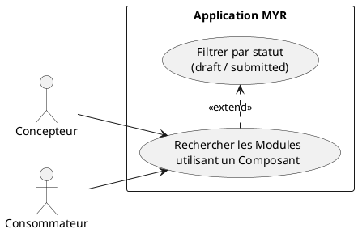
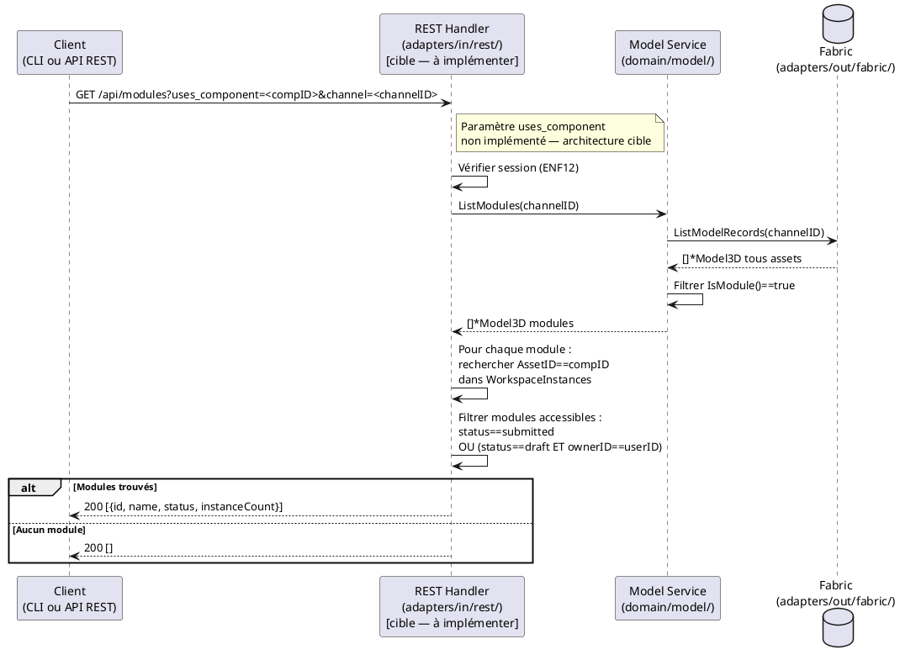

# Rechercher les Modules qui utilisent un Composant

## Diagramme d'acteurs



## Contexte

À partir d'un Composant identifié, lister tous les Modules du réseau qui l'intègrent dans leur assemblage. Cette fonctionnalité répond à deux besoins :
- **Impact analysis :** un Concepteur veut savoir quels Modules seront affectés s'il modifie un Composant (nécessité de fork — RM19)
- **Découverte :** un Consommateur veut trouver des Modules déjà assemblés utilisant un Composant spécifique qu'il connaît

Un Module "utilise" un Composant si son `WorkspaceInstances` contient une instance avec `AssetID == composantID`.

**Statut d'implémentation :** L'endpoint `/api/modules?uses_component=:id` est **absent** du code actuel. À implémenter.

## Pré-conditions

- Identité authentifiée (rôle `Lecteur` minimum)
- Un Composant identifié (ID connu du client)
- La blockchain est accessible

## Scénario

**Étape initiale :** `GET /api/modules?uses_component=<componentID>&channel=<channelID>` est appelée

### Flux nominal — Modules trouvés

1. `ListModules(channelID)` récupère tous les Modules du réseau
2. Les Modules dont `WorkspaceInstances` contient au moins une entrée avec `AssetID == componentID` sont filtrés
3. La liste des Modules correspondants est retournée, avec pour chacun : nom, statut (`draft`/`submitted`), nombre de liaisons

<!-- tests-obsidian:begin — tests rattachés à cette exigence, section générée : ne pas l'éditer à la main -->
> [!warning] Tests — aucun test ne couvre cette exigence
> [Matrice de couverture](../../../docs/tests/Matrice_Couverture_Tests.md)
<!-- tests-obsidian:end -->

### Flux nominal — Aucun Module utilisant ce Composant

1. Aucun Module ne contient d'instance du Composant
2. Message : "Aucun module n'utilise ce composant"

<!-- tests-obsidian:begin — tests rattachés à cette exigence, section générée : ne pas l'éditer à la main -->
> [!warning] Tests — aucun test ne couvre cette exigence
> [Matrice de couverture](../../../docs/tests/Matrice_Couverture_Tests.md)
<!-- tests-obsidian:end -->

### Flux alternatif — Filtrage par statut

1. Un filtre par statut `submitted` (Modules publics uniquement) est transmis
2. Les Modules en état `draft` (non publiés, appartenant à d'autres) sont exclus de la réponse

<!-- tests-obsidian:begin — tests rattachés à cette exigence, section générée : ne pas l'éditer à la main -->
> [!warning] Tests — aucun test ne couvre cette exigence
> [Matrice de couverture](../../../docs/tests/Matrice_Couverture_Tests.md)
<!-- tests-obsidian:end -->

### Flux alternatif — Composant utilisé dans un Module non accessible (draft d'un autre utilisateur)

1. Un Module contient le Composant mais est en état `draft` appartenant à un autre utilisateur
2. Ce Module n'apparaît pas dans les résultats (non visible sur le réseau tant que non soumis)

<!-- tests-obsidian:begin — tests rattachés à cette exigence, section générée : ne pas l'éditer à la main -->
> [!warning] Tests — aucun test ne couvre cette exigence
> [Matrice de couverture](../../../docs/tests/Matrice_Couverture_Tests.md)
<!-- tests-obsidian:end -->

## Post-conditions

- La liste des Modules utilisant le Composant est retournée
- Aucune modification de la blockchain

## Diagramme de séquence



## Règles métier déclenchées

| Règle | Description | Point d'application |
|-------|-------------|---------------------|
| **RM16** | Les Modules en `draft` appartenant à d'autres utilisateurs sont invisibles | Filtre sur `status + ownerID` dans le handler |
| **RM19** | Impact analysis — un Concepteur doit savoir quels Modules sont affectés avant de modifier un Composant | Contexte d'utilisation de cet UC |

## Exigences non-fonctionnelles

- **ENF12** : Authentification par session (token opaque) obligatoire

## Notes d'implémentation

**Endpoint manquant :** Le handler `handleModules()` (handlers.go:~965) ne supporte pas le paramètre `uses_component`. À ajouter dans la branche `GET` de `handleModules()` :
```go
if usesComp := r.URL.Query().Get("uses_component"); usesComp != "" {
    // filtrer filtered par WorkspaceInstances contenant usesComp
}
```

**Filtrage côté handler :** La recherche est effectuée côté handler (pas dans le chaincode Fabric) car `WorkspaceInstances` est un champ complexe difficile à requêter dans le chaincode v1. Pour les gros réseaux, un index secondaire dans le chaincode est à envisager.

**Modules `draft` d'autres utilisateurs :** Les Modules en `draft` ne doivent apparaître que pour leur propriétaire. L'information `ownerID` est disponible dans `Model3D.OwnerID`. Le handler doit comparer ce champ au `Pseudo` de la session courante pour appliquer ce filtre (aucune comparaison de ce type n'existe aujourd'hui — voir écart similaire documenté dans UCA06/Securite.md).

**Cas des modules imbriqués :** Un Module peut contenir un sous-Module qui lui-même contient le Composant cible. Le filtrage actuel (direct `WorkspaceInstances`) ne détecte pas cette utilisation indirecte. La profondeur de recherche (directe vs récursive) est une décision de conception à soumettre au PO.

**Commande CLI équivalente (point ouvert) :** `myr module list` (méthode `ListModules`) fournit la même base que le futur `GET /api/modules?uses_component=:id`, mais sans le paramètre de filtre — absent tant côté REST que côté CLI. En attendant, l'administrateur doit inspecter chaque module avec `myr module get <id>` pour vérifier manuellement la présence du composant dans ses `WorkspaceInstances`.

<!-- liens-obsidian:begin — section de traçabilité générée à partir des références du document : ne pas l'éditer à la main -->
## Liens

**Étape suivante — conception**
- **API_REST** : [§ 4. D3/D4/D6 — Composants (ressource unique, ADR-11)](../../3-Conception/API_REST.md#4.%20D3/D4/D6%20—%20Composants%20%28ressource%20unique,%20ADR-11%29)
- **DC_CLI_Model** : [§ DC — CLI Modèle : Référence des commandes composant / interfaces / module](../../3-Conception/DC_CLI_Model.md#DC%20—%20CLI%20Modèle%20:%20Référence%20des%20commandes%20composant%20/%20interfaces%20/%20module) · [§ 5. Table de correspondance méthode domaine → commande CLI → use case](../../3-Conception/DC_CLI_Model.md#5.%20Table%20de%20correspondance%20méthode%20domaine%20→%20commande%20CLI%20→%20use%20case) · [§ 6. Écarts et points ouverts](../../3-Conception/DC_CLI_Model.md#6.%20Écarts%20et%20points%20ouverts)
- **DC_D8_Recherche** : [§ DC — D8 : Recherche](../../3-Conception/DC_D8_Recherche.md#DC%20—%20D8%20:%20Recherche) · [§ 1. Objectif](../../3-Conception/DC_D8_Recherche.md#1.%20Objectif) · [§ 4. UCREC04 — Modules utilisant un composant](../../3-Conception/DC_D8_Recherche.md#4.%20UCREC04%20—%20Modules%20utilisant%20un%20composant) · [§ 6. Décisions de conception](../../3-Conception/DC_D8_Recherche.md#6.%20Décisions%20de%20conception) · [§ 7. Écarts code → specs](../../3-Conception/DC_D8_Recherche.md#7.%20Écarts%20code%20→%20specs) · [§ 8. CLI et REST](../../3-Conception/DC_D8_Recherche.md#8.%20CLI%20et%20REST)

<!-- liens-obsidian:end -->
