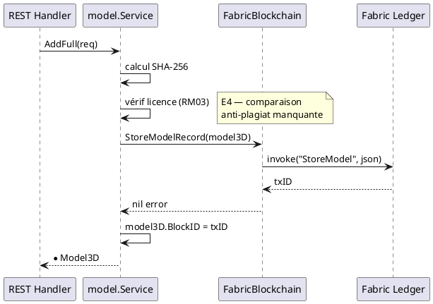
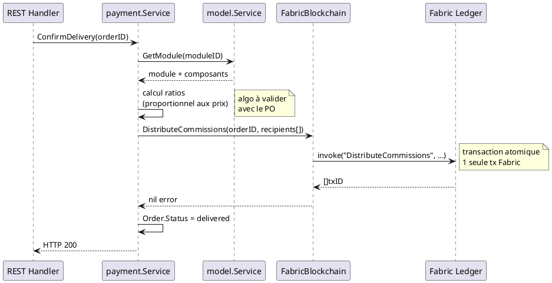

---
tags:
  - couche/conception
  - type/conception
  - rm/RM01
  - rm/RM03
  - rm/RM06
  - rm/RM23
  - rm/RM24
  - rm/RM25
  - rm/RM26
---
# Chaincode — Smart Contracts Fabric

> Phase 3 — Arrington | Package : `chaincode/model/` | Adapter : `adapters/out/fabric/`

---

## 1. Objectif

Le chaincode est le composant exécuté dans HyperLedger Fabric qui garantit :
- L'**immuabilité** des assets enregistrés (RM06)
- La **vérification d'intégrité** par hash SHA-256 (RM01, UCCE03)
- La **distribution automatique des commissions** à la livraison (RM23, RM24)
- La **traçabilité des transferts PI** et du clonage inter-réseaux (RM25, RM26)

Il convient de prendre en compte le fait que Fabric est l'adapteur Blockchain par défaut et qu'il pourra être complété par d'autres blockchain.
---

## 2. État actuel — `chaincode/model/entity.go`

L'entité `Model3D` dans le chaincode est incomplète (E6) :

```go
// Actuel — 7 champs seulement
type Model3D struct {
    ID        string
    Name      string
    Hash      string
    ChannelID string
    OwnerID   string
    Tags      []string
    Versions  []Version
}
```

**Problème :** `adapters/out/fabric/blockchain.go` sérialise le `Model3D` domaine (20+ champs) vers le chaincode. Le chaincode ne désérialisera que les 7 champs qu'il connaît — **perte de données silencieuse en production**.

---

## 3. Entité chaincode `Model3D` — version cible

```go
// Cible — alignée avec domain/model/entity.go
type Model3D struct {
    ID          string    `json:"id"`
    Name        string    `json:"name"`
    Description string    `json:"description,omitempty"`
    Category    string    `json:"category"`
    ParentID    string    `json:"parent_id,omitempty"`
    Hash        string    `json:"hash,omitempty"`        // SHA-256 fichier CAO
    ChannelID   string    `json:"channel_id"`
    OwnerID     string    `json:"owner_id"`
    LicenseID   string    `json:"license_id,omitempty"`
    Tags        []string  `json:"tags,omitempty"`
    Links       []string  `json:"links,omitempty"`
    BlockID     string    `json:"block_id,omitempty"`    // renseigné par le chaincode
    CreatedAt   time.Time `json:"created_at"`
    Interfaces  []AssetInterface `json:"interfaces,omitempty"` // ADR-02 : interfaces physiques/virtuelles embarquées
    // Champs module
    Status      string    `json:"status,omitempty"`      // draft|submitted
    ModuleVersions []ModuleVersion `json:"module_versions,omitempty"`
}

// AssetInterface — point de connexion physique ou virtuel d'un Model3D (ADR-02 : enregistrée sur la blockchain,
// jamais dans un store local séparé). Voir domain/model/entity.go pour la struct domaine de référence.
type AssetInterface struct {
    ID        string  `json:"id"`
    AssetID   string  `json:"asset_id"`
    Name      string  `json:"name,omitempty"`
    Category  string  `json:"category"`
    Tag       string  `json:"tag,omitempty"`
    Type      string  `json:"type"`
    Direction string  `json:"direction"` // in|out|bidir
    ValueMin  float64 `json:"value_min"`
    ValueMax  float64 `json:"value_max,omitempty"`
    IsRange   bool    `json:"is_range"`
    Unit      string  `json:"unit,omitempty"`
    Virtual   bool    `json:"virtual"`
    Removed   bool    `json:"removed,omitempty"` // Fabric ne supporte pas la suppression (règle 9) — marquage logique
}

type ModuleVersion struct {
    Number     int       `json:"number"`
    Assemblies []string  `json:"assemblies"`
    Hash       string    `json:"hash"`
    Note       string    `json:"note,omitempty"`
    CreatedAt  time.Time `json:"created_at"`
    BlockID    string    `json:"block_id,omitempty"`
}

type Version struct {
    Number    int       `json:"number"`
    Hash      string    `json:"hash"`
    CreatedAt time.Time `json:"created_at"`
}
```

> **ADR-02 (`Conception_intro.md`) :** `Interfaces` étant un champ de `Model3D` comme `Versions` ou `ModuleVersions`, aucune fonction chaincode dédiée n'est nécessaire. Mais contrairement à un champ mis à jour à chaque appel, `Interfaces` n'est écrit **qu'une seule fois par soumission** : tant que l'asset reste en brouillon (`draft`), ses interfaces sont éditées côté service domaine dans le store local (`InterfaceStore`) — le chaincode n'est sollicité (`StoreModel`) qu'au moment de la soumission (création du composant, ou `SubmitModule`), qui embarque alors l'état final du tableau `Interfaces`.

---

## 4. Fonctions chaincode — Store/Read (D3/D4/D6)

| Fonction | Arguments | Retour | UC déclencheur |
|----------|-----------|--------|---------------|
| `StoreModel` | `model3dJSON string` | `txID string, err` | UCCE01, UCMOD06 |
| `GetModel` | `id, channelID string` | `model3dJSON string, err` | UCCL01, UCMOD04 |
| `ListModels` | `channelID string` | `[]model3dJSON, err` | UCREC01 |
| `VerifyModel` | `id, hash, channelID string` | `bool, err` | UCCE03 |
| `UpdateModelOwner` | `id, newOwnerID string` | `txID string, err` | UCPI07 (transfert PI) |
| `CloneModel` | `model3dJSON, sourceNetworkID string` | `txID string, err` | UCPI08 |

---

## 5. Fonctions chaincode — Commissions (D7, à implémenter)

Les commissions doivent être calculées et distribuées dans **une seule transaction atomique** déclenchée par la confirmation de livraison (RM23).

| Fonction | Arguments | Retour | UC déclencheur |
|----------|-----------|--------|---------------|
| `DistributeCommissions` | `orderID, moduleID string, totalAmount float64, recipients []CommissionRecipient` | `[]txID, err` | UCAUT01 |
| `GetCommissions` | `userID string` | `[]CommissionJSON, err` | UCPI02 |
| `StoreAssetPrice` | `assetID string, price float64, currency string` | `txID string, err` | UCPI04, UCPI05 |
| `GetAssetPrice` | `assetID string` | `priceJSON string, err` | UCPI01 |

### Structure `CommissionRecipient`

```go
type CommissionRecipient struct {
    UserID  string  `json:"user_id"`
    AssetID string  `json:"asset_id"`
    Amount  float64 `json:"amount"`
    Ratio   float64 `json:"ratio"`  // 0.0-1.0
}
```

---

## 6. Diagramme de séquence — Soumission d'un asset (StoreModel)



---

## 7. Diagramme de séquence — Distribution de commissions (UCAUT01)



---

## 8. Événements Fabric (Events)

Le chaincode doit émettre des événements pour permettre aux clients de s'abonner :

| Événement | Payload | Déclencheur |
|-----------|---------|------------|
| `ModelStored` | `{id, name, ownerID, channelID}` | `StoreModel` |
| `ModuleSubmitted` | `{id, versionNumber, hash}` | `StoreModel` (module) |
| `CommissionDistributed` | `{orderID, recipientID, amount}` | `DistributeCommissions` (1 par destinataire) |
| `OwnershipTransferred` | `{assetID, fromOwnerID, toOwnerID}` | `UpdateModelOwner` |
| `ModelCloned` | `{originalID, sourceNetworkID, clonedNetworkID}` | `CloneModel` |

---

## 9. Politique d'endorsement

Définie par l'administrateur réseau dans `configtx.yaml`. Recommandation :

| Opération | Politique suggérée |
|-----------|-------------------|
| `StoreModel` | Majorité des organisations du canal |
| `DistributeCommissions` | Toutes les organisations impliquées dans la commande |
| `UpdateModelOwner` | Organisation source + organisation cible |

---

## 10. Informations manquantes

- **Implémentation Go chaincode** : seul `chaincode/model/entity.go` existe — aucune fonction chaincode n'est implémentée. Cela bloque toute mise en production Fabric.
- **Gestion des wallets inactifs** : que fait `DistributeCommissions` si un `userID` destinataire n'a plus de wallet actif ?
- **Versionnement du chaincode** : procédure de mise à jour du chaincode en production (endorsement, approvals des organisations)
- **Optimisation des lectures** : `ListModels` peut devenir très lent sur un ledger volumineux — index CouchDB à définir

<!-- liens-obsidian:begin — section de traçabilité générée à partir des références du document : ne pas l'éditer à la main -->
## Liens

**Navigation**
- [Carte des specs](../Carte_des_specs.md)

**Use cases cités**
- UCAUT01 — Fabrication/Livraison d'un Composant : [expression](../1-Expression/UCAUT-Automatisation/UCAUT01.md) · [analyse](../2-Analyse/UCAUT-Automatisation/UCAUT01.md)
- UCCE01 — Ajout d'un composant Physique : [expression](../1-Expression/UCCE-Composant_Ecriture/UCCE01.md) · [analyse](../2-Analyse/UCCE-Composant_Ecriture/UCCE01.md)
- UCCE03 — Ajout d'un composant Numérique : [expression](../1-Expression/UCCE-Composant_Ecriture/UCCE03.md) · [analyse](../2-Analyse/UCCE-Composant_Ecriture/UCCE03.md)
- UCCL01 — Faire une recherche par filtre : [expression](../1-Expression/UCCL-Composant_Lecture/UCCL01.md) · [analyse](../2-Analyse/UCCL-Composant_Lecture/UCCL01.md)
- UCMOD04 — Visualiser les composants d'un Module : [expression](../1-Expression/UCMOD-Module/UCMOD04.md) · [analyse](../2-Analyse/UCMOD-Module/UCMOD04.md)
- UCMOD06 — Soumettre un module à la blockchain : [expression](../1-Expression/UCMOD-Module/UCMOD06.md) · [analyse](../2-Analyse/UCMOD-Module/UCMOD06.md)
- UCPI01 — Commander un Module complet : [expression](../1-Expression/UCPI-Propriete_Intellectuelle/UCPI01.md) · [analyse](../2-Analyse/UCPI-Propriete_Intellectuelle/UCPI01.md)
- UCPI02 — Recevoir une commission sur l'utilisation d'un Module : [expression](../1-Expression/UCPI-Propriete_Intellectuelle/UCPI02.md) · [analyse](../2-Analyse/UCPI-Propriete_Intellectuelle/UCPI02.md)
- UCPI04 — Définir un prix sur un Composant proprietaire : [expression](../1-Expression/UCPI-Propriete_Intellectuelle/UCPI04.md) · [analyse](../2-Analyse/UCPI-Propriete_Intellectuelle/UCPI04.md)
- UCPI05 — Définir un prix sur un Module proprietaire : [expression](../1-Expression/UCPI-Propriete_Intellectuelle/UCPI05.md) · [analyse](../2-Analyse/UCPI-Propriete_Intellectuelle/UCPI05.md)
- UCPI07 — Transfert de propriété intellectuelle : [expression](../1-Expression/UCPI-Propriete_Intellectuelle/UCPI07.md) · [analyse](../2-Analyse/UCPI-Propriete_Intellectuelle/UCPI07.md)
- UCPI08 — Cloner un Composant sur un réseau exterieur : [expression](../1-Expression/UCPI-Propriete_Intellectuelle/UCPI08.md) · [analyse](../2-Analyse/UCPI-Propriete_Intellectuelle/UCPI08.md)
- UCREC01 — Rechercher une référence existante : [expression](../1-Expression/UCREC-Recherche/UCREC01.md) · [analyse](../2-Analyse/UCREC-Recherche/UCREC01.md)

**Règles métier**
- [RM01 — Anti-plagiat obligatoire](../1-Expression/Regles_Metier.md#1.%20Assets%20et%20composants)
- [RM03 — Compatibilité de licence](../1-Expression/Regles_Metier.md#1.%20Assets%20et%20composants)
- [RM06 — Immuabilité des transactions](../1-Expression/Regles_Metier.md#2.%20Blockchain%20et%20immuabilité)
- [RM23 — Distribution automatique des commissions](../1-Expression/Regles_Metier.md#7.%20Propriété%20intellectuelle%20et%20commissions)
- [RM24 — Répartition proportionnelle multi-auteurs](../1-Expression/Regles_Metier.md#7.%20Propriété%20intellectuelle%20et%20commissions)
- [RM25 — Transfert de propriété définitif](../1-Expression/Regles_Metier.md#7.%20Propriété%20intellectuelle%20et%20commissions)
- [RM26 — Traçabilité du clonage inter-réseaux](../1-Expression/Regles_Metier.md#7.%20Propriété%20intellectuelle%20et%20commissions)

**Documents cités**
- [Conception_intro](Conception_intro.md)

**Cité par**
- [Conception_intro](Conception_intro.md)
- [DC_D9_Automatisation](DC_D9_Automatisation.md)
- [roadmap_dev](../roadmap_dev.md)

<!-- liens-obsidian:end -->
