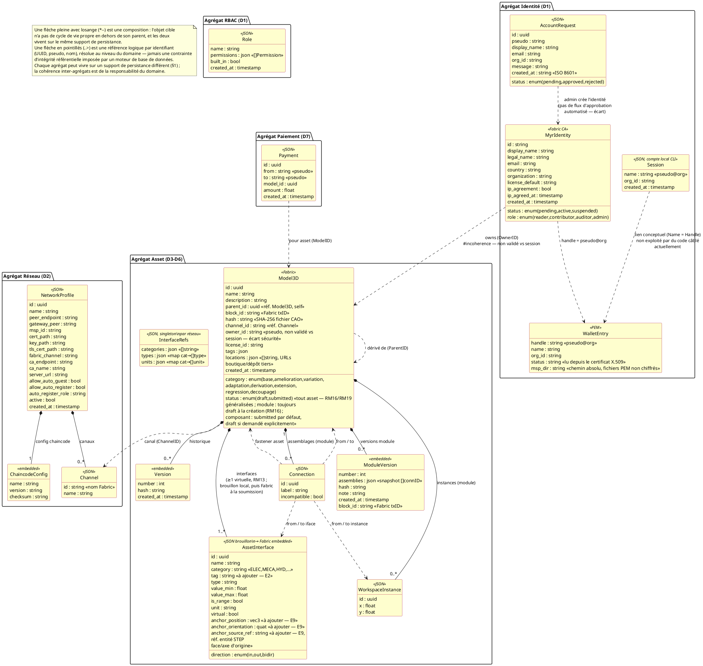

---
tags:
  - couche/conception
  - type/conception
  - rm/RM01
  - rm/RM02
  - rm/RM03
  - rm/RM04
  - rm/RM05
  - rm/RM09
  - rm/RM10
  - rm/RM11
  - rm/RM12
  - rm/RM13
  - rm/RM14
  - rm/RM15
  - rm/RM16
  - rm/RM17
  - rm/RM18
  - rm/RM19
  - rm/RM21
  - rm/RM22
  - rm/RM23
  - rm/RM24
  - rm/RM25
  - rm/RM26
  - rm/RM39
  - rm/RM40
  - rm/RM41
  - rm/RM42
  - relecture/incoherence
---
# Modèle de domaine — Agrégats et relations

> Phase 3 — Arrington | Référence : `specs/2-Analyse/Analyse_des_besoins.md` §6.3

---

## 1. Vue d'ensemble

Le modèle de données de Myr est distribué sur trois supports de persistance aux responsabilités distinctes — il n'y a pas de base SQL :

| Support | Adapter | Entités | Mutabilité |
|---------|---------|---------|-----------|
| Fichiers MSP locaux (non chiffrés) | `adapters/out/localstorage/` (wallets) | WalletEntry (PEM), MyrIdentity (attributs CA) | Mutable |
| JSON files (`data/`, `~/.Myr/`) | `adapters/out/localstorage/` | Connection, AssetInterface (brouillon — tant que l'asset porteur n'est pas soumis, ADR-02), InterfaceRefs, NetworkProfile, Session (local CLI), AccountRequest, Role, LocationCheck (statut de vérification par emplacement externe, RM42 — hors blockchain quel que soit l'état `draft`/`submitted` de l'asset porteur, voir §3) | Mutable |
| HyperLedger Fabric | `adapters/out/fabric/` | Model3D (asset, dont `Locations` — URLs des emplacements externes déclarés — et `Hash`, seule empreinte du fichier ressource conservée, RM01/RM42), AssetInterface (embarquée dans `Model3D.Interfaces` **à partir de la soumission** — ADR-02, `Conception_intro.md`), ModuleVersion (hash) | Immuable |

> La session REST (token opaque, `myrSession`) n'est pas un agrégat métier — c'est un détail d'implémentation de l'adaptateur `in/rest/`, en mémoire ou JSON/Redis selon la configuration. Voir `DC_D1_Auth_Identity.md`.

Le modèle est organisé par **agrégats** (au sens DDD) plutôt que par schéma relationnel : chaque agrégat regroupe les objets dont le cycle de vie est solidaire (composition), et référence les autres agrégats uniquement par identifiant (UUID, pseudo, nom) — jamais par une contrainte d'intégrité référentielle appliquée par un moteur de base de données, puisqu'aucun des trois supports du tableau ci-dessus n'en fournit une de façon transversale. Cette cohérence inter-agrégats est portée par le domaine (`domain/`), pas par le support de stockage.

---

## 2. Vue globale du domaine

---

## 3. Détail par agrégat

### Agrégat RBAC (D1 — role)

4 rôles intégrés (`reader`, `contributor`, `auditor`, `admin`) — non supprimables. Rôles personnalisés créés via `myr role create`.

> Il n'existe pas d'agrégat « Utilisateur/compte web » — voir `DC_D1_Auth_Identity.md`. L'identité de référence est `MyrIdentity` (agrégat suivant).

### Agrégat Identité (D1 — identity)

Voir §2 — entités MyrIdentity, WalletEntry, AccountRequest, Session.

### Agrégat Réseau (D2)

Voir §2 — entités NetworkProfile, ChaincodeConfig (embarquée), Channel.

### Agrégat Asset (D3/D4/D5/D6)

Voir §2 — entités Model3D, AssetInterface, Connection, WorkspaceInstance, ModuleVersion, InterfaceRefs.

Distinction Composant vs Module :

| Critère | Composant | Module |
|---------|-----------|--------|
| `Hash` | non vide (SHA-256 fichier CAO) | vide |
| `WorkspaceInstances` | vide | non vide |
| `ModuleVersions` | vide | non vide si `submitted` |

> `Status` (`draft`/`submitted`) n'est plus un critère distinctif depuis la généralisation de RM16/RM19 — il s'applique aux deux types (voir §1, §2 et ADR-02 dans `Conception_intro.md`). Seuls `Hash`, `WorkspaceInstances` et `ModuleVersions` distinguent un composant d'un module.

**Emplacements externes (`Model3D.Locations`) et leur statut de vérification (RM42) :** `Locations` est une liste d'URLs (boutique, dépôt de fichiers tiers…) déclarée par le Concepteur — elle suit le même cycle de vie que le reste des métadonnées de l'asset (mutable en brouillon, figée à la soumission, RM16/RM19). Le **statut de vérification** de chaque emplacement (accessible/inaccessible, date de dernière vérification) est une donnée d'un autre ordre : elle change à chaque vérification à la demande (UCCL03), y compris après soumission de l'asset porteur — l'embarquer dans `Model3D` obligerait chaque vérification à produire une transaction Fabric pour un simple constat d'accessibilité, ce qu'aucune règle métier n'exige. Ce statut vit donc dans une entité séparée, `LocationCheck` (`AssetID`, `URL`, `Status`, `CheckedAt`), tenue hors blockchain par un store dédié — même logique de séparation que `ThumbnailStore` pour les miniatures (§1, non diagrammé ici pour la même raison : ce n'est pas un agrégat métier mais un support de consultation dérivé). Une vérification de localisation ne constitue donc jamais une modification de l'asset au sens de RM19 et ne requiert pas de fork.

### Agrégat Paiement (D7)

Entité `Payment` implémentée (paiement manuel).

**Entités à concevoir** pour RM23/RM24 :

| Entité | Champs proposés | UC déclencheur |
|--------|----------------|----------------|
| `Order` | id, consumer_id, module_id, amount, status, created_at | UCPI01 |
| `OrderItem` | order_id, manufacturer_id, component_id, quantity | UCPI01 |
| `Commission` | id, order_id, recipient_id, asset_id, amount, ratio, tx_id | UCPI02, UCAUT01 |

> Ces entités sont à concevoir avec le PO — elles n'existent pas dans le code actuel.

---

## 4. Règles d'intégrité (invariants du domaine)

| Règle | Entité | Contrainte |
|-------|--------|-----------|
| RM01 | `Model3D` | `Category = base` → `Hash` unique parmi tous les assets Fabric |
| RM02 | `Model3D.Category` | valeur parmi les 8 catégories (dont `decoupage` — E1) |
| RM03 | `Model3D` | `ParentID != ""` → compatibilité licence vérifiée avant soumission |
| RM04 | `Model3D.ID` | UUID généré côté serveur — jamais fourni par le client |
| RM05 | `Model3D` | `Category != base` → `ParentID` obligatoire |
| RM09 | `AssetInterface` | un `id` ne peut apparaître qu'une seule fois dans `Connection.FromIfaceID` ou `ToIfaceID` |
| RM11 | `Connection` | `FromIface` et `ToIface` doivent satisfaire les 5 critères de compatibilité |
| RM12 | `Connection` | jamais supprimée automatiquement — `Incompatible: true` si interfaces évoluent |
| RM13 | `AssetInterface` | tout asset possède toujours au moins un `Virtual: true` |
| RM14 | `WorkspaceInstance` | suppression → cascade sur toutes les `Connection` liées |
| RM15 | `WorkspaceInstance` | plusieurs instances du même `AssetID` dans un module sont indépendantes |
| RM16 | `Model3D` (module) | `CreateModule` → `Status = draft` obligatoire |
| RM17 | `Model3D` (module) | `SubmitModule` → `len(Assemblies) > 0` requis |
| RM18 | `ModuleVersion` | créée à `SubmitModule` — immuable, horodatée, hashée |
| RM19 | `Model3D` (module) | `Status = submitted` → lecture seule — toute modification crée un fork |
| RM39 | `Model3D` | Découpage (`Category = decoupage`, E1) → sous-composants créés et module englobant référencent tous `ParentID` = composant d'origine |
| RM40 | — | `decompose preview` (UCAM09) ne persiste aucune entité — proposition temporaire seulement |
| RM41 | `Connection` | Connexion issue d'une suggestion de découpage soumise aux mêmes critères RM10/RM11 qu'une liaison manuelle, sans dérogation |
| RM21 | `MyrIdentity.Role` | rôle `reader` par défaut à l'auto-enregistrement, sauf rôle explicite |
| RM22 | `myrSession.Role` (REST) | déterminé à la connexion depuis `MyrIdentity.Role` #incoherence — cette ligne décrit un écart de synchronisation (état de suivi : `specs/roadmap_dev.md` § Écarts Identité & Session, E1), pas la règle RM22 telle que formulée dans `Regles_Metier.md` (changement de rôle réservé à l'admin, effectif au prochain ré-enrôlement) ; à réconcilier |
| RM25 | `Model3D.OwnerID` | transfert définitif et immuable sur Fabric |
| RM26 | `Model3D.ID` | UUID préservé lors du clonage inter-réseaux |
| RM42 | `LocationCheck` | vérification d'accessibilité à la demande, un statut par emplacement externe — Myr ne conservant aucune copie du fichier ressource, cette vérification ne porte jamais sur son contenu |

---

## 5. Informations manquantes

- **Commission, Order, OrderItem** : entités D7 à concevoir (voir §3 Agrégat Paiement)
- **Licence** : `Model3D.LicenseID` référence un catalogue de licences (`domain/model/license.go`) — entité `License` à ajouter au modèle de domaine
- **Organization** : entité logique référencée par `MyrIdentity.Organization` et `NetworkProfile.MSPID` — pas d'entité Go dédiée dans le code
- **Chiffrement des wallets** : décision de conception à trancher entre wallet chiffré au repos ou fichiers PEM en clair (`0600`) — voir `Securite.md`, `Conception_intro.md` ADR-03
- **Peer** : entité infrastructure Fabric (peer endpoint) — pas modélisée côté applicatif
- **Adresse de livraison** : UCPI01 mentionne une adresse dans le profil consommateur — entité `ConsumerProfile` absente
- **Repère géométrique sur `AssetInterface`** (écart E9) : position, orientation et référence à l'entité STEP d'origine (face/axe), nécessaires pour replacer et re-projeter une interface générée par une décomposition automatique (UCAM09) dans un visualiseur 3D — absents du code actuel, à ajouter sur `AssetInterface` ou une structure associée avant toute implémentation d'UCAM09

<!-- liens-obsidian:begin — section de traçabilité générée à partir des références du document : ne pas l'éditer à la main -->
## Liens

**Navigation**
- [Carte des specs](../Carte_des_specs.md)

**Use cases cités**
- UCAM09 — Décomposition assistée d'un composant assemblage : [expression](../1-Expression/UCAM-Assemblage_Module/UCAM09.md)
- UCAUT01 — Fabrication/Livraison d'un Composant : [expression](../1-Expression/UCAUT-Automatisation/UCAUT01.md) · [analyse](../2-Analyse/UCAUT-Automatisation/UCAUT01.md)
- UCCL03 — Vérifier la validité des emplacements externes d'un composant ou module : [expression](../1-Expression/UCCL-Composant_Lecture/UCCL03.md)
- UCPI01 — Commander un Module complet : [expression](../1-Expression/UCPI-Propriete_Intellectuelle/UCPI01.md) · [analyse](../2-Analyse/UCPI-Propriete_Intellectuelle/UCPI01.md)
- UCPI02 — Recevoir une commission sur l'utilisation d'un Module : [expression](../1-Expression/UCPI-Propriete_Intellectuelle/UCPI02.md) · [analyse](../2-Analyse/UCPI-Propriete_Intellectuelle/UCPI02.md)

**Règles métier**
- [RM01 — Anti-plagiat obligatoire](../1-Expression/Regles_Metier.md#1.%20Assets%20et%20composants)
- [RM02 — Catégorie d'asset obligatoire](../1-Expression/Regles_Metier.md#1.%20Assets%20et%20composants)
- [RM03 — Compatibilité de licence](../1-Expression/Regles_Metier.md#1.%20Assets%20et%20composants)
- [RM04 — UUID unique](../1-Expression/Regles_Metier.md#1.%20Assets%20et%20composants)
- [RM05 — ParentID obligatoire pour les dérivés](../1-Expression/Regles_Metier.md#1.%20Assets%20et%20composants)
- [RM09 — Interface à usage unique](../1-Expression/Regles_Metier.md#3.%20Interfaces%20et%20liaisons)
- [RM10 — Vérification de compatibilité automatique](../1-Expression/Regles_Metier.md#3.%20Interfaces%20et%20liaisons)
- [RM11 — Critères de compatibilité d'interfaces](../1-Expression/Regles_Metier.md#3.%20Interfaces%20et%20liaisons)
- [RM12 — Persistance des liaisons incompatibles](../1-Expression/Regles_Metier.md#3.%20Interfaces%20et%20liaisons)
- [RM13 — Slot virtuel garanti](../1-Expression/Regles_Metier.md#3.%20Interfaces%20et%20liaisons)
- [RM14 — Suppression en cascade des connexions](../1-Expression/Regles_Metier.md#4.%20Composition%20d'un%20Module%20%28instances%29)
- [RM15 — Instance indépendante](../1-Expression/Regles_Metier.md#4.%20Composition%20d'un%20Module%20%28instances%29)
- [RM16 — État draft](../1-Expression/Regles_Metier.md#5.%20Modules%20et%20cycle%20de%20vie%20des%20assets)
- [RM17 — Assemblage requis pour soumission (module uniquement)](../1-Expression/Regles_Metier.md#5.%20Modules%20et%20cycle%20de%20vie%20des%20assets)
- [RM18 — ModuleVersion immuable (module uniquement)](../1-Expression/Regles_Metier.md#5.%20Modules%20et%20cycle%20de%20vie%20des%20assets)
- [RM19 — Fork d'un asset soumis](../1-Expression/Regles_Metier.md#5.%20Modules%20et%20cycle%20de%20vie%20des%20assets)
- [RM21 — Rôle Lecteur par défaut à l'auto-enregistrement](../1-Expression/Regles_Metier.md#6.%20Compte%20et%20accès)
- [RM22 — Changement de rôle réservé à l'administrateur](../1-Expression/Regles_Metier.md#6.%20Compte%20et%20accès)
- [RM23 — Distribution automatique des commissions](../1-Expression/Regles_Metier.md#7.%20Propriété%20intellectuelle%20et%20commissions)
- [RM24 — Répartition proportionnelle multi-auteurs](../1-Expression/Regles_Metier.md#7.%20Propriété%20intellectuelle%20et%20commissions)
- [RM25 — Transfert de propriété définitif](../1-Expression/Regles_Metier.md#7.%20Propriété%20intellectuelle%20et%20commissions)
- [RM26 — Traçabilité du clonage inter-réseaux](../1-Expression/Regles_Metier.md#7.%20Propriété%20intellectuelle%20et%20commissions)
- [RM39 — Filiation d'un découpage](../1-Expression/Regles_Metier.md#5.%20Modules%20et%20cycle%20de%20vie%20des%20assets)
- [RM40 — Proposition de découpage non engageante](../1-Expression/Regles_Metier.md#5.%20Modules%20et%20cycle%20de%20vie%20des%20assets)
- [RM41 — Compatibilité toujours vérifiée pour une connexion suggérée](../1-Expression/Regles_Metier.md#5.%20Modules%20et%20cycle%20de%20vie%20des%20assets)
- [RM42 — Traçabilité et alerte des emplacements externes](../1-Expression/Regles_Metier.md#1.%20Assets%20et%20composants)

**Documents cités**
- [Regles_Metier](../1-Expression/Regles_Metier.md)
- [Analyse_des_besoins](../2-Analyse/Analyse_des_besoins.md)
- [Conception_intro](Conception_intro.md)
- [DC_D1_Auth_Identity](DC_D1_Auth_Identity.md)
- [Securite](Securite.md)
- [roadmap_dev](../roadmap_dev.md)

**Cité par**
- [UCAM09 (expression)](../1-Expression/UCAM-Assemblage_Module/UCAM09.md)
- [API_REST](API_REST.md)
- [Architecture_Composition](Architecture_Composition.md)
- [Conception_intro](Conception_intro.md)
- [DC_D9_Automatisation](DC_D9_Automatisation.md)

<!-- liens-obsidian:end -->
