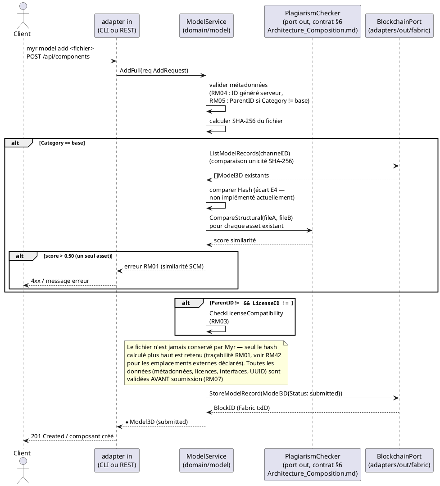
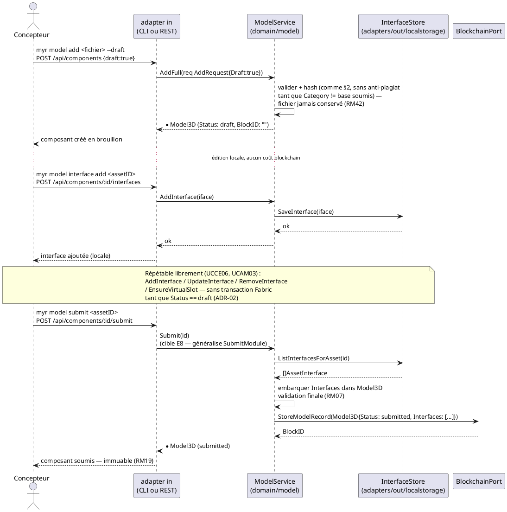

---
tags:
  - couche/conception
  - type/sequence
  - domaine/model
  - uc/UCCE01
  - uc/UCCE06
  - rm/RM01
  - rm/RM03
  - rm/RM04
  - rm/RM07
  - rm/RM19
  - rm/RM42
---
# Séquence — Soumission d'un composant (D3)

> Phase 3 — Arrington | Use cases : UCCE01, UCCE06 | Domaine : `domain/model`

---

## 1. Objectif

Diagramme de séquence détaillant les deux chemins de soumission d'un composant définis par ADR-02 (`Conception_intro.md` §6) et repris dans `Architecture_Composition.md` §3 : la création directe (comportement par défaut, une seule transaction Fabric) et le cycle brouillon → soumission explicite (`draft: true`).

---

## 2. Chemin par défaut — création directe (`AddFull`)

---

## 3. Chemin brouillon — `draft: true` puis `Submit` (E8)

---

## 4. Notes

- Les deux chemins convergent : une seule écriture Fabric (`StoreModelRecord`) commet l'intégralité du brouillon, `Interfaces` compris — jamais d'écriture blockchain par édition individuelle (ADR-02, `Conception_intro.md` §6).
- Le contrat `PlagiarismChecker.CompareStructural` (§6 `Architecture_Composition.md`) est représenté ci-dessus pour situer où l'algorithme SCM s'intégrerait une fois choisi — l'algorithme lui-même reste une question ouverte pour le PO, non tranchée par ce diagramme.
- `Submit(id)` (chemin §3) n'a pas de méthode `ModelService` dédiée : ce diagramme documente la cible — état de cet écart : `specs/2-Analyse/Analyse_des_besoins.md` § Écarts structurels connus, E8.

<!-- liens-obsidian:begin — section de traçabilité générée à partir des références du document : ne pas l'éditer à la main -->
## Liens

**Navigation**
- [Carte des specs](../Carte_des_specs.md)

**Use cases cités**
- UCAM03 — Créer une interface sur un composant : [expression](../1-Expression/UCAM-Assemblage_Module/UCAM03.md) · [analyse](../2-Analyse/UCAM-Assemblage_Module/UCAM03.md)
- UCCE01 — Ajout d'un composant Physique : [expression](../1-Expression/UCCE-Composant_Ecriture/UCCE01.md) · [analyse](../2-Analyse/UCCE-Composant_Ecriture/UCCE01.md)
- UCCE06 — Ajouter une interface à un Composant déjà créé : [expression](../1-Expression/UCCE-Composant_Ecriture/UCCE06.md) · [analyse](../2-Analyse/UCCE-Composant_Ecriture/UCCE06.md)

**Règles métier**
- [RM01 — Anti-plagiat obligatoire](../1-Expression/Regles_Metier.md#1.%20Assets%20et%20composants)
- [RM03 — Compatibilité de licence](../1-Expression/Regles_Metier.md#1.%20Assets%20et%20composants)
- [RM04 — UUID unique](../1-Expression/Regles_Metier.md#1.%20Assets%20et%20composants)
- [RM07 — Validation préalable obligatoire](../1-Expression/Regles_Metier.md#2.%20Blockchain%20et%20immuabilité)
- [RM19 — Fork d'un asset soumis](../1-Expression/Regles_Metier.md#5.%20Modules%20et%20cycle%20de%20vie%20des%20assets)
- [RM42 — Traçabilité et alerte des emplacements externes](../1-Expression/Regles_Metier.md#1.%20Assets%20et%20composants)

**Documents cités**
- [Analyse_des_besoins](../2-Analyse/Analyse_des_besoins.md)
- [Architecture_Composition](Architecture_Composition.md)
- [Conception_intro](Conception_intro.md)

**Cité par**
- [Conception_intro](Conception_intro.md)

<!-- liens-obsidian:end -->
