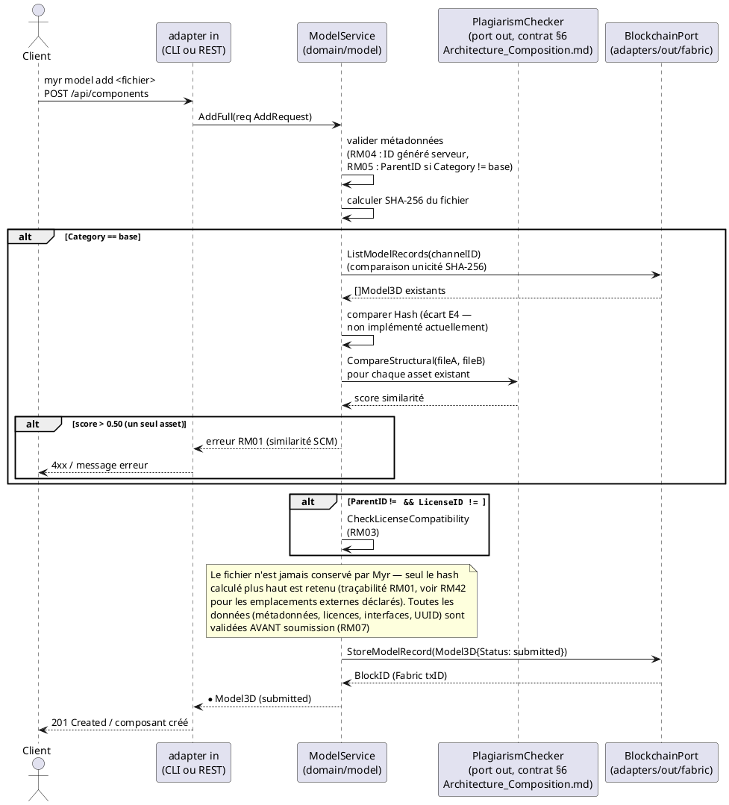
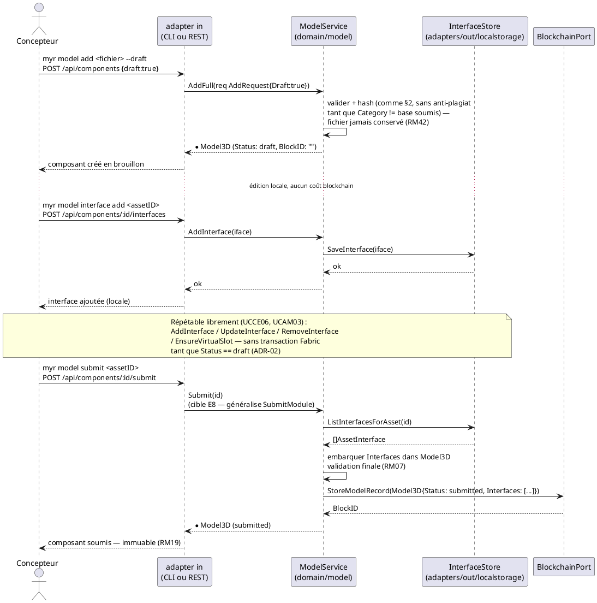

---
tags:
  - couche/conception
  - type/sequence
  - domaine/model
  - uc/UCCE01
  - uc/UCCE06
  - rm/RM01
  - rm/RM03
  - rm/RM04
  - rm/RM07
  - rm/RM19
  - rm/RM42
---
# Séquence — Soumission d'un composant (D3)

> Phase 3 — Arrington | Use cases : UCCE01, UCCE06 | Domaine : `domain/model`

---

## 1. Objectif

Diagramme de séquence détaillant les deux chemins de soumission d'un composant définis par ADR-02 (`Conception_intro.md` §6) et repris dans `Architecture_Composition.md` §3 : la création directe (comportement par défaut, une seule transaction Fabric) et le cycle brouillon → soumission explicite (`draft: true`).

---

## 2. Chemin par défaut — création directe (`AddFull`)

---

## 3. Chemin brouillon — `draft: true` puis `Submit` (E8)

---

## 4. Notes

- Les deux chemins convergent : une seule écriture Fabric (`StoreModelRecord`) commet l'intégralité du brouillon, `Interfaces` compris — jamais d'écriture blockchain par édition individuelle (ADR-02, `Conception_intro.md` §6).
- Le contrat `PlagiarismChecker.CompareStructural` (§6 `Architecture_Composition.md`) est représenté ci-dessus pour situer où l'algorithme SCM s'intégrerait une fois choisi — l'algorithme lui-même reste une question ouverte pour le PO, non tranchée par ce diagramme.
- `Submit(id)` (chemin §3) n'a pas de méthode `ModelService` dédiée : ce diagramme documente la cible — état de cet écart : `specs/2-Analyse/Analyse_des_besoins.md` § Écarts structurels connus, E8.

<!-- liens-obsidian:begin — section de traçabilité générée à partir des références du document : ne pas l'éditer à la main -->
## Liens

**Étape suivante — code, par section**
- [§ 2. Chemin par défaut — création directe (`AddFull`)](Sequence_soumission_asset.md#2.%20Chemin%20par%20défaut%20—%20création%20directe%20%28`AddFull`%29) → [REST /api/components/](../../docs/code/routes/REST%20api-components.md) · [CLI myr model add](../../docs/code/commandes/CLI%20myr-model-add.md) · [BlockchainPort.ListModelRecords](../../docs/code/fonctions/model.BlockchainPort.ListModelRecords.md) · [BlockchainPort.StoreModelRecord](../../docs/code/fonctions/model.BlockchainPort.StoreModelRecord.md) · [ModelService.AddFull](../../docs/code/fonctions/model.ModelService.AddFull.md) · [ModelService.CheckLicenseCompatibility](../../docs/code/fonctions/model.ModelService.CheckLicenseCompatibility.md)
- [§ 3. Chemin brouillon — `draft: true` puis `Submit` (E8)](Sequence_soumission_asset.md#3.%20Chemin%20brouillon%20—%20`draft:%20true`%20puis%20`Submit`%20%28E8%29) → [REST /api/components/](../../docs/code/routes/REST%20api-components.md) · [CLI myr model add](../../docs/code/commandes/CLI%20myr-model-add.md) · [CLI myr model interface add](../../docs/code/commandes/CLI%20myr-model-interface-add.md) · [CLI myr model submit](../../docs/code/commandes/CLI%20myr-model-submit.md) · [BlockchainPort.StoreModelRecord](../../docs/code/fonctions/model.BlockchainPort.StoreModelRecord.md) · [InterfaceStore.ListInterfacesForAsset](../../docs/code/fonctions/model.InterfaceStore.ListInterfacesForAsset.md) · [InterfaceStore.RemoveInterface](../../docs/code/fonctions/model.InterfaceStore.RemoveInterface.md) · [InterfaceStore.SaveInterface](../../docs/code/fonctions/model.InterfaceStore.SaveInterface.md) · [ModelService.AddFull](../../docs/code/fonctions/model.ModelService.AddFull.md) · [ModelService.AddInterface](../../docs/code/fonctions/model.ModelService.AddInterface.md) · [ModelService.EnsureVirtualSlot](../../docs/code/fonctions/model.ModelService.EnsureVirtualSlot.md) · [ModelService.ListInterfacesForAsset](../../docs/code/fonctions/model.ModelService.ListInterfacesForAsset.md) · [ModelService.RemoveInterface](../../docs/code/fonctions/model.ModelService.RemoveInterface.md) · [ModelService.SubmitModule](../../docs/code/fonctions/model.ModelService.SubmitModule.md) · [ModelService.UpdateInterface](../../docs/code/fonctions/model.ModelService.UpdateInterface.md)
- [§ 4. Notes](Sequence_soumission_asset.md#4.%20Notes) → [BlockchainPort.StoreModelRecord](../../docs/code/fonctions/model.BlockchainPort.StoreModelRecord.md) · [ModelService.Submit](../../docs/code/fonctions/model.ModelService.Submit.md)

<!-- liens-obsidian:end -->
