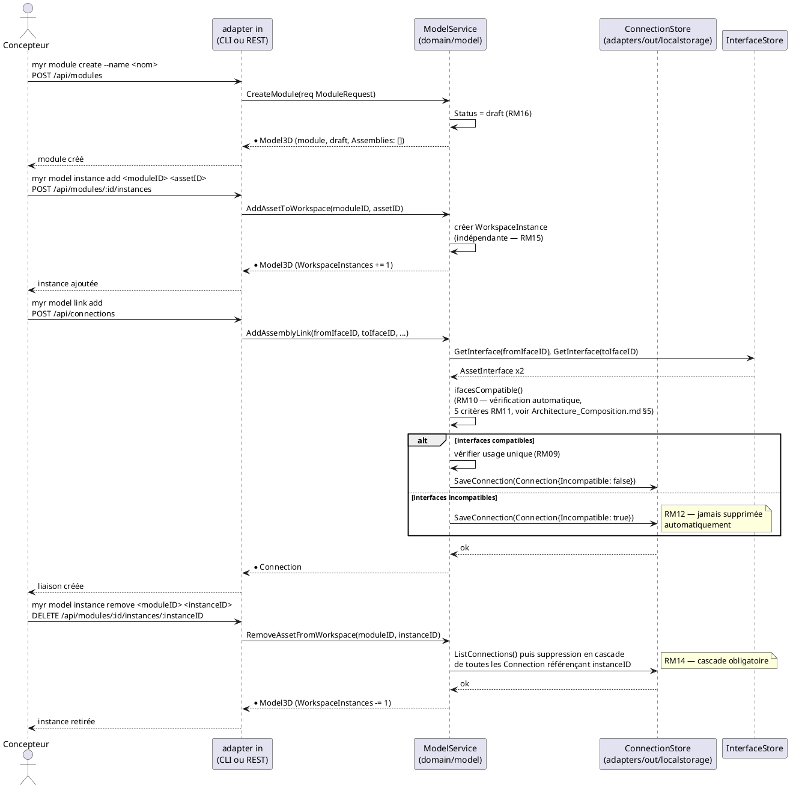
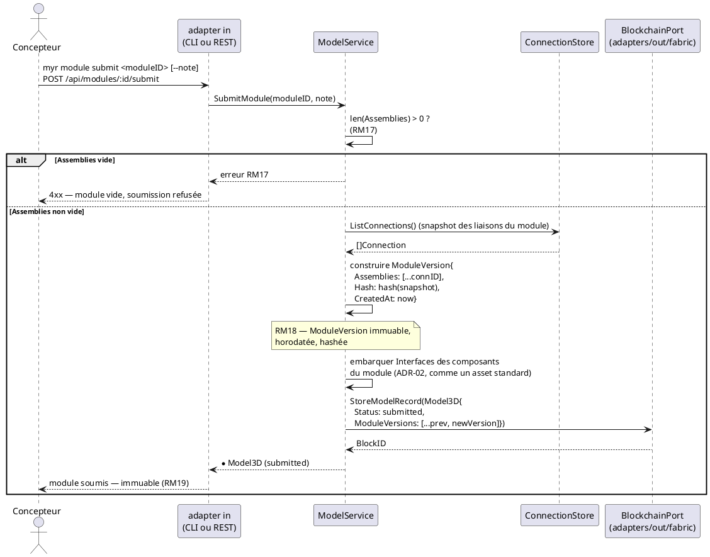

---
tags:
  - couche/conception
  - type/sequence
  - domaine/model
  - uc/UCAM01
  - uc/UCAM07
  - uc/UCAM08
  - uc/UCMOD01
  - uc/UCMOD02
  - uc/UCMOD06
  - rm/RM09
  - rm/RM10
  - rm/RM11
  - rm/RM12
  - rm/RM14
  - rm/RM15
  - rm/RM16
  - rm/RM17
  - rm/RM18
  - rm/RM19
---
# Séquence — Composition et soumission d'un module (D5/D6)

> Phase 3 — Arrington | Use cases : UCMOD01, UCMOD02, UCMOD06, UCAM01, UCAM07, UCAM08 | Domaine : `domain/model`

---

## 1. Objectif

Diagramme de séquence couvrant le cycle complet d'un module : création (`draft`, RM16), composition (instances + liaisons, mutable et locale), et soumission (`SubmitModule`, RM17/RM18). Complète `Architecture_Composition.md` §3 (diagramme d'états) et §9 (ADR-05).

---

## 2. Création et composition (état `draft`, entièrement local)

---

## 3. Soumission (`SubmitModule` — RM17/RM18, transaction unique)

---

## 4. Notes

- La composition (§2) reste entièrement locale et mutable — aucune transaction Fabric n'est déclenchée avant `SubmitModule` (ADR-05). C'est ce qui garantit les exigences de temps de réponse UCAM (`< 200 ms` / `< 300 ms`, `Conception_intro.md` §6 ADR-02).
- Une fois `submitted`, toute modification du module doit passer par un fork (RM19) — état de cette garde : `specs/2-Analyse/Analyse_des_besoins.md` § Écarts structurels connus, E5. Ce diagramme ne représente pas le chemin de fork, qui reste à concevoir au niveau service.
- Le retrait en cascade (§2, dernier bloc) est la seule opération de composition qui modifie un état déjà persisté localement (les `Connection` liées) — elle reste néanmoins purement locale tant que le module n'est pas soumis.

<!-- liens-obsidian:begin — section de traçabilité générée à partir des références du document : ne pas l'éditer à la main -->
## Liens

**Étape suivante — code, par section**
- [§ 1. Objectif](Sequence_soumission_module.md#1.%20Objectif) → [ModelService.SubmitModule](../../docs/code/fonctions/model.ModelService.SubmitModule.md)
- [§ 2. Création et composition (état `draft`, entièrement local)](Sequence_soumission_module.md#2.%20Création%20et%20composition%20%28état%20`draft`,%20entièrement%20local%29) → [REST /api/modules/](../../docs/code/routes/REST%20api-modules.md) · [REST /api/connections/](../../docs/code/routes/REST%20api-connections.md) · [CLI myr model instance add](../../docs/code/commandes/CLI%20myr-model-instance-add.md) · [CLI myr model link add](../../docs/code/commandes/CLI%20myr-model-link-add.md) · [CLI myr model instance remove](../../docs/code/commandes/CLI%20myr-model-instance-remove.md) · [ConnectionStore.ListConnections](../../docs/code/fonctions/model.ConnectionStore.ListConnections.md) · [ConnectionStore.SaveConnection](../../docs/code/fonctions/model.ConnectionStore.SaveConnection.md) · [InterfaceStore.GetInterface](../../docs/code/fonctions/model.InterfaceStore.GetInterface.md) · [ModelService.AddAssemblyLink](../../docs/code/fonctions/model.ModelService.AddAssemblyLink.md) · [ModelService.AddAssetToWorkspace](../../docs/code/fonctions/model.ModelService.AddAssetToWorkspace.md) · [ModelService.CreateModule](../../docs/code/fonctions/model.ModelService.CreateModule.md) · [ModelService.GetInterface](../../docs/code/fonctions/model.ModelService.GetInterface.md) · [ModelService.ListConnections](../../docs/code/fonctions/model.ModelService.ListConnections.md) · [ModelService.RemoveAssetFromWorkspace](../../docs/code/fonctions/model.ModelService.RemoveAssetFromWorkspace.md)
- [§ 3. Soumission (`SubmitModule` — RM17/RM18, transaction unique)](Sequence_soumission_module.md#3.%20Soumission%20%28`SubmitModule`%20—%20RM17/RM18,%20transaction%20unique%29) → [REST /api/modules/](../../docs/code/routes/REST%20api-modules.md) · [BlockchainPort.StoreModelRecord](../../docs/code/fonctions/model.BlockchainPort.StoreModelRecord.md) · [ConnectionStore.ListConnections](../../docs/code/fonctions/model.ConnectionStore.ListConnections.md) · [ModelService.ListConnections](../../docs/code/fonctions/model.ModelService.ListConnections.md) · [ModelService.SubmitModule](../../docs/code/fonctions/model.ModelService.SubmitModule.md)
- [§ 4. Notes](Sequence_soumission_module.md#4.%20Notes) → [ModelService.SubmitModule](../../docs/code/fonctions/model.ModelService.SubmitModule.md)

<!-- liens-obsidian:end -->
