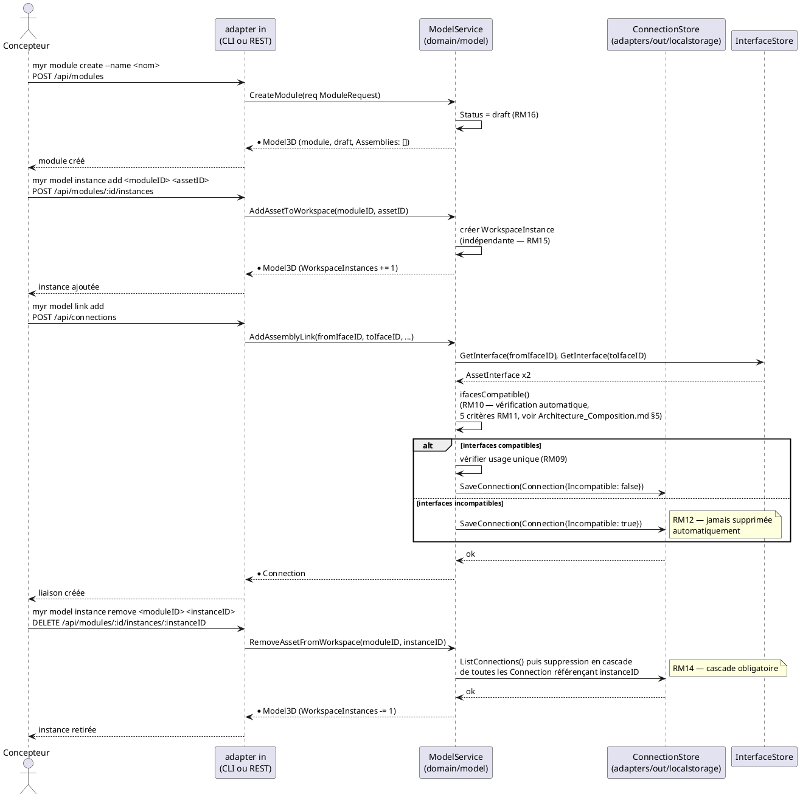
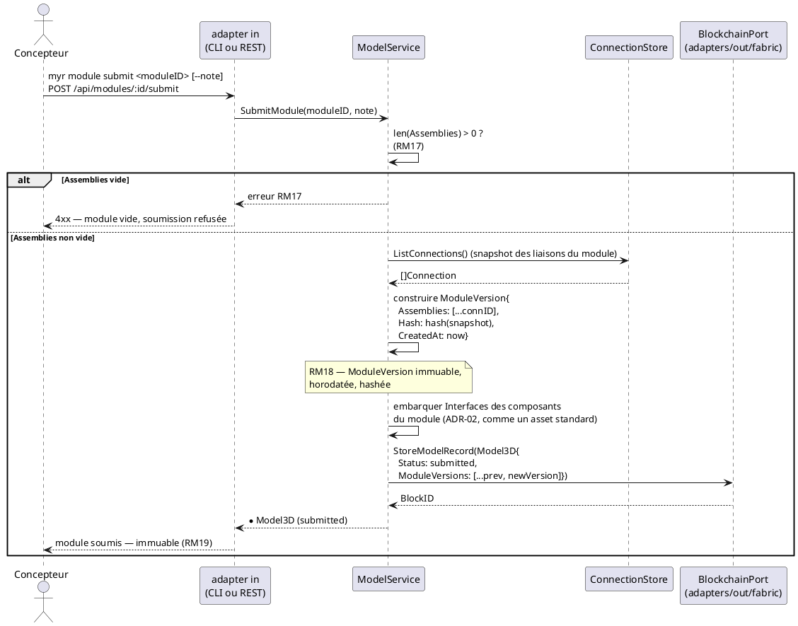

---
tags:
  - couche/conception
  - type/sequence
  - domaine/model
  - uc/UCAM01
  - uc/UCAM07
  - uc/UCAM08
  - uc/UCMOD01
  - uc/UCMOD02
  - uc/UCMOD06
  - rm/RM09
  - rm/RM10
  - rm/RM11
  - rm/RM12
  - rm/RM14
  - rm/RM15
  - rm/RM16
  - rm/RM17
  - rm/RM18
  - rm/RM19
---
# Séquence — Composition et soumission d'un module (D5/D6)

> Phase 3 — Arrington | Use cases : UCMOD01, UCMOD02, UCMOD06, UCAM01, UCAM07, UCAM08 | Domaine : `domain/model`

---

## 1. Objectif

Diagramme de séquence couvrant le cycle complet d'un module : création (`draft`, RM16), composition (instances + liaisons, mutable et locale), et soumission (`SubmitModule`, RM17/RM18). Complète `Architecture_Composition.md` §3 (diagramme d'états) et §9 (ADR-05).

---

## 2. Création et composition (état `draft`, entièrement local)

---

## 3. Soumission (`SubmitModule` — RM17/RM18, transaction unique)

---

## 4. Notes

- La composition (§2) reste entièrement locale et mutable — aucune transaction Fabric n'est déclenchée avant `SubmitModule` (ADR-05). C'est ce qui garantit les exigences de temps de réponse UCAM (`< 200 ms` / `< 300 ms`, `Conception_intro.md` §6 ADR-02).
- Une fois `submitted`, toute modification du module doit passer par un fork (RM19) — état de cette garde : `specs/2-Analyse/Analyse_des_besoins.md` § Écarts structurels connus, E5. Ce diagramme ne représente pas le chemin de fork, qui reste à concevoir au niveau service.
- Le retrait en cascade (§2, dernier bloc) est la seule opération de composition qui modifie un état déjà persisté localement (les `Connection` liées) — elle reste néanmoins purement locale tant que le module n'est pas soumis.

<!-- liens-obsidian:begin — section de traçabilité générée à partir des références du document : ne pas l'éditer à la main -->
## Liens

**Navigation**
- [Carte des specs](../Carte_des_specs.md)

**Use cases cités**
- UCAM01 — Liaison entre interfaces : [expression](../1-Expression/UCAM-Assemblage_Module/UCAM01.md) · [analyse](../2-Analyse/UCAM-Assemblage_Module/UCAM01.md)
- UCAM07 — Choisir un asset d'accroche (Fastener) : [expression](../1-Expression/UCAM-Assemblage_Module/UCAM07.md) · [analyse](../2-Analyse/UCAM-Assemblage_Module/UCAM07.md)
- UCAM08 — Retirer une instance de composant d'un Module : [expression](../1-Expression/UCAM-Assemblage_Module/UCAM08.md) · [analyse](../2-Analyse/UCAM-Assemblage_Module/UCAM08.md)
- UCMOD01 — Créer un Module : [expression](../1-Expression/UCMOD-Module/UCMOD01.md) · [analyse](../2-Analyse/UCMOD-Module/UCMOD01.md)
- UCMOD02 — Ajouter un Module existant : [expression](../1-Expression/UCMOD-Module/UCMOD02.md) · [analyse](../2-Analyse/UCMOD-Module/UCMOD02.md)
- UCMOD06 — Soumettre un module à la blockchain : [expression](../1-Expression/UCMOD-Module/UCMOD06.md) · [analyse](../2-Analyse/UCMOD-Module/UCMOD06.md)

**Règles métier**
- [RM09 — Interface à usage unique](../1-Expression/Regles_Metier.md#3.%20Interfaces%20et%20liaisons)
- [RM10 — Vérification de compatibilité automatique](../1-Expression/Regles_Metier.md#3.%20Interfaces%20et%20liaisons)
- [RM11 — Critères de compatibilité d'interfaces](../1-Expression/Regles_Metier.md#3.%20Interfaces%20et%20liaisons)
- [RM12 — Persistance des liaisons incompatibles](../1-Expression/Regles_Metier.md#3.%20Interfaces%20et%20liaisons)
- [RM14 — Suppression en cascade des connexions](../1-Expression/Regles_Metier.md#4.%20Composition%20d'un%20Module%20%28instances%29)
- [RM15 — Instance indépendante](../1-Expression/Regles_Metier.md#4.%20Composition%20d'un%20Module%20%28instances%29)
- [RM16 — État draft](../1-Expression/Regles_Metier.md#5.%20Modules%20et%20cycle%20de%20vie%20des%20assets)
- [RM17 — Assemblage requis pour soumission (module uniquement)](../1-Expression/Regles_Metier.md#5.%20Modules%20et%20cycle%20de%20vie%20des%20assets)
- [RM18 — ModuleVersion immuable (module uniquement)](../1-Expression/Regles_Metier.md#5.%20Modules%20et%20cycle%20de%20vie%20des%20assets)
- [RM19 — Fork d'un asset soumis](../1-Expression/Regles_Metier.md#5.%20Modules%20et%20cycle%20de%20vie%20des%20assets)

**Documents cités**
- [Analyse_des_besoins](../2-Analyse/Analyse_des_besoins.md)
- [Architecture_Composition](Architecture_Composition.md)
- [Conception_intro](Conception_intro.md)

**Cité par**
- [Conception_intro](Conception_intro.md)

<!-- liens-obsidian:end -->
